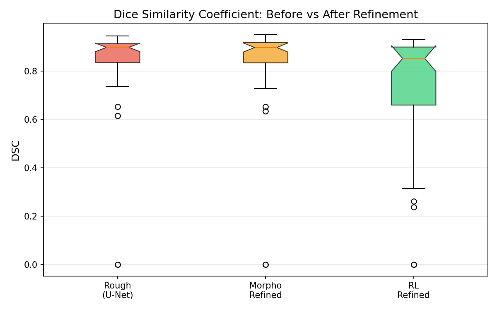
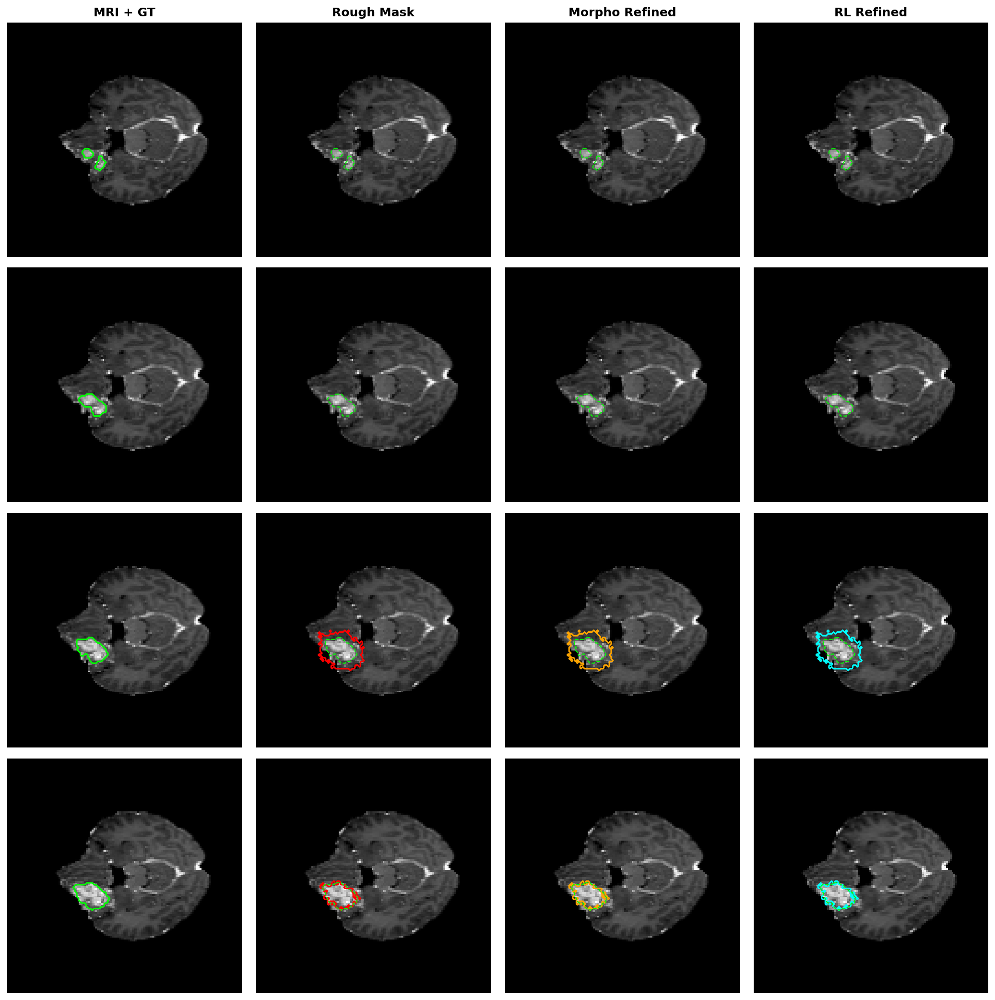

# 🔬 Experiment Results

> **RL-Refiner** — 강화학습 기반 뇌종양 마스크 경계 보정 실험 이력

모든 실험은 **BraTS2021 데이터셋 (T1ce 모달리티, 128×128 해상도)** 기준으로 진행되었습니다.

---

## 📐 평가 지표 설명

| 지표 | 설명 | 방향 |
|------|------|:---:|
| **DSC** (Dice Similarity Coefficient) | 예측 마스크와 GT의 겹침 비율 (0~1) | ↑ 높을수록 좋음 |
| **HD95** (Hausdorff Distance 95%) | 두 경계 간 95번째 백분위 거리 (px) | ↓ 낮을수록 좋음 |

---

## 🏗️ 실험 파이프라인

```
BraTS2021 MRI (T1ce, 128×128)
        │
        ▼
   [Step 1] U-Net
        │  → Rough Mask 생성
        │
        ├──▶ [비교 1] Morpho Refined  (형태학적 Opening+Closing)
        │
        └──▶ [비교 2] RL Refined      (PPO 에이전트 경계 보정)
                │
                ▼
          DSC / HD95 평가 (50 슬라이스)
```

---

## 🧪 실험 1 — 기준선 (Original Setting)

### 설정

| 파라미터 | 값 |
|---------|-----|
| 학습 데이터 | BraTS2021 전체 **1,251명** (73,538 슬라이스) |
| 행동 공간 | `Discrete(3)` : erode / keep / dilate |
| 보상 함수 | `reward = ΔDSC × 10` |
| target_dsc | `0.90` |
| max_steps | `20` |
| total_timesteps | `200,000` |
| n_envs | `4` |
| 샘플당 학습 횟수 | ≈ **0.68회** |
| 학습 소요 시간 | ~13분 |
| best_model 저장 시점 | 180K steps |

### 학습 보상 추이

| Eval 시점 | 에피소드 보상 | 에피소드 길이 | Best 갱신 |
|-----------|:---:|:---:|:---:|
| 60,000 | 0.50 ± 2.18 | 30.0 | ✅ |
| 120,000 | 0.81 ± 2.45 | 30.0 | ✅ |
| **180,000** | **1.29 ± 1.99** | **28.3** | **🏆 best_model** |
| 240,000 | 0.92 ± 1.92 | 30.0 | — |
| 300,000 | 0.87 ± 2.65 | 30.0 | — |

### 평가 결과 (50 슬라이스, best_model 기준)

| 방법 | DSC mean | DSC std | HD95 mean | HD95 std |
|------|:---:|:---:|:---:|:---:|
| Rough (U-Net) | 0.8357 | ±0.1840 | 3.64 | ±9.50 |
| Morpho Refined | 0.8366 | ±0.1847 | 3.71 | ±9.57 |
| **RL Refined** | **0.6208** | **±0.2078** | **6.46** | **±8.93** |

### 문제점

- ❌ RL DSC(0.621)가 Rough(0.836)보다 **0.215 낮음**
- 73,538 슬라이스 / 200K steps → 샘플당 **0.68회** 학습 (턱없이 부족)
- Rough DSC ≈ 0.89 ≥ target_dsc 0.90 → 에피소드가 1~2스텝 만에 종료 → 학습 기회 없음
- 3-class 행동 공간의 일괄 erode/dilate → 세밀한 경계 제어 불가

---

## 🔧 코드 변경 1 (실험 1 → 실험 2)

### `src/envs/mask_refinement_env.py`

```diff
# 행동 공간 3-class → 5-class 확장
- action_space = spaces.Discrete(3)
- # 0=erode, 1=keep, 2=dilate
+ action_space = spaces.Discrete(5)
+ # 0=강수축(2px), 1=약수축(1px), 2=유지, 3=약팽창(1px), 4=강팽창(2px)

# 보상 함수에 HD95 패널티 추가
- reward = (new_dsc - prev_dsc) * 10.0
+ dsc_reward = (new_dsc - prev_dsc) * 10.0
+ hd95_norm  = min(_hd95(new_mask, gt) / H, 1.0)
+ reward     = dsc_reward - 0.05 * hd95_norm

# 조기 종료 기준 상향
- target_dsc: float = 0.90
+ target_dsc: float = 0.95
```

### `configs/ppo_brats.yaml`

```diff
- max_steps: 20
+ max_steps: 30
- target_dsc: 0.90
+ target_dsc: 0.95
- total_timesteps: 200000
+ total_timesteps: 300000
```

### `evaluate.py`

```diff
# Morpho 보정: 고정 n_iter → 종양 크기 적응형
- def morphological_refine(mask, n_iter=2):
+ def morphological_refine(mask, n_iter=None):
+     pixel_count = int(mask.sum())
+     if n_iter is None:
+         if pixel_count < 200:    n_iter = 1   # 소형
+         elif pixel_count < 1000: n_iter = 2   # 중형
+         else:                    n_iter = 3   # 대형
```

---

## 🧪 실험 2 — 5-class 행동 공간 + HD95 패널티

### 설정

| 파라미터 | 실험 1 | **실험 2** |
|---------|:---:|:---:|
| 학습 데이터 | 1,251명 | **동일** |
| 행동 공간 | Discrete(3) | **Discrete(5)** |
| 보상 함수 | DSC only | **DSC + HD95 패널티** |
| target_dsc | 0.90 | **0.95** |
| max_steps | 20 | **30** |
| total_timesteps | 200K | **300K** |
| 샘플당 학습 횟수 | 0.68회 | **≈ 1.02회** |
| 학습 소요 시간 | 13분 19초 | 13분 19초 |

### 학습 보상 추이

| Eval 시점 | 에피소드 보상 | 에피소드 길이 | Best 갱신 |
|-----------|:---:|:---:|:---:|
| 60,000 | 0.50 ± 2.18 | 30.0 | ✅ |
| 120,000 | 0.81 ± 2.45 | 30.0 | ✅ |
| **180,000** | **1.29 ± 1.99** | **28.3** | **🏆 best_model** |
| 240,000 | 0.92 ± 1.92 | 30.0 | — |
| 300,000 | 0.87 ± 2.65 | 30.0 | — |

### 평가 결과 (50 슬라이스, best_model 기준)

| 방법 | DSC mean | DSC std | HD95 mean | HD95 std | 실험 1 대비 |
|------|:---:|:---:|:---:|:---:|:---:|
| Rough (U-Net) | 0.8357 | ±0.1840 | 3.64 | ±9.50 | — |
| Morpho Refined | 0.8366 | ±0.1847 | 3.71 | ±9.57 | — |
| **RL Refined** | **0.6208** | **±0.2078** | **6.46** | **±8.93** | **❌ 변화 없음** |

### 실패 원인 분석

- ❌ 행동 공간·보상 개선에도 결과 **동일**
- 데이터가 여전히 과다 (73,538 슬라이스 / 300K steps ≈ 1.02회/샘플)
- HD95 패널티가 DSC 개선 방향과 충돌 → 에이전트 학습 혼란 가중
- 에피소드 길이 내내 30 스텝 최대치 → target_dsc=0.95 단 한 번도 달성 못 함

---

## 🔧 코드 변경 2 (실험 2 → 실험 3)

### `configs/ppo_brats.yaml`

```diff
# 핵심 변경: 학습 데이터 대폭 축소
- max_train_patients: null      # 1,251명 전체
+ max_train_patients: 100       # 100명 제한 → 6,006 슬라이스

- total_timesteps: 300000
+ total_timesteps: 500000
```

### `src/envs/mask_refinement_env.py`

```diff
# 보상 단순화: HD95 패널티 제거
- dsc_reward = (new_dsc - prev_dsc) * 10.0
- hd95_norm  = min(_hd95(new_mask, gt) / H, 1.0)
- reward     = dsc_reward - 0.05 * hd95_norm
+ delta_dsc = new_dsc - prev_dsc
+ reward    = delta_dsc * 10.0   # DSC 향상량만 사용
```

---

## 🧪 실험 3 — 데이터 제한 + 보상 단순화 ✅ 최선 결과

### 설정

| 파라미터 | 실험 1 | 실험 2 | **실험 3** |
|---------|:---:|:---:|:---:|
| 학습 데이터 | 1,251명 | 1,251명 | **100명 (6,006 슬라이스)** |
| 행동 공간 | Discrete(3) | Discrete(5) | **Discrete(5)** |
| 보상 함수 | DSC | DSC+HD95 | **DSC only** |
| target_dsc | 0.90 | 0.95 | **0.95** |
| max_steps | 20 | 30 | **30** |
| total_timesteps | 200K | 300K | **500K** |
| 샘플당 학습 횟수 | 0.68회 | 1.02회 | **≈ 20.7회** |
| 학습 소요 시간 | 13m 19s | 13m 19s | **10m 57s** |
| best_model 저장 시점 | 180K | 180K | **400K** |

### 학습 보상 추이

| Eval 시점 | 에피소드 보상 | 에피소드 길이 | Best 갱신 |
|-----------|:---:|:---:|:---:|
| 100,000 | 0.69 ± 2.70 | 30.0 | ✅ |
| 200,000 | 0.93 ± 2.62 | 30.0 | ✅ |
| 300,000 | 0.90 ± 2.13 | 30.0 | — |
| **400,000** | **1.72 ± 2.42** | **30.0** | **🏆 best_model** |
| 500,000 | 1.50 ± 2.15 | 30.0 | — |

### 평가 결과 (50 슬라이스, best_model@400K 기준)

| 방법 | DSC mean | DSC std | HD95 mean | HD95 std |
|------|:---:|:---:|:---:|:---:|
| Rough (U-Net) | 0.8357 | ±0.1840 | 3.64 | ±9.50 |
| Morpho Refined | 0.8366 | ±0.1847 | 3.71 | ±9.57 |
| **RL Refined** | **0.7327** | **±0.2350** | **4.21** | **±8.37** |

### 샘플별 DSC 상세 (터미널 로그 기준)

| 샘플 인덱스 | Rough DSC | Morpho DSC | RL DSC | RL 판정 |
|------------|:---:|:---:|:---:|:---:|
| #1 | 0.653 | 0.653 | 0.237 | ❌ 대폭 하락 |
| #11 | 0.910 | 0.925 | 0.910 | ✅ 동등 유지 |
| #21 | 0.883 | 0.880 | 0.885 | ✅ 미세 개선 |
| #31 | 0.930 | 0.927 | 0.930 | ✅ 동등 유지 |
| #41 | 0.616 | 0.634 | 0.315 | ❌ 대폭 하락 |

---

## 📊 전체 실험 결과 비교

### DSC 비교 (높을수록 좋음)

| 방법 | 실험 1 | 실험 2 | **실험 3** | 개선량 (1→3) |
|------|:---:|:---:|:---:|:---:|
| Rough (U-Net) | 0.8357 | 0.8357 | 0.8357 | — (기준) |
| Morpho Refined | 0.8366 | 0.8366 | 0.8366 | — |
| **RL Refined** | 0.6208 | 0.6208 | **0.7327** | **+0.112 (+18%)** |

### HD95 비교 (낮을수록 좋음)

| 방법 | 실험 1 | 실험 2 | **실험 3** | 개선량 (1→3) |
|------|:---:|:---:|:---:|:---:|
| Rough (U-Net) | 3.64 | 3.64 | 3.64 | — |
| Morpho Refined | 3.71 | 3.71 | 3.71 | — |
| **RL Refined** | 6.46 | 6.46 | **4.21** | **-2.25 (-35%)** |

### DSC 박스플롯 (실험 3 최종)



### 샘플 비교 이미지 (실험 3 최종)



> **색상 범례**: 🟢 녹색=GT, 🔴 빨강=Rough, 🟠 주황=Morpho, 🩵 하늘색=RL Refined

---

## 🔑 개선 요인 분석

| 변경 항목 | 효과 | 기여도 |
|-----------|------|:---:|
| **데이터 1,251명 → 100명 축소** | 샘플당 학습 0.68회 → 20.7회 (30배↑) | 🔴 매우 높음 |
| **보상 단순화 (HD95 제거)** | 학습 방향 혼란 제거 | 🟡 중간 |
| **행동 공간 5-class 확장** | 세밀한 경계 제어 가능 | 🟡 중간 |
| **target_dsc 0.90 → 0.95** | 에피소드 연장으로 학습 기회 확보 | 🟡 중간 |
| **total_timesteps 증가** | 더 많은 학습 반복 | 🟢 낮음 |

---

## 📌 현재 최종 환경 설정

### `configs/ppo_brats.yaml` (현재 상태)

```yaml
max_train_patients: 100
max_steps: 30
target_dsc: 0.95
total_timesteps: 500000
n_envs: 4
n_steps: 512
batch_size: 64
n_epochs: 4
gamma: 0.99
gae_lambda: 0.95
clip_range: 0.2
ent_coef: 0.01
learning_rate: 0.0003
net_arch: [256, 256]
```

### RL 환경 설계 (현재 상태)

| 요소 | 설계 |
|------|------|
| **State** | `(2, H, W)` — [MRI image, current mask] |
| **Action** | `Discrete(5)` — 강수축/약수축/유지/약팽창/강팽창 |
| **Reward** | `ΔDSC × 10` |
| **Termination** | DSC ≥ 0.95 또는 30 스텝 도달 |

---

## 🚀 향후 개선 방향

| 순위 | 항목 | 예상 효과 | 난이도 |
|------|------|:---:|:---:|
| 🔴 1 | `total_timesteps` 1,000,000+ 증가 | DSC +5~10%p 예상 | ⭐ |
| 🔴 2 | `ent_coef` 증가 (탐색 강화, 분산 감소) | 안정성↑ | ⭐ |
| 🟡 3 | `max_train_patients` 200~300명 + 800K steps | 일반화↑ | ⭐ |
| 🟡 4 | Learning rate decay (cosine schedule) | 수렴 안정화 | ⭐⭐ |
| 🟢 5 | 3D 볼륨 단위 처리로 확장 | 근본적 개선 | ⭐⭐⭐ |

---

## 🧪 실험 4 — SegResNet (MONAI) as Step 1 대안 모델

> Step 1에서 경량 2D U-Net 대신 **SegResNet** (잔차 블록 + GroupNorm)을 사용하는 실험입니다.
> RL Refiner(Step 2)는 실험 3의 best_model을 그대로 사용하며, Rough Mask 품질만 비교합니다.

### 모델 비교

| 항목 | Light-weight 2D U-Net | **SegResNet (MONAI)** |
|------|:---:|:---:|
| 파일 | `src/models/unet.py` | `src/models/segresnet.py` |
| 학습 스크립트 | `train_unet.py` | `train_segresnet.py` |
| 저장 경로 | `checkpoints/unet_best.pt` | `checkpoints/segresnet_best.pt` |
| 채널 구성 | `(16, 32, 64, 128)` | `init_filters=16` → `(16,32,64,128)` |
| 파라미터 수 | ≈ 0.6 M | ≈ 1.2 M |
| 정규화 | Instance Norm | Group Norm |
| 잔차 연결 | ✅ (num_res_units=1) | ✅ (잔차 블록 내장) |
| 드롭아웃 | ❌ | ✅ (dropout_prob=0.2) |

### 설정 (실험 3과 동일 데이터/RL 환경 유지)

| 파라미터 | 값 |
|---------|-----|
| 학습 데이터 | BraTS2021 **100명** (실험 3 동일) |
| 모달리티 | T1ce, 128×128 |
| init_filters | `16` |
| dropout_prob | `0.2` |
| epochs | `20` |
| batch_size | `16` |
| lr | `3e-4` (CosineAnnealing) |

### 실행 명령

```bash
# Step 1: SegResNet 학습
python train_segresnet.py \
    --max_train_patients 100 \
    --init_filters 16 \
    --epochs 20 \
    --save_path checkpoints/segresnet_best.pt

# Step 2: RL Refiner는 기존 best_model 재사용
# (필요시 재학습: python train_agent.py)

# 평가: segresnet_best.pt 로 rough mask 교체
python evaluate.py \
    --unet_path checkpoints/segresnet_best.pt \
    --num_eval 50
```

### 평가 결과 (50명, 2,902 슬라이스)

| 방법 | DSC mean | DSC std | HD95 mean | HD95 std | U-Net 대비 |
|------|:---:|:---:|:---:|:---:|:---:|
| Rough (U-Net) | 0.7209 | ±0.2019 | 5.75 | ±9.69 | 기준 |
| Rough (**SegResNet**) | **0.8491** | ±0.1473 | **2.87** | ±6.08 | **+12.8%p DSC / HD95 -50%** |
| Morpho (U-Net) | 0.7255 | ±0.1967 | 5.04 | ±8.63 | — |
| Morpho (**SegResNet**) | **0.8504** | ±0.1414 | **2.84** | ±5.96 | **+12.5%p DSC / HD95 -44%** |
| RL Refined (U-Net 기반) | 0.6911 | ±0.2154 | 6.07 | ±10.28 | — |
| RL Refined (**SegResNet 기반**) | 0.7268 | ±0.2297 | 3.87 | ±6.63 | +3.6%p DSC |

### 실제 측정 결과 분석

| 항목 | 결과 |
|------|------|
| Rough DSC | U-Net(0.721) 대비 **+0.128 (+17.8%)** ✅ 예상 초과 |
| HD95 | U-Net(5.75px) 대비 **-2.88px (-50%)** ✅ 매우 큰 개선 |
| 학습 안정성 | 표준편차 0.202 → **0.147** (27% 감소) ✅ |
| RL 보정 효과 | RL이 U-Net 기준 학습됨 → SegResNet 초기값 분포 외(OOD) → **DSC 하락** ❌ |

> **RL Refiner 재학습 필요**: SegResNet Rough를 시작점으로 재학습하면 최종 DSC 0.85+ 목표 가능
