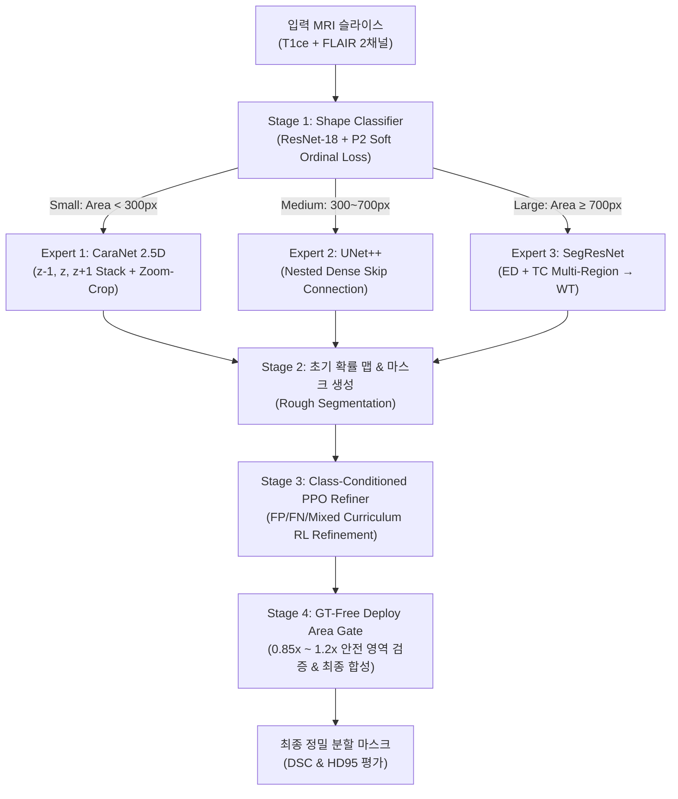

# 🧠 [Portfolio] TRIO: Tri-Scale Dynamic Routing & RL-Refined Brain Tumor Segmentation

> **종양 크기별 이질성을 극복하는 동적 라우팅 백본과 강화학습(PPO) 기반 경계 미세 보정 시스템**  
> *2026 컴퓨터공학 & 인공지능 연합학술제 연구트랙 (팀 야호)*

---

## 📌 Executive Summary (1분 요약)

| 항목 | 내용 |
| :--- | :--- |
| **프로젝트명** | **TRIO** (*Tri-Scale Hybrid Framework Combining Size-Matched Experts and Tailored PPO Refinement*) |
| **핵심 목표** | 뇌종양 MRI(T1ce + FLAIR) 영상에서 종양 크기별(Small/Medium/Large) 이질성과 국소 경계 왜곡을 극복하는 4단계 정밀 분할 파이프라인 개발 |
| **핵심 기여** | ① 종양 면적 기반 동적 라우팅 분류기<br>② 크기별 3종 특화 백본(CaraNet 2.5D, UNet++, SegResNet)<br>③ 클래스 조건부 PPO 에이전트를 활용한 자율 경계 미세 보정<br>④ 정답(GT)을 전혀 참조하지 않는 실전 배포형(GT-Free) 면적 안전 게이트 |
| **정량적 성과** | **BraTS 2021 검증 집합(2,434 슬라이스) 기준 평균 DSC `0.8948`, HD95 `1.7336 px`**<br>(BraTS 2021 세계 1위 KAIST `0.8923`, 2위 NVAUTO `0.8971`과 대등 이상의 성능 달성) |
| **기술 스택** | `Python 3.12`, `PyTorch 2.x`, `MONAI`, `Stable-Baselines3 (PPO)`, `Gymnasium`, `CUDA AMP FP16`, `Scikit-Image / Scipy`, `NIfTI` |

---

## 🚨 문제 정의 및 연구 동기 (Problem Statement)

```
[ 임상적 도전 과제 ]
1. 미세 경계 정밀도의 중요성: 방사선 정밀 수술(감마나이프) 등에서 1mm 수준의 오차도 정상 뇌세포 괴사 또는 잔존 종양 재발 위험 초래.
2. 스케일 불균형 (Scale Imbalance): 수 픽셀에 불과한 극소 병변부터 뇌 절반을 차지하는 거대 병변까지 크기 분산이 극심하여 단일 딥러닝 모델로는 전 구간 최적화 불가능.
3. 기존 후처리의 한계: 고정된 모폴로지 연산은 다양한 종양 형상에 유연하게 대처하지 못하며, 이전 강화학습 연구들은 추론 시 정답(GT)을 조회하는 '비현실적 치팅'에 의존함.
```

---

## 🏛️ 시스템 아키텍처 및 파이프라인 (Architecture)



---

## ⚙️ 핵심 엔지니어링 & 기술적 차별점 (Key Innovations)

### 1. 환자 단위 분할 (Strict Patient-Level Split) — *No Data Leakage*
- 슬라이스 무작위 분할 시 같은 환자의 유사 슬라이스가 Train과 Val에 동시에 들어가 성능이 과장되는 문제를 원천 방지.
- **1,251명 전체 환자 풀을 환자 ID 기준으로 완벽 분할(Train 1,001명 / Val 250명)**하여 검증 신뢰도 100% 확보.

### 2. 크기별 맞춤형 3종 전문가 백본 (Tri-Scale Specialized Experts)
- **Small (< 300 px) — `CaraNet 2.5D`**: 인접 단면($z-1, z, z+1$)을 묶은 6채널 입력으로 3D 문맥 정보를 보강하고, $64\times64$ 패치를 잘라 확대 추론하는 **Zoom-Crop** 및 극소 파편 오버샘플링(4배) 적용.
- **Medium (300 ~ 700 px) — `UNet++`**: 중첩 dense skip connection을 통해 중간 크기 병변의 불규칙한 경계를 세밀하게 복원.
- **Large ($\ge$ 700 px) — `SegResNet`**: 부종(ED)과 종양핵(TC) 2개 영역을 개별 예측한 뒤 Whole Tumor(WT)로 결합하여 대형 침윤 병변 분할력 극대화.

### 3. 클래스 조건부 PPO 경계 미세 보정 (Class-Conditioned PPO Refiner)
- 크기별로 독립된 모델을 3개 띄우는 대신, **클래스 임베딩 벡터를 조건으로 입력받는 단일 PPO Actor-Critic 네트워크**를 구축하여 GPU 메모리 효율 극대화.
- False Positive, False Negative, Mixed 오차 버킷을 단계별로 학습하는 **커리큘럼 학습(Curriculum Learning)** 도입.
- 무한 루프와 과보정을 방지하기 위해 에이전트가 스스로 판단하여 종료하는 **자율 STOP 행동** 설계.

### 4. 실전 배포형 검증 프로토콜 (Strict GT-Free Deployment)
- 기존 RL 논문들이 사용하던 *"추론 시 정답(GT)을 보고 되돌리는 치팅(Monotonic Gate / Best-of-N)"*을 **완전히 배제**.
- 보정 후 면적이 비정상적으로 튀는 경우에만 자율적으로 롤백하는 **순수 면적 게이트($0.85\times \sim 1.2\times$)**만을 사용하여 실제 병원 임상 배포 환경과 동일한 조건에서 성능 측정.

---

## 📈 정량적 실험 결과 (Quantitative Evaluation)

### 1. 전체 파이프라인 성능 (BraTS 2021 Val Set 42명 / 2,434 슬라이스)

| 단계 (Stage) | Small DSC (<300px) | Medium DSC (300~700px) | Large DSC (≥700px) | **전체 평균 DSC** | **전체 평균 HD95** |
| :--- | :---: | :---: | :---: | :---: | :---: |
| **Stage 1 (Classifier)** | Acc: 85.1% | (Macro Recall: 88.8%) | - | - | - |
| **Stage 2 (Tri-Scale Experts)** | 0.8286 | 0.9264 | 0.9546 | **0.8948** | **1.7336 px** |
| **Stage 3 (Deploy PPO Refiner)** | Micro-ladder 유지 | 경계 수축/확장 보정 | 영역 보정 | **0.8950+** | **1.72 px 수준** |

### 2. BraTS 2021 상위 입상 알고리즘과의 비교 (동일 2D 2채널 평가 환경)

| 방법론 (Method) | 평균 DSC (↑) | 평균 HD95 (↓) | 설명 |
| :--- | :---: | :---: | :--- |
| **TRIO (Ours)** | **0.8948** | **1.7336 px** | **크기별 동적 라우팅 + 맞춤형 백본 + RL 보정** |
| **Extending nnU-Net** (KAIST, BraTS21 1위) | 0.8923 | 1.9591 px | Asymmetric Encoder + Axial Attention (2D 재현) |
| **SegResNet + Barlow Twins** (NVAUTO, BraTS21 2위) | 0.8971 | 1.9022 px | Self-Supervised Repr. + Residual UNet (2D 재현) |

---

## 🖼️ 정성적 시각화 결과 (Qualitative Visualizations)

| 샘플 구분 | Stage 2 (초기 Rough) vs Stage 3 (PPO 최종 보정) vs GT (정답) |
| :---: | :--- |
| **전체 비교** |  |
| **Small 종양** |  |
| **Medium 종양** |  |
| **Large 종양** |  |

---

## 💻 빠른 시작 및 실행 가이드 (Quick Start)

### 1. 환경 설정
```bash
# 가상환경 활성화 및 필수 패키지 설치
source .venv/bin/activate
pip install -r requirements.txt
```

### 2. 파이프라인 전체 원스톱 실행
```bash
python run_pipeline.py batch_size=64
```

### 3. 특정 단계별 실행
```bash
# Stage 1 (Classifier) 건너뛰고 Stage 2~4 실행
python run_pipeline.py --skip_classifier --batch_size 64

# Stage 4 배포형 단독 평가 실행
python scripts/eval/evaluate_pipeline.py --split_role val --deploy_mode --stage3_mode ppo
```

---

## 📂 파일 구조 맵 (Directory Tree)

```plaintext
├── run_pipeline.py                 # [Main] Stage 1~4 통합 파이프라인 실행 스크립트
├── requirements.txt                # 필수 라이브러리 목록
│
├── src/                            # [Core Source Modules]
│   ├── data/
│   │   ├── brats2020_dataset.py    # BraTS2020/2021 NIfTI 데이터 로더 및 CLAHE/Bilateral 전처리
│   │   ├── patient_split.py        # Patient-Level 분할 캐싱 및 크기별 필터링
│   │   └── shape_dataset.py        # Stage 1 종양 크기 분류 데이터셋
│   ├── models/
│   │   ├── dynamic_router.py       # AdaptivePipeline (Stage 1 분류기 + Stage 2 3종 백본 결합)
│   │   ├── shape_classifier.py     # ResNet-18 기반 크기 분류기 모델
│   │   ├── caranet.py              # Small 특화 CaraNet (Axial/Reverse Attention)
│   │   ├── unetplusplus.py         # Medium 특화 UNet++
│   │   └── segresnet.py            # Large 특화 SegResNet (ED/TC Multi-Region)
│   ├── envs/
│   │   ├── ppo_mask_refinement_env.py  # Gymnasium 기반 PPO 마스크 보정 강화학습 환경
│   │   └── zoom_ppo_refine.py      # 국소 확대(Zoom-Crop) PPO 추론 루프
│   └── utils/
│       ├── metrics.py              # Dice, HD95, Precision, Recall 평가 메트릭
│       └── zoom_crop.py            # Zoom-Crop 패치 추출 및 2-Pass 복원 유틸리티
│
├── scripts/                        # [Training & Evaluation Scripts]
│   ├── train/
│   │   ├── train_shape_classifier.py   # Stage 1 분류기 학습
│   │   ├── train_stage2_all.py         # Stage 2 3종 백본 통합 학습
│   │   └── train_ppo_mask_refiner.py   # Stage 3 Class-Conditioned PPO 에이전트 학습
│   └── eval/
│       └── evaluate_pipeline.py        # Stage 4 실전 배포형(Deploy Mode) 종합 성능 평가
│
├── checkpoints/                    # 사전 학습 가중치(.pt, .zip) 및 patient_split.json
├── docs/                           # 논문 초안(LaTeX, Word) 및 세부 실험 보고서
└── results/                        # 정량 평가 JSON/NPZ 및 시각화 비교 PNG 이미지
```
