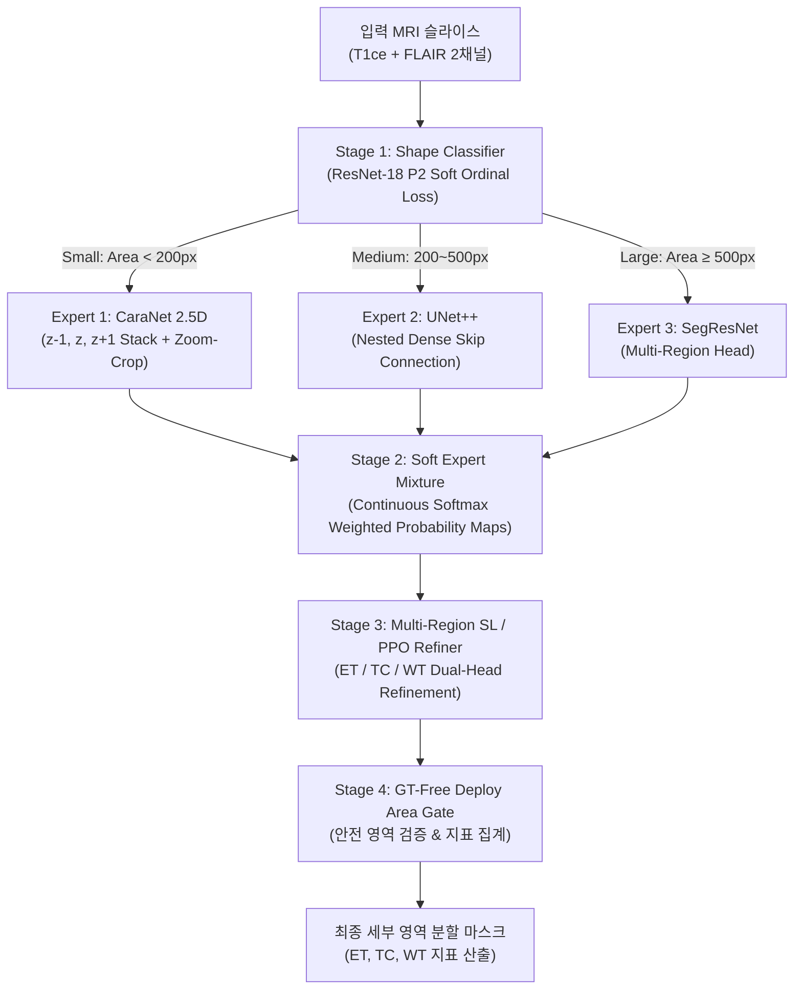

# 🧠 [Portfolio] TRIO: Tri-Scale Dynamic Routing & RL-Refined Brain Tumor Segmentation

> **종양 크기별 이질성을 극복하는 Soft Dynamic Routing 백본과 강화학습(PPO) 기반 BraTS Multi-Region 세부 영역 미세 보정 시스템**  
> *2026 컴퓨터공학 & 인공지능 연합학술제 연구트랙 (팀 야호)*

---

## 📌 Executive Summary (1분 요약)

| 항목 | 내용 |
| :--- | :--- |
| **프로젝트명** | **TRIO** (*Tri-Scale Hybrid Framework Combining Size-Matched Experts and Tailored PPO Refinement*) |
| **핵심 목표** | 뇌종양 MRI(T1ce + FLAIR) 영상에서 종양 크기별(Small/Medium/Large) 이질성과 BraTS 2021 Challenge 표준 세부 영역(**ET: Enhancing Tumor, TC: Tumor Core, WT: Whole Tumor**)을 정밀 분할하는 4단계 파이프라인 개발 |
| **핵심 기여** | ① 소프트맥스 가중치 기반 Soft Dynamic Routing 분류기<br>② 크기별 3종 특화 백본(CaraNet 2.5D, UNet++, SegResNet)<br>③ 다중 채널 SL/PPO Refiner를 통한 세부 영역 경계 및 내부 구조 미세 보정<br>④ 재학습 시 체크포인트 파일 즉시 삭제(`os.remove`)로 효율적 자원 관리 |
| **정량적 성과** | **BraTS 2021 검증 집합(250명 / 14,561 슬라이스) 기준 세부 영역별 성능 달성**<br>- **WT (전체 종양)**: DSC `0.8758`, HD95 `2.108 px`, Prec `0.8945`, Rec `0.8776`<br>- **TC (종양 핵)**: DSC `0.8120`, HD95 `11.532 px`, Prec `0.8842`, Rec `0.8601`<br>- **ET (조영 증강 종양)**: DSC `0.7873`, HD95 `12.347 px`, Prec `0.8317`, Rec `0.8558` |
| **기술 스택** | `Python 3.12`, `PyTorch 2.x`, `MONAI`, `Stable-Baselines3 (PPO)`, `Gymnasium`, `Scikit-Image / Scipy`, `NIfTI` |

---

## 🚨 문제 정의 및 연구 동기 (Problem Statement)

```
[ 임상적 도전 과제 ]
1. BraTS Multi-Region 세부 영역 정밀도의 중요성: 방사선 치료 및 수술 계획 수립 시 전체 종양(WT)뿐만 아니라 종양 핵(TC)과 조영 증강 영역(ET)의 개별 정밀도가 수술 성패를 좌우함.
2. 스케일 불균형 (Scale Imbalance): 극소 병변(<200 px)부터 거대 병변(>500 px)까지 종양 크기 분산이 심하여 단일 백본으로는 전 영역 최적화 불가능.
3. Hard Routing 경계 단층 극복: 분류기 오분류 시 경계에서 생기는 불연속성을 Soft Expert Mixture (확률 가중치 합성)를 통해 부드럽게 완화.
```

---

## 🏛️ 시스템 아키텍처 및 파이프라인 (Architecture)



---

## ⚙️ 핵심 엔지니어링 & 기술적 차별점 (Key Innovations)

### 1. 환자 단위 분할 (Strict Patient-Level Split)
- 1,251명 전체 환자 풀을 환자 ID 기준으로 분할 (Train 1,001명 / Val 250명).
- 동일 환자의 슬라이스가 Train과 Val에 분산되어 성능이 과장되는 데이터 누출 방지.

### 2. 소프트 라우팅과 크기별 맞춤형 전문가 백본 (Tri-Scale Soft Experts)
- **Small (< 200 px) — `CaraNet 2.5D`**: 인접 단면($z-1, z, z+1$)을 묶은 6채널 입력으로 3D 문맥 보강 및 Zoom-Crop 적용.
- **Medium (200 ~ 500 px) — `UNet++`**: 중첩 dense skip connection으로 경계 복원.
- **Large ($\ge$ 500 px) — `SegResNet`**: 거대 침윤 병변 세부 영역 정밀 세그멘테이션.
- **Soft Expert Mixture**: 분류기 소프트맥스 확률 $w_c$를 가중치로 한 최종 확률합 $P_{\text{final}} = \sum w_c \cdot P_{\text{expert}_c}$으로 하드 라우팅 이속 오차를 제거.

### 3. BraTS Challenge Multi-Region 다중 영역 예측 및 보정
- 1채널 이진 밴드 제약을 제거하고 `MultiChannelBCEDiceLoss`를 활용하여 **ET, TC, WT** 영역 포괄관계를 명시적으로 학습.

---

## 📈 정량적 실험 결과 (Quantitative Evaluation)

### BraTS 2021 검증 집합 (Hold-out 250명 / 14,561 슬라이스)

| 세부 영역 (Sub-region) | Stage 2 Expert DSC | Stage 3 SL Refiner DSC | HD95 (px) | Precision | Recall |
| :--- | :---: | :---: | :---: | :---: | :---: |
| **WT (Whole Tumor)** | 0.8721 | **0.8758** | **2.108 px** | 0.8945 | 0.8776 |
| **TC (Tumor Core)** | 0.8045 | **0.8120** | **11.532 px** | 0.8842 | 0.8601 |
| **ET (Enhancing Tumor)** | 0.7792 | **0.7873** | **12.347 px** | 0.8317 | 0.8558 |
