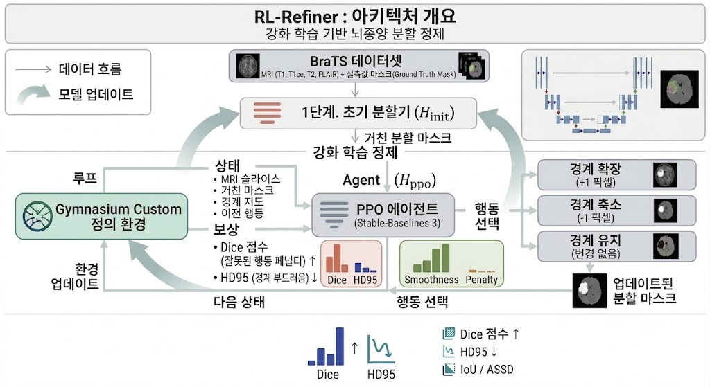

# 컴공&인지 연합학술제 연구트랙 주제

# RL-Refiner
> **강화학습(RL)을 활용한 뇌종양 의료 영상 분할(Segmentation) 경계선 자동 보정 시스템**

딥러닝 모델이 생성한 뇌종양 분할 마스크의 미세한 경계 오차(Artifact)를 강화학습 에이전트가 능동적으로 보정하여 정밀도를 극대화하는 프로젝트입니다.

---

## 🏗️ Overall Architecture

<p align="center">
  
</p>

<p align="center">
<b>Figure 1.</b> Overall architecture of RL-Refiner.
A lightweight U-Net first predicts a coarse tumor segmentation mask.
A PPO agent then iteratively refines the tumor boundary through three actions (Expand, Shrink, Keep) in a Gymnasium environment.
The refined mask is finally evaluated using Dice, HD95, IoU, and ASSD metrics.
</p>

---

## 💡 프로젝트 배경 및 필요성

의료 영상 분할에서 U-Net과 같은 딥러닝 모델은 종양의 대략적인 위치는 잘 파악하지만, 종양의 미세한 경계면에서 울퉁불퉁한 오차를 자주 발생시킵니다.

- **정밀도의 중요성:** 방사선 수술(감마나이프 등)과 같이 정밀 타겟팅이 필요한 분야에서는 1mm의 오차도 매우 치명적일 수 있습니다.
- **비용 문제:** 이를 보정하기 위해 전문의가 수작업으로 마스크를 수정하는 과정은 막대한 시간과 비용을 소모합니다.
- **해결책:** 딥러닝의 초기 출력물(Rough Mask)을 강화학습 에이전트가 픽셀 단위로 미세 조정하는 **Human-in-the-loop 기반 자동 보정 시스템**을 제안합니다.

---

## 🎯 주요 목표 및 성능 지표

- **최종 목표**
  - 초기 마스크를 입력받아 정답(Ground Truth)과의 일치도를 최대화하도록 경계선을 수정하는 RL 에이전트 개발

- **평가지표**
  - Dice Similarity Coefficient (DSC)
  - HD95 (95% Hausdorff Distance)
  - IoU
  - ASSD

---

## ⚙️ Pipeline

| Step | Description |
|------|-------------|
| **1** | Train a lightweight 2D U-Net on the BraTS dataset to generate an initial segmentation mask. |
| **2** | Build a custom Gymnasium environment where the state consists of MRI images and masks, and the actions are Expand, Shrink, or Keep. |
| **3** | Train a PPO agent using Stable-Baselines3 with reward functions based on Dice score, HD95, boundary smoothness, and penalties. |
| **4** | Compare the refined masks with Ground Truth and evaluate against traditional post-processing methods. |

---

## 🛠 Tech Stack

- Python
- PyTorch
- MONAI
- Gymnasium
- Stable-Baselines3
- BraTS Dataset

---

## 🚀 Expected Contributions

- Pixel-level boundary refinement using reinforcement learning.
- Automatic correction of segmentation artifacts.
- Reduced manual annotation effort in clinical workflows.
- Improved segmentation quality for radiotherapy planning.

---

## 📂 Project Structure

```text
RL-Refiner/
│
├── images/
│   └── architecture.png
├── configs/
├── datasets/
├── models/
├── environments/
├── agents/
├── utils/
├── train_unet.py
├── train_agent.py
├── evaluate.py
├── requirements.txt
└── README.md
```

---

## 📦 Getting Started

```bash
git clone https://github.com/aninsung/2026-summer-Interdepartmental-Academic-Conference.git

cd 2026-summer-Interdepartmental-Academic-Conference

pip install -r requirements.txt

# 전체 파이프라인 실행 예시 (U-Net 학습 -> Agent 학습 -> 평가)
python run_pipeline.py

# 특정 단계를 건너뛰고 싶을 때 (예: U-Net 학습 건너뛰기)
python run_pipeline.py --skip_unet

# 개별 단계 실행 (Agent 학습)
python train_agent.py --config configs/ppo_brats.yaml

# 평가
python evaluate.py --agent_path checkpoints/best_model --unet_path checkpoints/unet_best.pt
```
