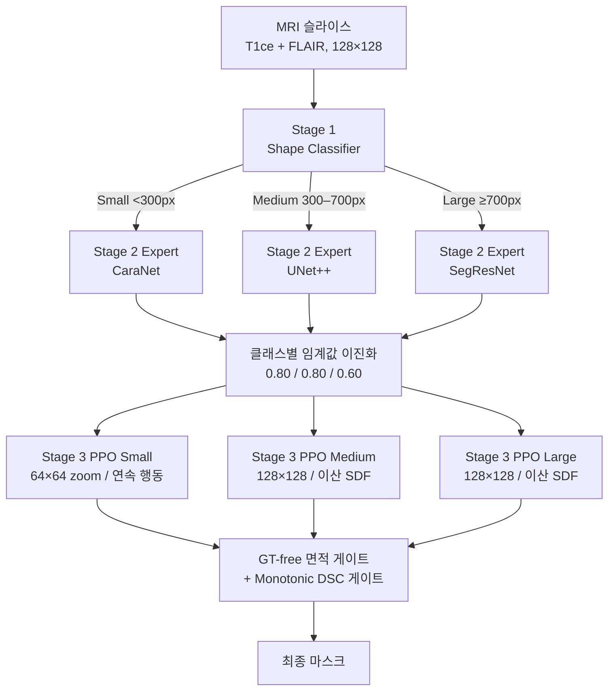
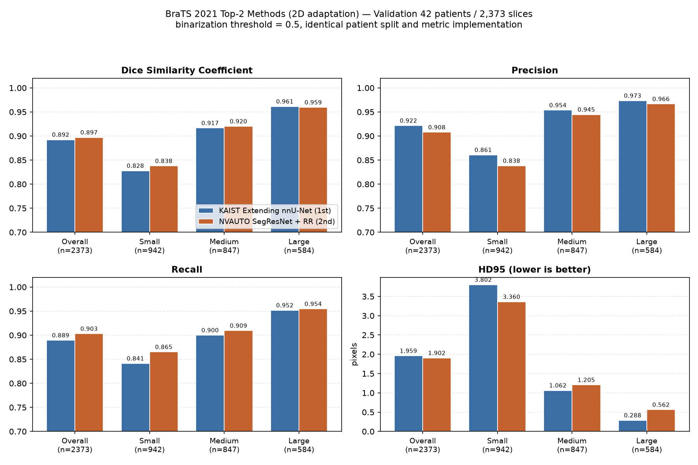
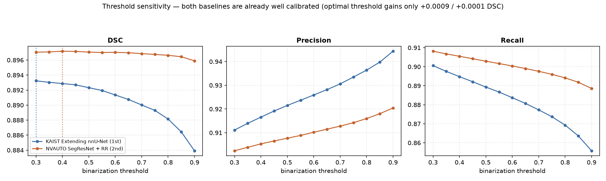

# RL-Refiner

2026 컴공&인지 연합학술제 연구트랙

**강화학습 기반 뇌종양 MRI 분할 경계 보정 시스템**

딥러닝 모델이 만든 초기 분할(Rough Mask)의 경계 오차를, 종양 크기별 전용 PPO 에이전트가 순차적으로 보정합니다.

---

## 한눈에 보는 최종 결과 (2026-08-19)

`t1ce+flair` 2채널, BraTS 2021 환자 210명 중 **val 42명(2,373 슬라이스) hold-out** 평가입니다. 라우팅은 Stage 1 분류기 예측을 쓰고(Oracle 아님), Monotonic DSC 게이트(초기 DSC ≤ 최종 DSC)를 적용했습니다.

| 단계 | 산출 | 수치 |
|---|---|---|
| Stage 1 Shape Classifier | Best Val Acc | **0.8512** (ImageNet 사전학습) |
| Stage 2 Expert 3종 | val 초기 DSC (Small/Medium/Large) | **0.7753** / **0.9223** / **0.9316** |
| Stage 3 PPO 3종 | 학습 스텝 | 303,104 each |

| 지표 | Stage 2 (초기 분할) | Stage 3 (PPO 보정) | 변화 |
|---|---:|---:|---:|
| **평균 DSC** | 0.8672 | **0.8752** | **+0.80%p** |
| **평균 HD95** | 2.3365 px | **2.2897 px** | **−0.047 px** |

| 크기 클래스 | Expert | n | 초기 DSC → 최종 DSC | 초기 HD95 → 최종 HD95 |
|---|---|---:|---:|---:|
| Small (`<300px`) | CaraNet | 922 | 0.7753 → **0.7892** | 4.4593 → **4.4459 px** |
| Medium (`300–700px`) | UNet++ | 935 | 0.9223 → **0.9270** | 1.0764 → **1.0170 px** |
| Large (`≥700px`) | SegResNet | 516 | 0.9316 → **0.9347** | 0.8271 → **0.7432 px** |

### 대회 상위 입상 방법과의 비교

같은 42명 val 환자, 같은 지표 구현으로 측정했습니다.

| 방법 | DSC | HD95 (px) | Precision | Recall |
|---|---:|---:|---:|---:|
| 본 파이프라인 Stage 2 (게이트 없음) | 0.8672 | 2.3365 | — | — |
| 본 파이프라인 Stage 3 (Monotonic DSC 게이트) | 0.8752 | 2.2897 | — | — |
| Extending nnU-Net (KAIST, BraTS21 1위) | 0.8923 | 1.9591 | 0.9215 | 0.8893 |
| SegResNet + 중복 감소 (NVAUTO, BraTS21 2위) | **0.8971** | **1.9022** | 0.9077 | 0.9029 |

**현재 파이프라인은 두 베이스라인보다 낮습니다.** 크기별로는 Medium(0.9270 vs 0.9165 / 0.9200)만 앞서고, Large에서 −0.027로 가장 크게 뒤집니다. 두 베이스라인은 3D·4모달리티·앙상블을 제외한 2D 각색 구현이므로 대회 리더보드 점수와 직접 비교할 수 없습니다 → [베이스라인 상세](baselines/README.md).

> **Monotonic DSC 게이트는 GT를 봅니다.** 보정 후 DSC가 초기보다 낮으면 Stage 2 마스크로 되돌리므로, 최종 DSC는 배포 성능이 아니라 **상한**입니다. 이번 실행에서 2,373장 중 858장(36.2%)이 되돌려졌습니다. GT 없이 측정되는 값은 Stage 2 초기 DSC입니다.

파이프라인 단계·입출력·학습/평가 차이는 [파이프라인 상세](docs/PIPELINE.md), 학습 로그와 실험 이력은 [실험 결과 보고서](docs/EXPERIMENT_RESULTS.md)에 있습니다.

---

## 배경

의료 영상 분할에서 CNN은 종양의 대략적인 위치는 잘 잡지만, 경계에서는 1픽셀 수준의 오차가 남습니다. 감마나이프 같은 정밀 방사선 치료에서는 이 오차가 치료 범위에 영향을 줄 수 있고, 의료진이 모든 슬라이스를 수동으로 고치는 비용도 큽니다.

이 프로젝트는 그 후처리를 **크기별 전문가 분할 모델 + PPO 경계 보정기**로 자동화합니다.

평가 지표는 겹침 비율 **DSC**(높을수록 좋음), 경계 거리 **HD95**(낮을수록 좋음), 그리고 과분할/과소분할을 구분하는 **Precision / Recall**입니다.

---

## 파이프라인


```mermaid
flowchart TD
    A["MRI 슬라이스<br/>T1ce + FLAIR, 128×128"] --> B["Stage 1<br/>Shape Classifier"]
    B -->|Small &lt;300px| C["Stage 2 Expert<br/>CaraNet"]
    B -->|Medium 300–700px| D["Stage 2 Expert<br/>UNet++"]
    B -->|Large ≥700px| E["Stage 2 Expert<br/>SegResNet"]
    C --> T["클래스별 임계값 이진화<br/>0.80 / 0.80 / 0.60"]
    D --> T
    E --> T
    T --> F["Stage 3 PPO Small<br/>64×64 zoom / 연속 행동"]
    T --> G["Stage 3 PPO Medium<br/>128×128 / 이산 SDF"]
    T --> H["Stage 3 PPO Large<br/>128×128 / 이산 SDF"]
    F --> I["GT-free 면적 게이트<br/>+ Monotonic DSC 게이트"]
    G --> I
    H --> I
    I --> J["최종 마스크"]
```

| 단계 | 역할 | 산출물 |
|:---:|---|---|
| **1** | 종양 면적으로 Small / Medium / Large 분류 | `shape_classifier_best.pt` |
| **2** | 클래스별 Expert가 확률 맵 생성 → 클래스별 임계값으로 이진화 | `caranet_best.pt`, `unetplusplus_best.pt`, `segresnet_best.pt` |
| **3** | 클래스별 PPO가 8방위 경계를 SDF로 미세 조정 | `ppo_small.zip`, `ppo_medium.zip`, `ppo_large.zip` |
| **4** | DSC / HD95 / Precision / Recall 평가 및 시각화 | `results/pipeline_sample_*.png` |

Stage 3의 크기별 동작 차이:

- **Small**: 종양 중심 64×64 crop, 4채널(영상·마스크·확률·에지), 연속 행동 `[-2, 2]⁸`
- **Medium / Large**: 전체 128×128, 3채널(영상·마스크·확률), 이산 5단계×8섹터. Large는 보상에서 HD95 가중치를 더 크게 둠

관측에는 GT가 들어가지 않습니다. GT는 학습 시 보상 계산과 평가 시 게이트·지표에만 쓰입니다.

단계별 데이터 흐름, SDF 보정, 임계값 조정, 평가 게이트, 학습 vs 추론 차이는 [파이프라인 상세](docs/PIPELINE.md)를 봅니다.

---

## 데이터 분할

환자 단위로 나눕니다. 같은 환자의 인접 슬라이스가 train과 val에 동시에 들어가는 누출이 없습니다.

| 역할 | 환자 | 슬라이스 | Small | Medium | Large |
|---|---:|---:|---:|---:|---:|
| train | 168 | 9,868 | 3,561 | 4,184 | 2,123 |
| val | 42 | 2,373 | 942 | 847 | 584 |

분할 파일 `checkpoints/patient_split.json`(seed 42)을 Stage 1–4와 베이스라인이 모두 공유합니다.

---

## 시각화

클래스마다 Rough DSC와 RL Refined DSC 차이가 큰 원본 2장씩, 총 6장입니다. 초록=GT, 빨강=Stage 2 Rough, 하늘색=Stage 3 RL. 개선폭이 가장 큰 표본이므로 평균을 대표하지 않습니다.


| Small | Medium | Large |
|---|---|---|
|  |  |  |
|  |  |  |

베이스라인 비교 그림은 `baselines/results/`에 있습니다.

| 크기별 성능 | 임계값 스윕 |
|---|---|
|  |  |

---

## 기술 스택

| 분야 | 사용 기술 |
|------|----------|
| Deep Learning | PyTorch, MONAI |
| Reinforcement Learning | Gymnasium, Stable-Baselines3 (PPO) |
| Dataset | BraTS 2021 (`t1ce+flair`, 128×128 2D 슬라이스) |
| Language | Python |

---

## 프로젝트 구조

```
├── run_pipeline.py                 # Stage 1–4 원스톱 실행 (시드·결정적 모드 전파)
├── configs/ppo_brats.yaml          # PPO 하이퍼파라미터
├── scripts/train/                  # 분류기 · Expert · PPO 학습
├── scripts/eval/                   # 파이프라인 / 단일 모델 평가, 임계값 스윕
├── src/data/                       # BraTS 로더, 환자 단위 분할, 크기 레이블
├── src/envs/                       # MaskRefinementEnv (크기별 PPO 환경)
├── src/models/                     # Classifier, Experts, AdaptivePipeline
├── src/utils/                      # 지표(DSC/HD95/P/R), 게이트, 시드
├── baselines/                      # BraTS21 1·2위 방법 2D 각색 비교 실험
├── checkpoints/                    # 학습된 가중치 + patient_split.json
├── results/                        # 평가 시각화
├── docs/PIPELINE.md                # 파이프라인 상세
├── docs/EXPERIMENT_RESULTS.md      # 실험 결과 통합본
└── docs/paper_draft_ko.md          # 논문 초안
```

---

## Getting Started

### 1. 환경 설치

```bash
git clone https://github.com/aninsung/2026-summer-Interdepartmental-Academic-Conference.git
cd 2026-summer-Interdepartmental-Academic-Conference
pip install -r requirements.txt
```

BraTS 2021 데이터는 `src/data/archive`에 둡니다.

### 2. 실행

```bash
python run_pipeline.py batch_size=64
```

`key=value` 형태를 `--key value`로 자동 변환하므로 `--batch_size 64`와 같습니다.

**재현성이 기본값입니다.** `--seed 42`와 결정적 모드(cuDNN deterministic)가 켜진 상태로 Stage 1–4에 전파됩니다. 속도를 위해 끄려면 `--no_deterministic`을 씁니다.

주요 옵션:

```bash
# 특정 단계만 건너뛰기
python run_pipeline.py --skip_classifier --skip_experts --skip_agents

# 평가만 직접 실행
python scripts/eval/evaluate_pipeline.py --split_role val

# Stage 2 단독 성능 (PPO·게이트 없음)
python scripts/eval/evaluate_pipeline.py --split_role val --skip_ppo

# 이진화 임계값 스윕 (확률 맵 캐시 → 재학습 불필요)
python scripts/eval/sweep_threshold.py --split_role val --plot results/threshold_sweep.png

# 베이스라인 학습·평가·비교
python baselines/run_comparison.py --epochs 20 --batch_size 32 --sweep
```
