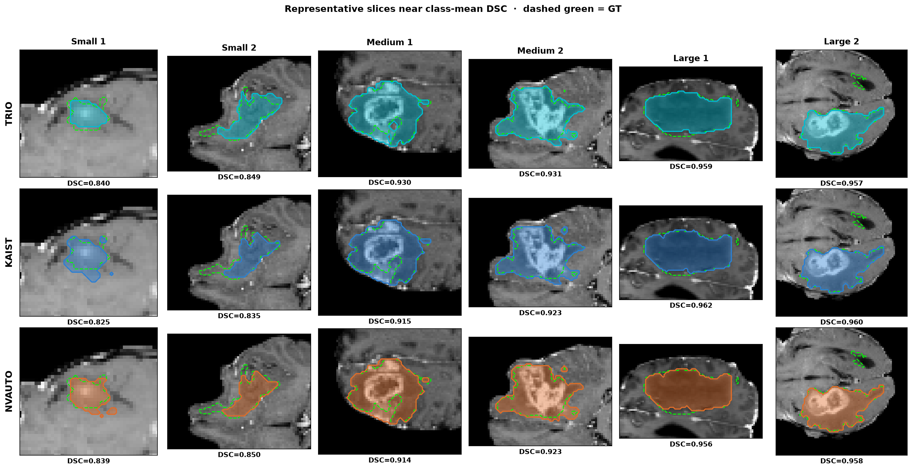

# TRIO (RL-Refiner)

2026 컴공&인지 연합학술제 연구트랙 · 팀 야호

**크기별 전문가 분할 + SL 경계 보정(PPO teacher 증류)으로 뇌종양 MRI 마스크를 다듬는 시스템**

딥러닝이 만든 초기 분할(Rough Mask)의 경계 오차를, 종양 크기에 맞는 Expert와 **SL Refiner**(학습 시 PPO teacher로 증류)가 순서대로 보정합니다. 비교 그림·표에서는 이 파이프라인을 **TRIO**로 표기합니다.

| 검증 집합 | Stage 2 DSC | Stage 3 DSC (배포) | HD95 |
|---|---:|---:|---:|
| BraTS 2021 val 42명 (2,434 슬라이스) | **0.8948** | 재측정 중 (`--deploy_mode`) | Stage2 **1.73 px** |

> 예전 표기 **0.9031**은 단조 DSC 게이트 + best-of-15(GT) 상한이다. 논문·README 메인 숫자로 쓰지 않는다.

---

## 목차

1. [왜 필요한가](#왜-필요한가)
2. [파이프라인](#파이프라인)
3. [주요 결과](#주요-결과)
4. [시작하기](#시작하기)
5. [프로젝트 구조](#프로젝트-구조)
6. [시각화](#시각화)
7. [문서](#문서)

---

## 왜 필요한가

U-Net 계열 모델은 종양의 대략적인 위치는 잘 잡지만, 경계에서는 작은 오차가 남기 쉽습니다.

- **정밀도:** 감마나이프 같은 정밀 방사선 치료에서는 1 mm 수준의 오차도 부담이 됩니다.
- **비용:** 의료진이 모든 경계를 손으로 고치는 과정은 시간과 비용이 큽니다.
- **접근:** 종양 크기를 먼저 나누고, 크기별 전문가 모델과 SL 보정기로 후처리를 자동화합니다.

평가 지표는 겹침 비율 **DSC**(높을수록 좋음), 경계 거리 **HD95**(낮을수록 좋음), 과분할/과소분할을 나누는 **Precision / Recall**입니다.

---

## 파이프라인


| 단계 | 역할 | 산출물 |
|:---:|---|---|
| **1** | 종양 면적으로 Small / Medium / Large 분류 | `shape_classifier_best.pt` |
| **2** | 클래스별 Expert가 확률 맵 생성 → 클래스별 임계값으로 이진화 | `caranet_best.pt`, `unetplusplus_best.pt`, `segresnet_best.pt` |
| **3** | 클래스별 SL Refiner 학습 (PPO teacher 교대 증류). **배포 추론은 SL** | `sl_refiner_*.pt`, `ppo_*.zip`(teacher) |
| **4** | DSC / HD95 / Precision / Recall 평가 (`--deploy_mode`, area gate) | `results/pipeline_sample_*.png` |

크기별 동작:

| 클래스 | 면적 | Expert | Stage3 (배포=SL) |
|---|---|---|---|
| Small | `<300 px` | CaraNet 2.5D (`z-1, z, z+1`) | DualHead SL (+ PPO teacher 학습용) |
| Medium | `300–700 px` | UNet++ | DualHead SL (+ PPO teacher) |
| Large | `≥700 px` | SegResNet (ED/TC → WT) | DualHead SL (+ PPO teacher) |

관측에는 GT가 들어가지 않습니다. GT는 학습 시 손실/보상과 평가 지표에만 씁니다. **Stage3 학습·평가 라우팅은 모두 Stage1 분류기**를 씁니다(Expert도 동일). Stage2 Expert 단독 학습만 GT 면적으로 특화합니다.

데이터는 **환자 단위**로 나눕니다. 같은 환자의 인접 슬라이스가 train과 val에 동시에 들어가지 않습니다. 분할 파일 `checkpoints/patient_split.json`(seed 42)을 Stage 1–4와 베이스라인이 공유합니다.

| 역할 | 환자 | 슬라이스 |
|---|---:|---:|
| train | 168 | 9,868 |
| val (2026-08-20 평가, 분류기 라우팅) | 42 | **2,434** |

단계별 데이터 흐름, SDF 보정, 임계값, 평가 게이트는 [파이프라인 상세](docs/PIPELINE.md)를 봅니다.

---

## 주요 결과

`t1ce+flair` 2채널, BraTS 2021 환자 210명 중 **val 42명(2,434 슬라이스) hold-out**입니다. 라우팅은 Stage 1 분류기 예측을 씁니다(Oracle 아님). Stage 2 임계값은 **0.80 / 0.80 / 0.50**, 연결요소 필터는 **0 / 15 / 25**입니다.

| 단계 | 산출 | 수치 |
|---|---|---|
| Stage 1 Shape Classifier | Best Val Acc | **0.8512** (ImageNet 사전학습) |
| Stage 2 Expert 3종 | val 초기 DSC (S / M / L) | **0.8286** / **0.9264** / **0.9546** |
| Stage 3 | Alternating SL ↔ PPO teacher | `sl_refiner_*.pt` (배포), `ppo_*.zip` (teacher) |

| 지표 | Stage 2 (초기 분할) | Stage 3 (배포 SL, `--deploy_mode`) |
|---|---:|---:|
| **평균 DSC** | **0.8948** | `--deploy_mode` 재측정 |
| **평균 HD95** | **1.7336 px** | `--deploy_mode` 재측정 |

크기별 Stage 2 Init: Small 0.8286 / Medium 0.9264 / Large 0.9546.  
과거 Stage 3 Final(0.9031 등)은 GT 단조 게이트·best-of-15 상한이라 메인 표에서 제외한다.

### 대회 상위 입상 방법과의 비교

같은 42명 val 환자에서 측정했습니다. 베이스라인은 당시 2,373 슬라이스, TRIO는 2,434 슬라이스라 장 수가 완전히 같지는 않습니다.

| 방법 | DSC | HD95 (px) |
|---|---:|---:|
| **TRIO Stage 2** | **0.8948** | **1.7336** |
| Extending nnU-Net (KAIST, BraTS21 1위) | 0.8923 | 1.9591 |
| SegResNet + 중복 감소 (NVAUTO, BraTS21 2위) | 0.8971 | 1.9022 |

Stage 2(0.8948)는 KAIST(0.8923)를 넘고 NVAUTO(0.8971)에 근접합니다.

> **배포 안전 장치.** 면적 게이트(**0.85×–1.2×**, GT 불필요)만 사용한다. Medium/Large는 shrink band + zoom delete. 단조 DSC 게이트·best-of-15는 쓰지 않는다. Stage3 배포 경로는 **SL Refiner**이다.
>
> 두 베이스라인은 3D·4모달리티·앙상블을 제외한 **2D 각색**이므로 대회 리더보드 점수와 직접 비교할 수 없습니다. 상세는 [베이스라인 README](baselines/README.md)를 봅니다.

학습 로그와 실험 이력은 [실험 결과 보고서](docs/EXPERIMENT_RESULTS.md)에 있습니다.

---

## 시작하기

### 1. 환경 설치

```bash
git clone https://github.com/aninsung/2026-summer-Interdepartmental-Academic-Conference.git
cd 2026-summer-Interdepartmental-Academic-Conference
pip install -r requirements.txt
```

BraTS 2021 데이터는 `src/data/archive`에 둡니다.

사용 기술: PyTorch, MONAI, Gymnasium, Stable-Baselines3 (PPO). 입력은 BraTS 2021 `t1ce+flair`, 128×128 2D 슬라이스입니다.

### 2. 실행

```bash
python run_pipeline.py batch_size=64
```

`key=value`는 `--key value`와 같습니다. 재현성이 기본값이며 `--seed 42`와 결정적 모드가 Stage 1–4에 전파됩니다. 속도를 위해 끄려면 `--no_deterministic`을 씁니다.

```bash
# 특정 단계만 건너뛰기
python run_pipeline.py --skip_classifier --skip_experts --skip_agents

# 평가만 (배포 프로토콜: SL refiner + 면적 게이트, 단조 게이트 없음)
python scripts/eval/evaluate_pipeline.py --split_role val --deploy_mode --stage3_mode sl

# Stage 2 단독 (Stage3·게이트 없음)
python scripts/eval/evaluate_pipeline.py --split_role val --stage3_mode skip

# 이진화 임계값 스윕 (확률 맵 캐시 → 재학습 불필요)
python scripts/eval/sweep_threshold.py --split_role val --plot results/threshold_sweep.png

# 베이스라인 학습·평가·비교
python baselines/run_comparison.py --epochs 20 --batch_size 32 --sweep

# TRIO / KAIST / NVAUTO 같은 슬라이스 비교 그리드
python scripts/eval/plot_three_method_grid.py --indices 113,2286,1121,2295,95,1480 --out results/method_comparison_3x6.png
```

---

## 프로젝트 구조

```
├── run_pipeline.py                 # Stage 1–4 원스톱 실행
├── configs/ppo_brats.yaml          # (legacy) PPO 하이퍼파라미터
├── scripts/train/                  # 분류기 · Expert · Stage3 SL/PPO 교대
├── scripts/eval/                   # 배포 평가, 임계값 스윕, 비교 그리드
├── src/data/                       # BraTS 로더, 환자 단위 분할
├── src/envs/                       # MaskRefinementEnv (PPO teacher 환경)
├── src/models/                     # Classifier, Experts, SL Refiner, AdaptivePipeline
├── src/utils/                      # DSC/HD95, 게이트, zoom-crop, 시드
├── baselines/                      # BraTS21 1·2위 방법의 2D 각색 비교
├── ppo/                            # 단일 백본 + PPO ablation (t1ce)
├── checkpoints/                    # 학습된 가중치 + patient_split.json
├── results/                        # TRIO 평가 시각화
│   └── legacy_single_backbone/     # 예전 단일 모델 평가 그림
└── docs/                           # 파이프라인 · 실험 · 논문 초안 · 발표 자료
```

---

## 시각화

### TRIO vs KAIST vs NVAUTO

같은 val 슬라이스 6장입니다. 행은 TRIO / KAIST / NVAUTO, 열은 Small 1–2 · Medium 1–2 · Large 1–2입니다. 초록 점선은 GT입니다.



슬라이스 인덱스는 `113, 2286, 1121, 2295, 95, 1480`으로 고정합니다. 그림에 쓰인 베이스라인 가중치는 원본이 없어서 2026-08-20에 같은 분할로 다시 학습한 것입니다. 위 정량 표의 0.8923 / 0.8971은 2026-08-19 `baselines/results/{kaist,nvauto}_metrics.json` 값입니다.

### 파이프라인 Stage 2 → Stage 3

초록=GT, 빨강=Stage 2 Rough, 하늘색=Stage 3 SL. 클래스마다 Final DSC가 평균에 가깝고, Final DSC > Initial DSC인 원본 2장씩을 골랐습니다.


| Small | Medium | Large |
|---|---|---|
|  |  |  |
|  |  |  |

베이스라인 크기별 성능과 임계값 스윕은 `baselines/results/`에 있습니다.

| 크기별 성능 | 임계값 스윕 |
|---|---|
|  |  |

---

## 문서

| 문서 | 내용 |
|---|---|
| [docs/PIPELINE.md](docs/PIPELINE.md) | 단계별 입출력, SDF 보정, 게이트, 학습 vs 추론 |
| [docs/EXPERIMENT_RESULTS.md](docs/EXPERIMENT_RESULTS.md) | 실험 수치와 학습 이력 |
| [docs/paper_draft_ko.md](docs/paper_draft_ko.md) | 논문 초안 |
| [docs/trio_vs_backbone_summary.md](docs/trio_vs_backbone_summary.md) | TRIO vs 단일 백본+PPO ablation |
| [baselines/README.md](baselines/README.md) | KAIST / NVAUTO 2D 각색 비교 |
| [ppo/README.md](ppo/README.md) | 단일 백본 실험 코드·결과 |
