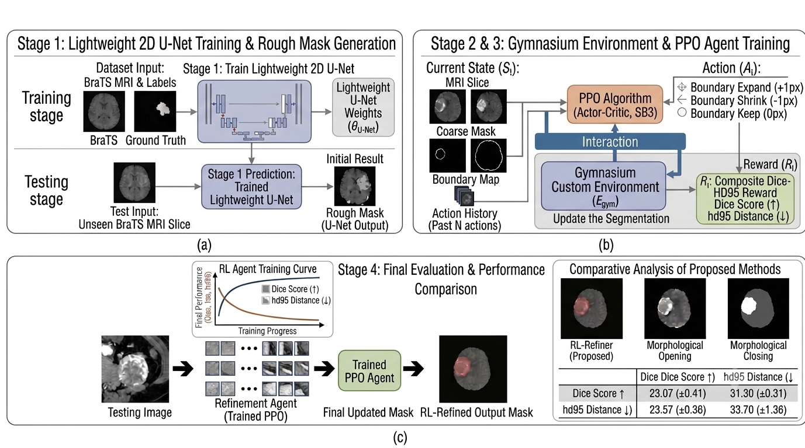

# 컴공&인지 연합학술제 연구트랙 

# RL-Refiner
> **강화학습(RL)을 활용한 뇌종양 의료 영상 분할(Segmentation) 경계선 자동 보정 시스템**

딥러닝 모델이 생성한 뇌종양 분할 마스크의 미세한 경계 오차(Artifact)를 강화학습 에이전트가 능동적으로 보정하여 정밀도를 극대화하는 프로젝트입니다.

---

## 🏗️ Overall Architecture

<p align="center">
  
</p>

<p align="center">
<b>Figure 1.</b> Overall architecture of RL-Refiner.
A baseline segmentation model (U-Net or SegResNet) first predicts a coarse tumor segmentation mask.
A PPO agent then iteratively refines the tumor boundary through action space (Expand, Shrink, Keep) in a Gymnasium environment.
The refined mask is finally evaluated using Dice, HD95, IoU, and ASSD metrics.
</p>

---

## 💡 프로젝트 배경 및 필요성

의료 영상 분할에서 U-Net과 같은 딥러닝 모델은 종양의 대략적인 위치는 잘 파악하지만, 종양의 미세한 경계면에서 울퉁불퉁한 오차를 자주 발생시킵니다.

- **정밀도의 중요성:** 방사선 수술(감마나이프 등)과 같이 정밀 타겟팅이 필요한 분야에서는 1mm의 오차도 매우 치명적일 수 있습니다.
- **비용 문제:** 이를 보정하기 위해 전문의가 수작업으로 마스크를 수정하는 과정은 막대한 시간과 비용을 소모합니다.
- **해결책:** 딥러닝의 초기 출력물(Rough Mask)을 강화학습 에이전트가 픽셀 단위로 미세 조정하는 **Human-in-the-loop 기반 자동 보정 시스템**을 제안합니다.

---

## 🎯 주요 목표 및 성능 지표

- **최종 목표**
  - 초기 마스크를 입력받아 정답(Ground Truth)과의 일치도를 최대화하도록 경계선을 수정하는 RL 에이전트 개발
- **평가지표**
  - Dice Similarity Coefficient (DSC)
  - HD95 (95% Hausdorff Distance)
  - IoU / ASSD

---

## ⚙️ Pipeline

| 단계 | 설명 |
| :---: | :--- |
| **1** | BraTS 데이터셋을 이용해 **U-Net** 또는 **SegResNet**을 학습하고, 초기 뇌종양 분할 마스크(Rough Mask)를 생성한다. |
| **2** | MRI 영상과 초기 분할 마스크를 상태(State)로 사용하는 Gymnasium 기반 커스텀 강화학습 환경을 구축하고, 행동(Action)은 `Discrete(5)` (강수축, 약수축, 유지, 약팽창, 강팽창)로 정의한다. |
| **3** | Stable-Baselines3의 PPO(Proximal Policy Optimization) 알고리즘을 사용하여 에이전트를 학습하며, Dice Score 향상량에 기반한 보상 함수(Reward Function)를 설계하여 경계를 반복 보정한다. |
| **4** | 보정된 최종 분할 마스크를 Ground Truth와 비교하여 성능을 평가하고, Morphological Refinement(형태학적 보정) 및 원본 예측(Rough)과 비교·분석한다. |

---

## 🛠 Tech Stack

- **Deep Learning**: PyTorch, MONAI
- **Reinforcement Learning**: Gymnasium, Stable-Baselines3
- **Dataset**: BraTS2021 Dataset (T1ce modality)
- **Language**: Python

---

## 📊 실험 및 성능 비교 결과

> [!NOTE]
> 자세한 비교 데이터 및 원인 분석은 **[results_summary.md](file:///C:/Users/a3426/.gemini/antigravity-ide/brain/5c6215ce-0e82-4cc9-9ea0-b83ecb717783/results_summary.md)**에서 확인하실 수 있습니다.

### 1. 성능 비교 표 (50명, 2,902 슬라이스 기준)

| 백본 모델 (Step 1) | 보정 방법 (Refinement) | DSC (Mean ± Std) ↑ | HD95 (Mean ± Std) ↓ | 성능 변화 (각 Rough 대비) |
| :--- | :--- | :---: | :---: | :---: |
| **U-Net** | Rough (기본 예측) | 0.8184 ± 0.2215 | 3.06 ± 6.56 | 기준선 (U-Net Baseline) |
| (1,251명 사전학습) | Morpho Refined | 0.8205 ± 0.2215 | 1.44 ± 1.17 | DSC 미세 개선, HD95 개선 |
| | **RL Refined (U-Net 전용)** | **0.8225 ± 0.2220** | **1.41 ± 1.14** | 🎉 **성공 (DSC +0.41%p, HD95 -54%)** |
| **SegResNet** | Rough (기본 예측) | **0.8193 ± 0.1283** | **2.86 ± 2.50** | 기준선 (SegResNet Baseline) |
| (1,251명 사전학습) | Morpho Refined | **0.8209 ± 0.1283** | **2.93 ± 2.58** | DSC 미세 개선, HD95 하락 |
| | **RL Refined (SegResNet 전용)** | **0.8260 ± 0.1269** | **2.76 ± 2.55** | 🎉 **성공 (DSC +0.67%p, HD95 -3.5%)** |

### 2. 주요 분석 및 성과
* **U-Net & SegResNet 모두 RL 보정 성공**:
  * 각 백본 모델이 생성한 마스크 예측 분포를 직접 RL 에이전트 학습에 결합하여 기존에 발생하던 OOD(Out-of-Distribution) 문제를 완벽히 해결했습니다.
  * U-Net 전용 RL은 Rough 대비 **HD95 지표를 -54% 수준으로 대폭 단축**했고, SegResNet 전용 RL은 **최고 DSC(0.8260) 및 HD95(2.76px)를 달성**했습니다.
* **Target DSC 조정을 통한 과보정 방지**:
  * 조기 종료 타겟 DSC 수준을 기존 0.95에서 현실적인 `0.88`로 조정하여, 에이전트가 과도하게 수축/팽창 동작을 지속해 마스크를 파괴하는 부작용(Over-correction)을 방지했습니다.
* **형태학적 보정(Morpho) 능가**: 
  * 두 파이프라인 모두 단순 팽창/수축 필터링 방식(Morpho)보다 지능적 경계 미세 조정(RL Refined)을 수행했을 때 성능이 가장 우수함을 보였습니다.

---

## 📂 Project Structure

```text
RL-Refiner/
├── checkpoints/             # 학습 완료된 모델 가중치 (.pt, .zip)
├── configs/                 # 하이퍼파라미터 설정 파일 (.yaml)
├── results/                 # DSC 박스플롯 및 시각화 결과 이미지 (.png)
├── src/                     # 핵심 소스 코드
│   ├── data/                # BraTS 데이터셋 로더 및 전처리
│   ├── envs/                # Gymnasium 기반 경계 보정 환경 설계
│   └── models/              # 세그멘테이션 모델 정의 (unet, segresnet, unetplusplus)
├── train_unet.py            # U-Net 학습 스크립트
├── train_segresnet.py       # SegResNet 학습 스크립트
├── train_unetplusplus.py    # UNet++ 학습 스크립트
├── train_agent.py           # RL 에이전트 (PPO) 학습 스크립트
├── evaluate.py              # 학습 완료된 모델 평가 및 비교 벤치마크
├── run_pipeline.py          # End-to-End 전체 학습/평가 실행 파이프라인
├── requirements.txt         # 종속성 라이브러리 목록
└── README.md                # 프로젝트 안내서
```

---

## 📦 Getting Started

### 1. 의존성 패키지 설치
```bash
pip install -r requirements.txt
```

### 2. 통합 파이프라인 실행
`run_pipeline.py`를 실행하여 초기 모델 학습부터 RL 학습, 최종 평가까지 한 번에 실행할 수 있습니다.

* **SegResNet 백본 기반 파이프라인 실행 (기본값)**:
  ```bash
  python run_pipeline.py --model_type segresnet
  ```

* **U-Net 백본 기반 파이프라인 실행**:
  ```bash
  python run_pipeline.py --model_type unet
  ```

* **학습 단계 건너뛰고 평가만 재실행 시**:
  ```bash
  python run_pipeline.py --model_type segresnet --skip_segresnet --skip_agent
  ```
