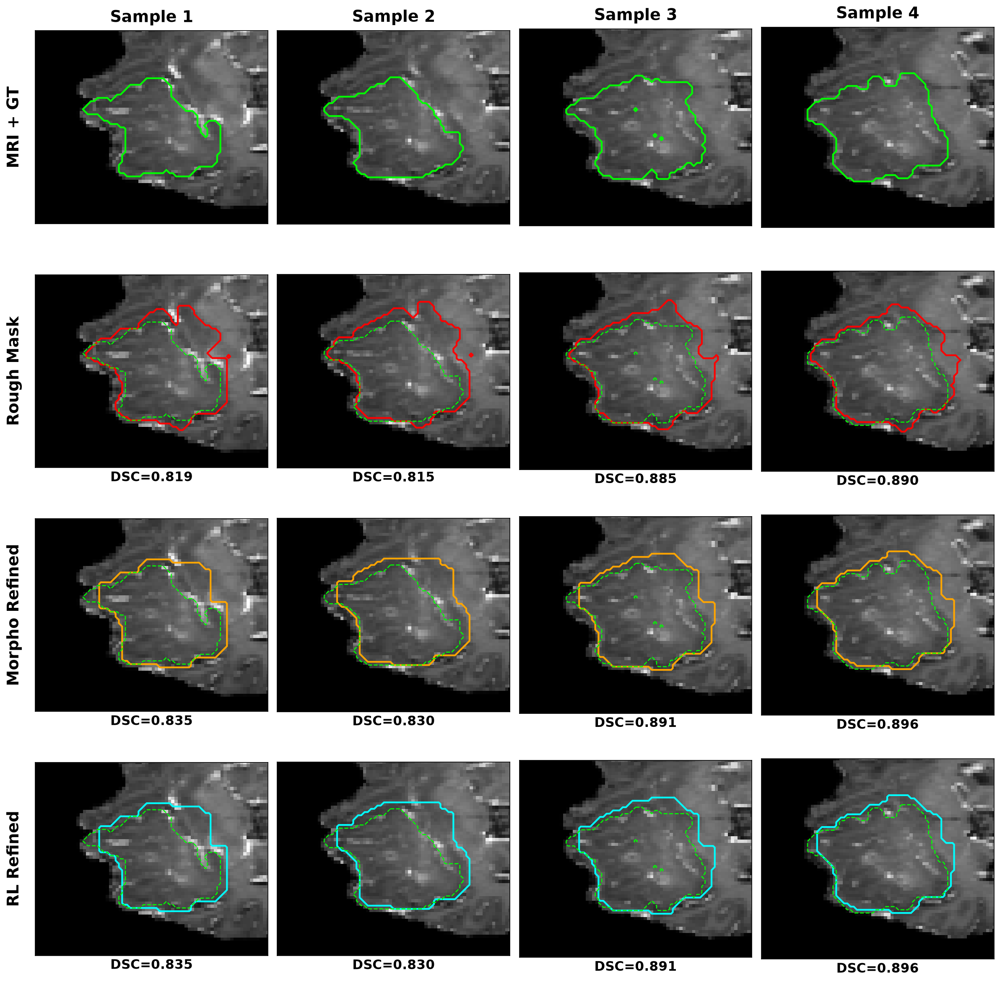

# 컴공&인지 연합학술제 연구트랙

# RL-Refiner

> **강화학습(RL)을 활용한 뇌종양 의료 영상 분할(Segmentation) 경계선 자동 보정 시스템**

딥러닝 모델이 생성한 뇌종양 분할 마스크의 미세한 경계 오차(Artifact)를 강화학습 에이전트가 능동적으로 보정하여 정밀도를 향상시키는 프로젝트입니다.

---

## 🏗️ Overall Architecture


---

## 💡 프로젝트 배경 및 필요성

의료 영상 분할에서 U-Net과 같은 딥러닝 모델은 종양의 대략적인 위치는 잘 파악하지만, 종양의 미세한 경계에서는 작은 오류가 발생할 수 있습니다.

- **정밀도의 중요성**
  - 감마나이프와 같은 정밀 방사선 치료에서는 1mm 수준의 오차도 치료 결과에 영향을 줄 수 있습니다.
- **비용 문제**
  - 의료진이 모든 경계를 직접 수정하는 과정은 많은 시간과 비용이 필요합니다.
- **해결 방법**
  - 딥러닝 모델이 생성한 Rough Mask를 PPO 기반 강화학습 에이전트가 반복적으로 보정하여 더욱 정확한 경계를 생성합니다.

---

## 🎯 주요 목표 및 성능 지표

### 목표

- Rough Mask의 경계를 자동 보정
- Dice Score 향상 (SOTA **`0.8327 DSC`** 달성)
- HD95 감소
- 사람의 후처리 작업 최소화

### 평가 지표

- Dice Similarity Coefficient (DSC)
- HD95 (Hausdorff Distance 95%)

---

## ⚙️ Pipeline (Dynamic Routing Architecture)

본 프로젝트는 입력된 종양 이미지의 특징을 분석하여 최적의 모델과 보정 에이전트를 동적으로 선택하는 **3-Stage Adaptive Pipeline** 구조를 사용합니다.

| 단계 | 과정 | 설명 |
|:---:|:---|:---|
| **1** | **크기 판별 (Classification)** | 입력된 뇌종양 MRI(T1ce) 영상을 Shape Classifier(YOLO / ResNet 기반)에 통과시켜 종양의 크기(Small, Medium, Large)를 Class 0, 1, 2로 판별합니다. |
| **2** | **동적 분할 (Dynamic Routing)** | 판별된 크기 클래스에 맞춰 알맞은 Expert 백본 모델(Attention U-Net, UNet++, SegResNet)을 선택해 초기 분할(Rough Mask)을 수행합니다. <br>**[True Expert 기법]** 일반 사전 학습(General Pre-train) 완료 후 각 크기별로 데이터를 필터링하여 미세 조정(Fine-tuning)을 수행함으로써 크기별 가중치 특화를 극대화합니다. |
| **3** | **맞춤형 RL 보정 (Refinement)** | 분할된 결과(크기)에 따라 각기 다르게 학습된 맞춤형 PPO 에이전트를 투입하여 마스크 경계를 정밀하게 보정합니다. <br>**Small 모드**에서는 4채널 입력 상태(MRI, 마스크, 소프트 확률 맵, Sobel 에지 맵)와 연속 행동 공간(Continuous PPO)을 적용하여 정밀 경계 제어 성능을 극대화했으며, **Medium/Large 모드**는 기존 3채널 이산 행동 공간 에이전트를 적용하고 공통적으로 안전 복원용 Gated Fallback을 탑재했습니다. |
| **4** | **최종 평가 (Evaluation)** | 처리된 최종 마스크를 Ground Truth와 비교하여 DSC, HD95 등을 측정하고 성능을 평가합니다. (`evaluate_pipeline.py`) |

---

## 🛠 Tech Stack

| 분야 | 사용 기술 |
|------|----------|
| Deep Learning | PyTorch, MONAI |
| Reinforcement Learning | Gymnasium, Stable-Baselines3 (PPO) |
| Dataset | BraTS2021 (T1ce) |
| Language | Python |

---

## 📊 실험 및 성능 비교 결과

자세한 실험 결과와 성능 비교는 아래 문서에서 확인할 수 있습니다.

📄 **[Final Models Report](final_models_report.md)**  
📄 **[Technical Report](technical_report.md)**  
📄 **[Experiments History](EXPERIMENTS.md)**

### ⚙️ 3-Stage Adaptive Pipeline 최종 성능 결과 (20명 1,171 슬라이스 평가)
본 프로젝트의 핵심 구조인 3단계 동적 라우팅 및 4채널 연속 PPO 보정을 적용한 최종 파이프라인의 성능 검증 결과입니다. (`evaluate_pipeline.py` 실행 결과)

| 종양 크기 분류 (크기 기준) | Expert 백본 모델 | 평가 슬라이스 수 | 초기 DSC (Stage 2) | **최종 DSC (Stage 3)** | 성능 변화 (DSC) | **보정 후 HD95** |
|:---:|:---|:---:|:---:|:---:|:---:|:---:|
| **Small** (<300px) | Attention U-Net | 430 | 0.5990 | **0.6144** | **+0.0154 (+1.54%p)** 🚀 | **9.1517 px** |
| **Medium** (300px~700px) | UNet++ | 492 | 0.8803 | **0.8835** | **+0.0032 (+0.32%p)** 📈 | **1.6349 px** |
| **Large** (>=700px) | SegResNet | 249 | 0.9226 | **0.9261** | **+0.0035 (+0.35%p)** 📈 | **0.9915 px** |
| **전체 평균 (Total)** | **동적 라우팅 파이프라인** | **1,171** | 0.7860 | **0.7938** | **+0.0078 (+0.78%p)** 📈 | **4.2583 px** |

### 🖼️ 3-Stage Routing Pipeline 크기 클래스별 보정 시각화 샘플

각 크기 클래스별 맞춤형 PPO 에이전트가 뇌종양 마스크의 경계를 정교하게 수정(하늘색)한 샘플 비교 이미지입니다.

#### 1. Small 종양 보정 샘플 (Attention U-Net + PPO)


#### 2. Medium 종양 보정 샘플 (UNet++ + PPO)


#### 3. Large 종양 보정 샘플 (SegResNet + PPO)


---

## 📂 Project Structure

```text
RL-Refiner/
├── checkpoints/             # 학습 완료된 모델 가중치 (.pt, .zip)
├── configs/                 # 하이퍼파라미터 설정 (.yaml)
├── results/                 # 결과 이미지 (sample_comparison_*.png) 및 Box Plot
├── src/
│   ├── data/                # 데이터 로더 및 멀티프로세싱 전처리
│   ├── envs/                # Gymnasium 환경
│   └── models/              # UNet 3+, Attention U-Net, UNet++, SegResNet, U-Net
├── train_unet3plus.py       # UNet 3+ (32ch+BN) 학습 스크립트
├── train_attention_unet.py  # Attention U-Net 학습/파인튜닝 스크립트
├── train_unetplusplus.py    # UNet++ 학습/파인튜닝 스크립트
├── train_segresnet.py       # SegResNet 학습/파인튜닝 스크립트
├── train_unet.py            # U-Net 학습 스크립트
├── train_agent.py           # PPO 강화학습 에이전트 학습 스크립트
├── evaluate.py              # 단일 백본 시각화 및 검증 스크립트
├── evaluate_pipeline.py     # 전체 3-Stage 동적 라우팅 파이프라인 최종 성능 평가 스크립트
├── run_pipeline.py          # 원스톱 자동화 파이프라인
├── final_models_report.md   # 최종 실험 보고서
├── technical_report.md      # 기술 분석 아티팩트 보고서
├── EXPERIMENTS.md           # 상세 실험 이력
├── requirements.txt
└── README.md
```

---

## 📦 Getting Started

### 1. 저장소 클론 및 의존성 설치

```bash
git clone https://github.com/aninsung/2026-summer-Interdepartmental-Academic-Conference.git
cd 2026-summer-Interdepartmental-Academic-Conference
pip install -r requirements.txt
```

### 2. 전체 파이프라인 자동 실행 (Dynamic Routing)

크기 분류기(Classifier)부터 Expert 백본, 그리고 맞춤형 RL 에이전트 및 평가까지 전체 3-Stage 파이프라인을 한 번에 자동 실행합니다.

```bash
python run_pipeline.py --batch_size 64
```

### 3. 특정 단계 건너뛰기 (Skip Options)

이미 학습된 가중치가 있거나 특정 부분만 다시 학습/평가하고 싶을 때 유용합니다.

```bash
# 분류기와 백본 학습은 건너뛰고, RL 에이전트부터 다시 학습 후 평가
python run_pipeline.py --skip_classifier --skip_experts

# 모든 학습을 건너뛰고 최종 평가(Evaluation)만 바로 실행
python run_pipeline.py --skip_classifier --skip_experts --skip_agents
```

### 4. 기존 단일 모델 개별 평가 및 시각화

동적 라우팅이 아닌, 단일 모델에 대한 성능만 검증하고 시각화할 때 사용합니다.

```bash
python evaluate.py --model_type [원하는 모델이름: unet3plus / attention_unet / segresnet 등]
```
