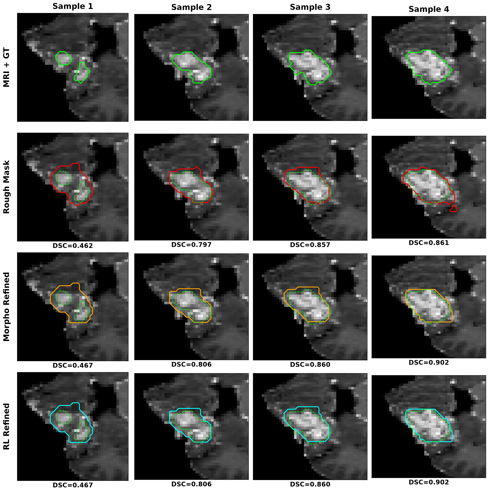
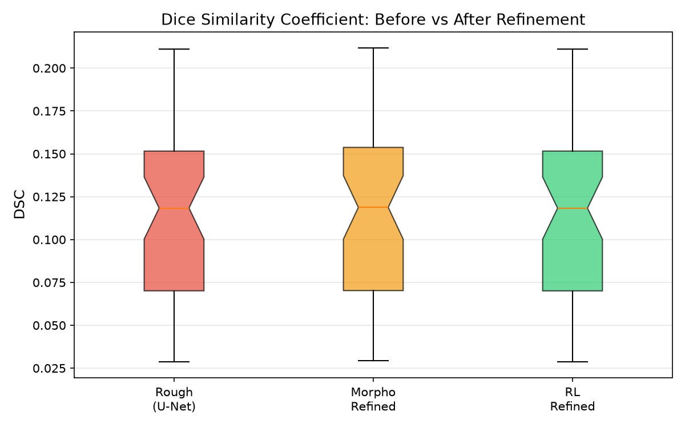

# 컴공&인지 연합학술제 연구트랙

# RL-Refiner

> **강화학습(RL)을 활용한 뇌종양 의료 영상 분할(Segmentation) 경계선 자동 보정 시스템**

딥러닝 모델이 생성한 뇌종양 분할 마스크의 미세한 경계 오차(Artifact)를 강화학습 에이전트가 능동적으로 보정하여 정밀도를 향상시키는 프로젝트입니다.

---

## 🏗️ Overall Architecture


---

## 💡 프로젝트 배경 및 필요성

의료 영상 분할에서 U-Net과 같은 딥러닝 모델은 종양의 대략적인 위치는 잘 파악하지만, 종양의 미세한 경계에서는 작은 오류가 발생할 수 있습니다.

- **정밀도의 중요성**
  - 감마나이프와 같은 정밀 방사선 치료에서는 1mm 수준의 오차도 치료 결과에 영향을 줄 수 있습니다.
- **비용 문제**
  - 의료진이 모든 경계를 직접 수정하는 과정은 많은 시간과 비용이 필요합니다.
- **해결 방법**
  - 딥러닝 모델이 생성한 Rough Mask를 PPO 기반 강화학습 에이전트가 반복적으로 보정하여 더욱 정확한 경계를 생성합니다.

---

## 🎯 주요 목표 및 성능 지표

### 목표

- Rough Mask의 경계를 자동 보정
- Dice Score 향상 (SOTA **`0.8327 DSC`** 달성)
- HD95 감소
- 사람의 후처리 작업 최소화

### 평가 지표

- Dice Similarity Coefficient (DSC)
- HD95 (Hausdorff Distance 95%)

---

## ⚙️ Pipeline

| 단계 | 설명 |
|------|------|
| **1** | BraTS2021 데이터셋으로 백본(UNet 3+, Attention U-Net, UNet++, SegResNet, U-Net)을 학습하여 초기 분할(Rough Mask) 생성 |
| **2** | MRI 영상과 Rough Mask를 입력(State)으로 사용하는 Gymnasium 환경 구성 |
| **3** | PPO 에이전트가 Erode / Dilate / Keep 등의 행동을 반복 수행하며 경계 수정 |
| **4** | Ground Truth와 비교하여 Dice, HD95 등을 평가하고 Morphology 기법과 비교 |

---

## 🛠 Tech Stack

| 분야 | 사용 기술 |
|------|----------|
| Deep Learning | PyTorch, MONAI |
| Reinforcement Learning | Gymnasium, Stable-Baselines3 (PPO) |
| Dataset | BraTS2021 (T1ce) |
| Language | Python |

---

## 📊 실험 및 성능 비교 결과

자세한 실험 결과와 성능 비교는 아래 문서에서 확인할 수 있습니다.

📄 **[Final Models Report](final_models_report.md)**  
📄 **[Technical Report](technical_report.md)**  
📄 **[Experiments History](EXPERIMENTS.md)**

### 종합 랭킹 및 듀얼 SOTA 백본 성능 비교 (50명 2,902 슬라이스 평가)

| 순위 | 백본 모델 (+ RL-Refiner) | **DSC (높을수록 좋음 ↑)** | **HD95 (낮을수록 좋음 ↓)** | **표준편차 (안정성)** | SOTA 분류 / 평가 |
|:---:|:---|:---:|:---:|:---:|:---|
| 🥇 | **Attention U-Net (MONAI)** 🏆 | **`0.8297`** | **`2.53 px` (1위)** | **`±0.1171` (1위)** | 🏆 **최종 종합 SOTA (HD95 오차 최저, 최고 밸런스)** |
| 🎯 | **UNet 3+ (32ch + BN)** 🎯 | **`0.8327` (1위)** | `3.46 px` | `±0.1273` | 🎯 **영역 분할 SOTA (Dice 겹침 비율 1위)** |
| 🥉 | **UNet++ (MONAI Basic)** | `0.8292` | `2.63 px` | `±0.1390` | 🥉 **종합 3위 (고른 성과)** |
| ⚡ | **SegResNet (MONAI ResNet)** | `0.8210` | `2.84 px` | `±0.1331` | 🎉 **DSC +0.99%p 향상, HD95 17% 감소** |
| 4️⃣ | **U-Net (커스텀)** | `0.8134` | `2.03 px` | `±0.1929` | 기준선 |

### 🖼️ 최종 종합 SOTA (Attention U-Net + RL-Refiner) 시각화 샘플


### 📈 최종 종합 SOTA (Attention U-Net + RL-Refiner) 성능 분포 Boxplot


---

## 📂 Project Structure

```text
RL-Refiner/
├── checkpoints/             # 학습 완료된 모델 가중치 (.pt, .zip)
├── configs/                 # 하이퍼파라미터 설정 (.yaml)
├── results/                 # 결과 이미지 (sample_comparison_*.png) 및 Box Plot
├── src/
│   ├── data/                # 데이터 로더 및 멀티프로세싱 전처리
│   ├── envs/                # Gymnasium 환경
│   └── models/              # UNet 3+, Attention U-Net, UNet++, SegResNet, U-Net
├── train_unet3plus.py       # UNet 3+ (32ch+BN) 학습 스크립트
├── train_attention_unet.py  # Attention U-Net 학습 스크립트
├── train_unetplusplus.py    # UNet++ 학습 스크립트
├── train_segresnet.py       # SegResNet 학습 스크립트
├── train_unet.py            # U-Net 학습 스크립트
├── train_agent.py           # PPO 강화학습 에이전트 학습 스크립트
├── evaluate.py              # 전지 레이아웃 시각화 및 검증 스크립트
├── run_pipeline.py          # 원스톱 자동화 파이프라인
├── final_models_report.md   # 최종 실험 보고서
├── technical_report.md      # 기술 분석 아티팩트 보고서
├── EXPERIMENTS.md           # 상세 실험 이력
├── requirements.txt
└── README.md
```

---

## 📦 Getting Started

### 1. 저장소 클론 및 의존성 설치

```bash
git clone https://github.com/USERNAME/RL-Refiner.git
cd RL-Refiner
pip install -r requirements.txt
```

### 2. SOTA 1위 모델 (UNet 3+ 하이브리드) 전체 파이프라인 실행

```bash
python run_pipeline.py --model_type unet3+ --batch_size 128
```

### 3. Attention U-Net 파이프라인 실행

```bash
python run_pipeline.py --model_type attention_unet --batch_size 64
```

### 4. UNet++ 파이프라인 실행

```bash
python run_pipeline.py --model_type unetplusplus --batch_size 64
```

### 5.  UNet 파이프라인 실행

```bash
python run_pipeline.py --model_type unet
```
### 6.  segresnet 파이프라인 실행

```bash
python run_pipeline.py --model_type segresnet
```

### 7.기존 학습 가중치를 활용한 시각화 및 평가만 수행

```bash
python evaluate.py --model_type [원하는 모델이름]
```
