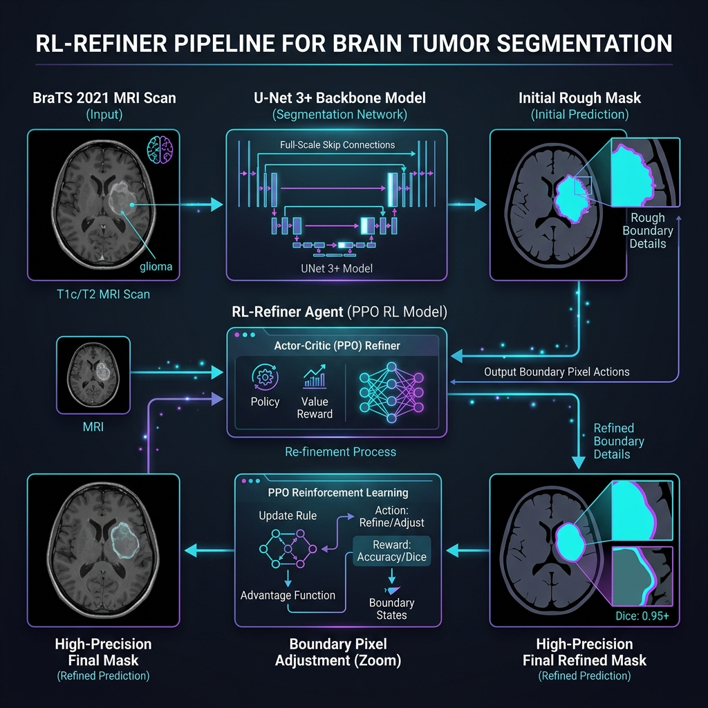

# 컴공&인지 연합학술제 연구트랙

# RL-Refiner

> **강화학습(RL)을 활용한 뇌종양 의료 영상 분할(Segmentation) 경계선 자동 보정 시스템**

딥러닝 모델이 생성한 뇌종양 분할 마스크의 미세한 경계 오차(Artifact)를 강화학습 에이전트가 능동적으로 보정하여 정밀도를 향상시키는 프로젝트입니다.

---

## 🏗️ Overall Architecture

> (전체 시스템 구조 이미지 삽입)



---

## 💡 프로젝트 배경 및 필요성

의료 영상 분할에서 U-Net과 같은 딥러닝 모델은 종양의 대략적인 위치는 잘 파악하지만, 종양의 미세한 경계에서는 작은 오류가 발생할 수 있습니다.

- **정밀도의 중요성**
  - 감마나이프와 같은 정밀 방사선 치료에서는 1mm 수준의 오차도 치료 결과에 영향을 줄 수 있습니다.
- **비용 문제**
  - 의료진이 모든 경계를 직접 수정하는 과정은 많은 시간과 비용이 필요합니다.
- **해결 방법**
  - 딥러닝 모델이 생성한 Rough Mask를 PPO 기반 강화학습 에이전트가 반복적으로 보정하여 더욱 정확한 경계를 생성합니다.

---

## 🎯 주요 목표 및 성능 지표

### 목표

- Rough Mask의 경계를 자동 보정
- Dice Score 향상
- HD95 감소
- 사람의 후처리 작업 최소화

### 평가 지표

- Dice Similarity Coefficient (DSC)
- HD95
- IoU
- ASSD

---

## ⚙️ Pipeline

| 단계 | 설명 |
|------|------|
| **1** | BraTS2021 데이터셋으로 U-Net 또는 SegResNet을 학습하여 초기 분할(Rough Mask) 생성 |
| **2** | MRI 영상과 Rough Mask를 입력(State)으로 사용하는 Gymnasium 환경 구성 |
| **3** | PPO 에이전트가 Expand / Shrink / Keep 등의 행동을 반복 수행하며 경계 수정 |
| **4** | Ground Truth와 비교하여 Dice, HD95 등을 평가하고 Morphology 기법과 비교 |

---

## 🛠 Tech Stack

| 분야 | 사용 기술 |
|------|----------|
| Deep Learning | PyTorch, MONAI |
| Reinforcement Learning | Gymnasium, Stable-Baselines3 (PPO) |
| Dataset | BraTS2021 (T1ce) |
| Language | Python |

---

## 📊 실험 및 성능 비교 결과

자세한 실험 결과와 성능 비교는 아래 문서에서 확인할 수 있습니다.

📄 **[Final Models Report](final_models_report.md)**

보고서에는 다음 내용이 포함되어 있습니다.

- 실험 환경
- 모델별 성능 비교
- Rough vs Morphology vs RL 비교
- Dice / HD95 / IoU / ASSD 결과
- Box Plot
- 정성적 결과 비교
- 결과 분석

---

## 📂 Project Structure

```text
RL-Refiner/
├── checkpoints/             # 학습 완료된 모델 가중치 (.pt, .zip)
├── configs/                 # 하이퍼파라미터 설정 (.yaml)
├── results/                 # 결과 이미지 및 Box Plot
├── src/
│   ├── data/                # 데이터 로더 및 전처리
│   ├── envs/                # Gymnasium 환경
│   └── models/              # U-Net, SegResNet, UNet++
├── train_unet.py
├── train_segresnet.py
├── train_unetplusplus.py
├── train_agent.py
├── evaluate.py
├── run_pipeline.py
├── final_models_report.md   # 실험 결과 보고서
├── requirements.txt
└── README.md
```

---

## 📦 Getting Started

### 1. 저장소 클론

```bash
git clone https://github.com/USERNAME/RL-Refiner.git
cd RL-Refiner
```

### 2. 의존성 설치

```bash
pip install -r requirements.txt
```

### 3. SegResNet 기반 전체 파이프라인 실행

```bash
python run_pipeline.py --model_type segresnet
```

### 4. U-Net 기반 전체 파이프라인 실행

```bash
python run_pipeline.py --model_type unet
```

### 5. 평가만 수행

```bash
python run_pipeline.py \
    --model_type segresnet \
    --skip_segresnet \
    --skip_agent
```

---

## 📈 향후 연구

- 3D Volume 기반 RL Refinement
- Multi-class Brain Tumor Segmentation
- nnUNet 및 SAM2 기반 초기 마스크 적용
- 의료진 Interactive Correction 시스템 개발

---

## 👨‍💻 Contributors

- 안인성 컴퓨터공학과
- 한수진 인공지능학과 

---

## 📄 License

MIT License
