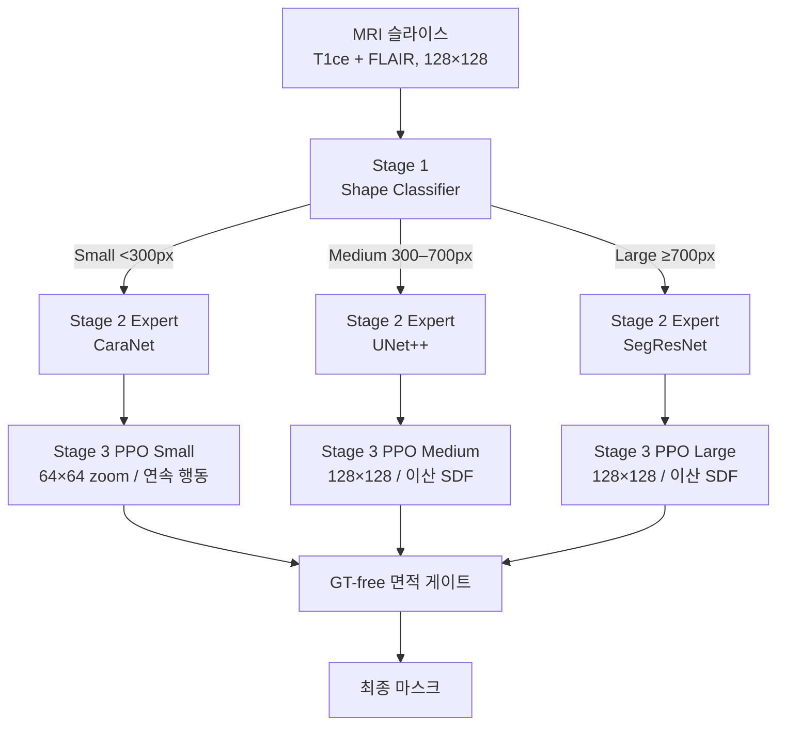
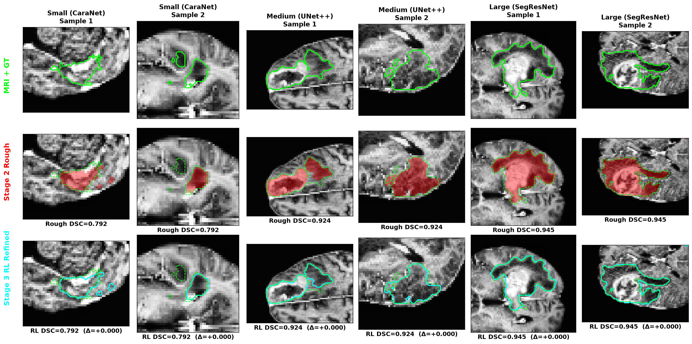
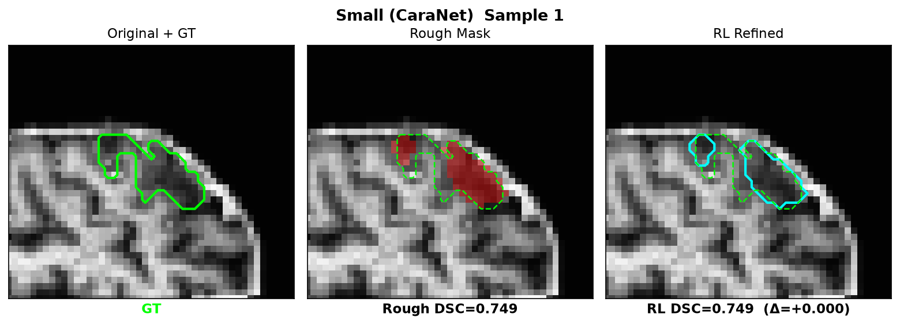
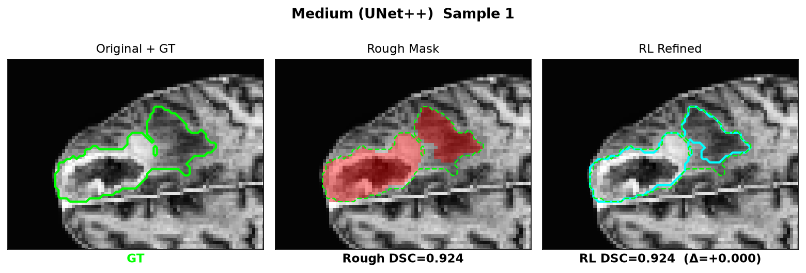
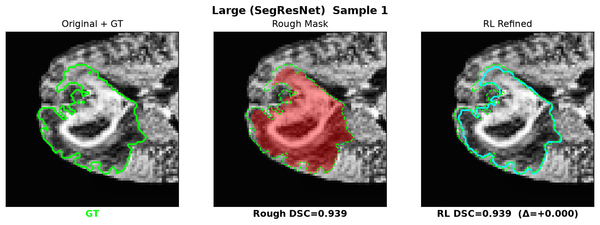
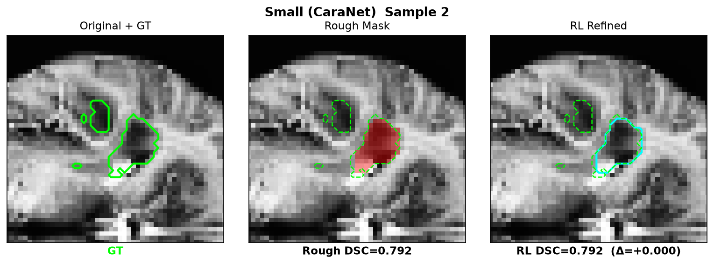
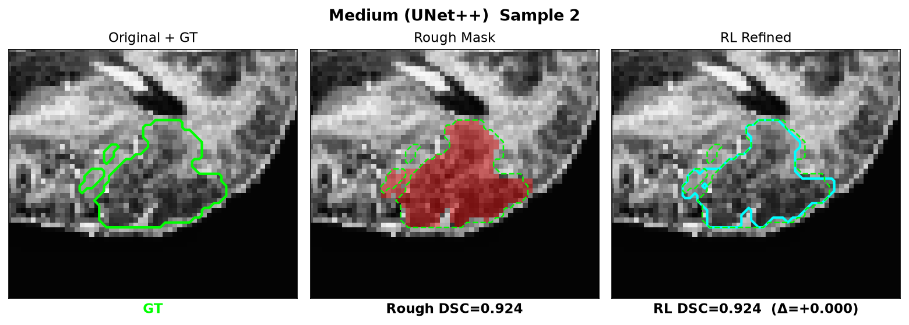
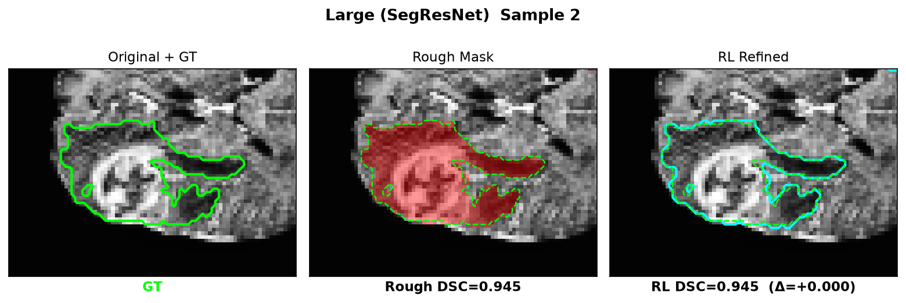

# RL-Refiner

2026 컴공&인지 연합학술제 연구트랙

**강화학습 기반 뇌종양 MRI 분할 경계 보정 시스템**

딥러닝 모델이 만든 초기 분할(Rough Mask)의 경계 오차를, 종양 크기별 전용 PPO 에이전트가 순차적으로 보정합니다.

---

## 한눈에 보는 최종 결과 (2026-08-19)

`t1ce+flair` 2채널. 아래 표는 **2026-08-19 상한 평가**(학습=평가 210명, Oracle Routing, Medium/Large는 GT 형태학). 현재 코드는 val hold-out + 분류기 라우팅 + 전 클래스 PPO이며, 재학습·재평가 전 숫자입니다.

| 단계 | 산출 | 수치 |
|---|---|---|
| Stage 1 Shape Classifier | Best Val Acc | **0.9383** |
| Stage 2 CaraNet / UNet++ / SegResNet | Best Val DSC | **0.8262** / **0.9197** / **0.9381** |
| Stage 3 PPO Small / Medium / Large | 학습 스텝 · 시간 | 303,104 · 12m / 16m / 19m |

| 지표 | Stage 2 (초기 분할) | Stage 3 (PPO 보정) | 변화 |
|---|---:|---:|---:|
| **평균 DSC** | 0.8775 | **0.8880** | **+1.05%p** |
| **평균 HD95** | 1.8416 px | **1.6843 px** | **-0.157 px** |

| 크기 클래스 | Expert | n | 초기 DSC → 최종 DSC | 초기 HD95 → 최종 HD95 |
|---|---|---:|---:|---:|
| Small (`<300px`) | CaraNet | 4,503 | 0.7956 → **0.8035** | 3.5405 → **3.4353 px** |
| Medium (`300–700px`) | UNet++ | 5,031 | 0.9180 → **0.9322** | 0.9031 → **0.6965 px** |
| Large (`≥700px`) | SegResNet | 2,707 | 0.9386 → **0.9464** | 0.7595 → **0.6077 px** |

파이프라인 단계·입출력·학습/평가 차이는 [파이프라인 상세](docs/PIPELINE.md), 학습 로그와 실험 이력은 [실험 결과 보고서](docs/EXPERIMENT_RESULTS.md)에 있습니다.

---

## 배경

의료 영상 분할에서 CNN은 종양의 대략적인 위치는 잘 잡지만, 경계에서는 1픽셀 수준의 오차가 남습니다. 감마나이프 같은 정밀 방사선 치료에서는 이 오차가 치료 범위에 영향을 줄 수 있고, 의료진이 모든 슬라이스를 수동으로 고치는 비용도 큽니다.

이 프로젝트는 그 후처리를 **크기별 전문가 분할 모델 + PPO 경계 보정기**로 자동화합니다.

평가 지표는 겹침 비율 **DSC**(높을수록 좋음)와 경계 거리 **HD95**(낮을수록 좋음)입니다.

---

## 파이프라인


```mermaid
flowchart TD
    A["MRI 슬라이스<br/>T1ce + FLAIR, 128×128"] --> B["Stage 1<br/>Shape Classifier"]
    B -->|Small &lt;300px| C["Stage 2 Expert<br/>CaraNet"]
    B -->|Medium 300–700px| D["Stage 2 Expert<br/>UNet++"]
    B -->|Large ≥700px| E["Stage 2 Expert<br/>SegResNet"]
    C --> F["Stage 3 PPO Small<br/>64×64 zoom / 연속 행동"]
    D --> G["Stage 3 PPO Medium<br/>128×128 / 이산 SDF"]
    E --> H["Stage 3 PPO Large<br/>128×128 / 이산 SDF"]
    F --> I["GT-free 면적 게이트"]
    G --> I
    H --> I
    I --> J["최종 마스크"]
```

| 단계 | 역할 | 산출물 |
|:---:|---|---|
| **1** | 종양 면적으로 Small / Medium / Large 분류 | `shape_classifier_best.pt` |
| **2** | 클래스별 Expert가 Rough Mask 생성 | `caranet_best.pt`, `unetplusplus_best.pt`, `segresnet_best.pt` |
| **3** | 클래스별 PPO가 8방위 경계를 SDF로 미세 조정 | `ppo_small.zip`, `ppo_medium.zip`, `ppo_large.zip` |
| **4** | DSC / HD95 평가 및 시각화 | `results/pipeline_sample_*.png` |

Stage 3의 크기별 동작 차이:

- **Small**: 종양 중심 64×64 crop, 4채널(영상·마스크·확률·에지), 연속 행동 `[-2, 2]⁸`
- **Medium / Large**: 전체 128×128, 3채널(영상·마스크·확률), 이산 5단계×8섹터. Large는 보상에서 HD95 가중치를 더 크게 둠

단계별 데이터 흐름, SDF 보정, 평가 게이트, 학습 vs 추론 차이는 [파이프라인 상세](docs/PIPELINE.md)를 봅니다.

---

## 시각화

클래스마다 Rough DSC와 RL Refined DSC 차이가 큰 원본 2장씩, 총 6장입니다. 초록=GT, 빨강=Stage 2 Rough, 하늘색=Stage 3 RL.



| Small | Medium | Large |
|---|---|---|
|  |  |  |
|  |  |  |

---

## 기술 스택

| 분야 | 사용 기술 |
|------|----------|
| Deep Learning | PyTorch, MONAI |
| Reinforcement Learning | Gymnasium, Stable-Baselines3 (PPO) |
| Dataset | BraTS 2021 (`t1ce+flair`, 128×128 2D 슬라이스) |
| Language | Python |

---

## 프로젝트 구조

```
├── run_pipeline.py                 # Stage 1–4 원스톱 실행
├── configs/ppo_brats.yaml          # PPO 하이퍼파라미터
├── scripts/train/                  # 분류기 · Expert · PPO 학습
├── scripts/eval/                   # 파이프라인 / 단일 모델 평가
├── src/data/                       # BraTS 로더
├── src/envs/                       # MaskRefinementEnv (크기별 PPO 환경)
├── src/models/                     # Classifier, Experts, AdaptivePipeline
├── checkpoints/                    # 학습된 가중치
├── results/                        # 평가 시각화
├── docs/PIPELINE.md                # 파이프라인 상세
└── docs/EXPERIMENT_RESULTS.md      # 실험 결과 통합본
```

---

## Getting Started

### 1. 환경 설치

```bash
git clone https://github.com/aninsung/2026-summer-Interdepartmental-Academic-Conference.git
cd 2026-summer-Interdepartmental-Academic-Conference
pip install -r requirements.txt
```

BraTS 2021 데이터는 `src/data/archive`에 둡니다.

### 2. 실행

```bash
python run_pipeline.py --batch_size 64 --modality t1ce+flair
```
