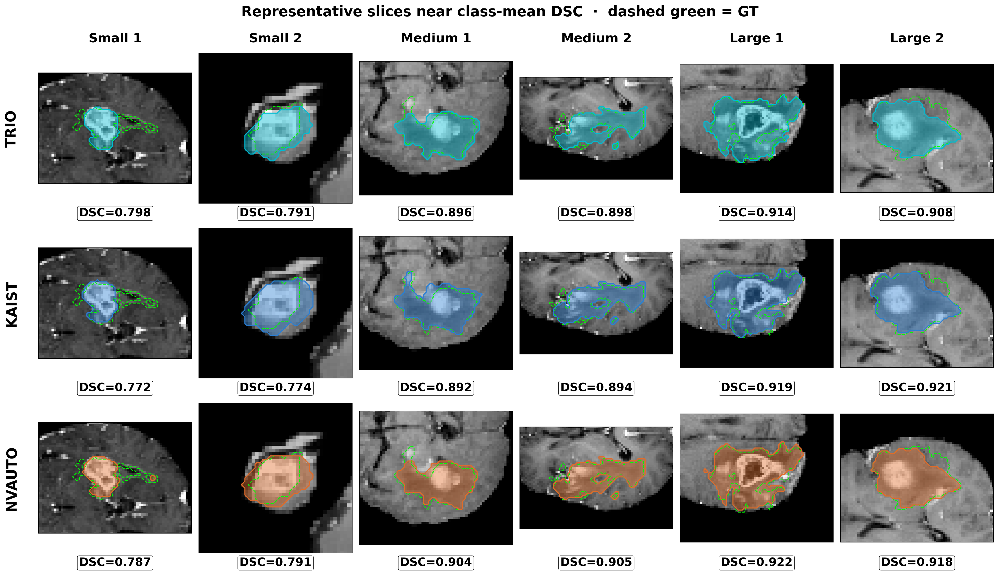

# TRIO — 뇌종양 MRI 경계 보정

2026 컴공&인지 연합학술제 연구트랙

딥러닝이 그린 뇌종양 경계에서, 크기에 맞는 전문 모델이 초기 마스크를 만들고 하나의 강화학습 정책이 애매한 띠만 고칩니다.

BraTS 2021 **851명**(가중치 학습에 쓰지 않은 환자)에서 2차원 슬라이스 DSC의 환자 평균이 **0.8337 → 0.8604**로 올랐습니다. 환자 짝 차이 +0.0267, 95% CI 0.0256–0.0278. 검증 60명으로 임계값을 다시 고른 Stage 2(0.8411)와 비교해도 **+0.0193** (95% CI 0.0184–0.0202)이 남습니다.

[논문](docs/paper_miccai.pdf) · [파이프라인](docs/PIPELINE.md) · [실험 수치](docs/EXPERIMENT_RESULTS.md)

---

## 문제

Whole Tumor의 단면 크기는 슬라이스마다 다릅니다. 작은 단면과 큰 단면을 한 모델이 동시에 맞추면, 위치는 맞아도 경계에 과소분할이 남습니다. 그 경계를 사람이 슬라이스마다 고치는 일을, 크기별 전문가와 경계 띠 정책으로 나눴습니다.

지표는 겹침 **DSC**(높을수록 좋음)입니다. 평가는 128×128 슬라이스 DSC를 환자마다 평균한 값이며, BraTS 3차원 대회 점수가 아닙니다.

## 방법


| 단계 | 하는 일 | 가중치 |
|:---:|---|---|
| 1 | T1ce·FLAIR로 종양 면적을 Small / Medium / Large로 분류 | `shape_classifier_best.pt` |
| 2 | 크기별 전문가가 확률 맵을 만들고 고정 임계값으로 이진화 | CaraNet · UNet++ · SegResNet |
| 3 | 확률 0.35–0.65 또는 경계 ±2px만 켜기·유지·끄기 | `band_ppo.pt` |
| 4 | 환자 평균 DSC로 채점 | `results/band_ppo_locked.json` |

Small은 인접 슬라이스 2.5D, Large는 부종과 종양핵을 Whole Tumor로 합칩니다. 정책은 크기마다 나누지 않습니다. 추론 관측에는 정답이 없고, 정답은 학습 보상에만 씁니다. 마지막 스텝의 행동만 그 슬라이스 FLAIR 밝기 제약을 받습니다.

환자 단위 분할입니다. BraTS 2021 1251명 중 seed 42로 고른 개발 400명(학습 280 / 검증 60 / 방법 선택 60)은 평가에서 뺍니다. 남은 **851명, 종양 슬라이스 50,010장**이 아래 표입니다. 고정 임계값 0.80/0.80/0.50과 연결요소 기준은 이전 210명 풀에서 정했고, 그중 148명이 이 851명에 들어 있습니다. 띠 설계는 이번 방법 선택 60명에서 정했고, 가중치는 이번 개발 400명으로 다시 학습했습니다.

## 결과

분류기가 전문가를 고르고, 임계값은 0.80 / 0.80 / 0.50으로 고정했습니다. 크기 행은 서로 다른 환자군이 아닙니다. 그 면적의 슬라이스가 있는 환자 평균이라 같은 환자가 두 행 이상에 들어갑니다.

| 정답 면적 | 환자 | Stage 2 | 경계 띠 PPO | 짝 차이 (95% CI) |
|---|---:|---:|---:|---|
| 전체 | 851 | 0.8337 | **0.8604** | +0.0267 (0.0256–0.0278) |
| 300px 미만 | 851 | 0.7579 | **0.7933** | +0.0354 (0.0338–0.0370) |
| 300–700px | 757 | 0.8700 | **0.8952** | +0.0252 (0.0239–0.0265) |
| 700px 이상 | 408 | 0.8981 | **0.9169** | +0.0188 (0.0173–0.0205) |


위는 정답, 가운데는 Stage 2, 아래는 경계 띠 PPO입니다. 열 제목의 앞은 정답 면적, 뒤는 분류기가 고른 전문가입니다. 중형 첫째는 정답 면적이 중형인데 CaraNet으로 갔습니다. 칸 숫자는 그 슬라이스 값이고 위 표의 환자 평균이 아닙니다. 중형 첫째의 HD95는 2.00에서 3.38 px로 늘었습니다.

임계값만 검증 60명으로 다시 고르면(0.45 / 0.80 / 0.20) Stage 2는 0.8411입니다. 이득의 약 28%는 임계값 조정으로 설명되고, 나머지 +0.0193은 PPO만의 몫입니다. 세 구간 모두 95% CI가 0을 포함하지 않습니다. 결과는 `results/stage2_retuned.json`이고, `python scripts/eval/evaluate_stage2_retuned.py`로 다시 만듭니다.

같은 851명에서, 검증 60명으로만 임계값을 고른 2차원 각색 베이스라인과 비교했습니다.

| 방법 | DSC | HD95 (px) | Precision | Recall |
|---|---:|---:|---:|---:|
| **TRIO** | **0.8604** | 4.608 | 0.8918 | 0.8600 |
| NVAUTO 각색 (임계값 0.30) | 0.8576 | **4.184** | 0.8836 | 0.8633 |
| KAIST 각색 (임계값 0.40) | 0.8463 | 4.224 | 0.8635 | 0.8642 |

DSC 환자 평균은 TRIO와 NVAUTO가 비슷합니다. 점추정은 TRIO가 조금 높지만 95% 구간이 겹치고, TRIO만 반전 TTA를 씁니다. 빈 마스크를 뺀 슬라이스만의 HD95 평균은 NVAUTO와 KAIST가 더 낮고, 이 HD95는 방법마다 빠지는 슬라이스가 달라 짝비교로 쓰지 않습니다. 두 베이스라인은 3차원·4채널 대회 제출의 2차원 각색입니다.



행은 TRIO / KAIST / NVAUTO, 열은 Small · Medium · Large입니다. 초록 점선은 정답입니다.

같은 분할의 학습 280명으로, 백본 하나와 섹터 PPO 하나를 다섯 세트 학습했습니다. 출력은 이진 Whole Tumor이고, 초기 임계값은 0.5, PPO는 15스텝·10만 스텝입니다. 아래 숫자는 851명 환자 평균이 아닙니다. 개발 400명을 뺀 환자 48명(seed 7), 종양 슬라이스 2,754장의 슬라이스 평균입니다. 그림의 TRIO 열만 현재 경계 띠 파이프라인입니다.

| 방법 | Small | Medium | Large |
|---|---:|---:|---:|
| TRIO | 0.812 | 0.904 | 0.916 |
| UNet++ + PPO | 0.778 | 0.894 | 0.926 |
| Attention U-Net + PPO | 0.761 | 0.884 | 0.904 |
| SegResNet + PPO | 0.676 | 0.871 | 0.912 |
| UNet+++ + PPO | 0.543 | 0.828 | 0.900 |
| U-Net + PPO | 0.537 | 0.813 | 0.866 |


가중치는 `checkpoints/single_backbone/`이고, 수치는 `results/single_backbone_ppo_grid_metrics.json`입니다. U-Net 검증 DSC는 0.8834입니다.

## 스택

PyTorch, MONAI, PPO. 입력은 BraTS 2021의 T1ce+FLAIR, 128×128 슬라이스입니다.

## 실행

```bash
git clone https://github.com/aninsung/2026-summer-Interdepartmental-Academic-Conference.git
cd 2026-summer-Interdepartmental-Academic-Conference
pip install -r requirements.txt
```

BraTS 2021은 `src/data/archive`에 둡니다. 논문 표는 아래 한 명령으로 다시 만듭니다.

```bash
python scripts/eval/evaluate_band_ppo_locked.py
```

```
run_pipeline.py          평가 진입점
scripts/train/           분류기, 전문가, 경계 띠 PPO
scripts/eval/            851명 평가와 비교 그림
src/                     데이터, 모델, 지표
baselines/               KAIST·NVAUTO 2차원 각색
checkpoints/             가중치와 patient_split.json
```

더 긴 실험 기록과 2026-08-20 평가(210명 풀, val 42명, 단조 DSC 게이트)는 [과거 기록](docs/history_2026-08-20.md)에 있습니다.
