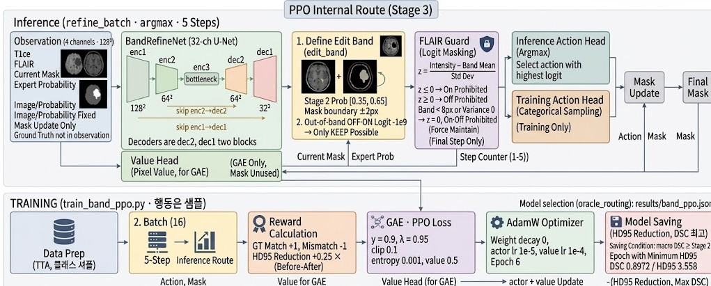

<p align="center">
  
</p>

<h1 align="center">뇌종양 MRI, 경계를 더 정밀하게.</h1>

<p align="center">
  크기에 맞는 전문가가 분할하고, 하나의 강화학습 정책이 애매한 경계 띠를 보정합니다.<br />
  <strong>2026 컴공 &amp; 인지 연합학술제 · 연구트랙</strong>
</p>

<p align="center">
  가천대학교 컴퓨터공학과 · 202135993 · <strong>안인성</strong> · a3426751@gachon.ac.kr<br />
  가천대학교 인공지능학과 · 202634031 · <strong>한수진</strong> · hansj@gachon.ac.kr<br />
  교신저자 · <strong>최아영</strong> · aychoi@gachon.ac.kr
</p>

<p align="center">
  <a href="https://aninsung.github.io/2026-summer-Interdepartmental-Academic-Conference/"><strong>연구 페이지</strong></a> &nbsp; · &nbsp;
  <a href="연구_야호_PPT(09.30).pdf"><strong>ppt</strong></a> &nbsp; · &nbsp;
  <a href="docs/paper_miccai.pdf"><strong>논문</strong></a> &nbsp; · &nbsp;
  <a href="#02--pipeline">Pipeline</a> &nbsp; · &nbsp;
  <a href="#03--results">Results</a> &nbsp; · &nbsp;
  <a href="#04--reproduce">Reproduce</a> &nbsp; · &nbsp;
  <a href="#05--documents">Documents</a>
</p>

<p align="center">
  <code>BraTS 2021</code> &nbsp; <code>PyTorch</code> &nbsp; <code>MONAI</code> &nbsp; <code>PPO</code>
</p>

| 평가 환자 | 종양 슬라이스 | Stage 2 → 경계 띠 PPO | 환자 평균 DSC 향상 |
|:---:|:---:|:---:|:---:|
| **851명** | **50,010장** | **0.8419 → 0.8595** | **+0.0176** |

환자 짝 차이의 **95% CI는 0.0166–0.0185**입니다. Stage 2와 PPO 모두 임계값 0.45/0.80/0.20으로 만든 2026-10-08 실행입니다. 지표는 2차원 슬라이스 DSC의 환자 평균입니다.

> **수치 읽기** — 128×128 2차원 슬라이스 DSC를 환자마다 평균한 결과이며, BraTS 3차원 대회 점수가 아닙니다. 851명은 가중치 학습에서 제외했지만, 이 중 148명은 과거 임계값·연결요소 기준을 정한 풀과 겹칩니다. 평가 조건과 비교의 한계는 아래에 함께 적었습니다.

---

## 01 · Research

Whole Tumor의 단면 크기는 슬라이스마다 다릅니다. 작은 단면과 큰 단면을 한 모델이 동시에 맞추면, 위치는 맞아도 경계에 과소분할이 남습니다. 그 경계를 사람이 슬라이스마다 고치는 일을, 크기별 전문가와 경계 띠 정책으로 나눴습니다.

지표는 겹침 **DSC**(높을수록 좋음)입니다. 평가는 128×128 슬라이스 DSC를 환자마다 평균한 값이며, BraTS 3차원 대회 점수가 아닙니다.

---

## 02 · Pipeline

<p align="center">
  
</p>

| 단계 | 하는 일 | 가중치 |
|:---:|---|---|
| 1 | T1ce·FLAIR로 종양 면적을 Small / Medium / Large로 분류 | `shape_classifier_best.pt` |
| 2 | 크기별 전문가가 확률 맵을 만들고 임계값 0.45/0.80/0.20으로 이진화 | CaraNet · UNet++ · SegResNet |
| 3 | 확률 0.35–0.65 또는 경계 ±2px만 켜기·유지·끄기 | `band_ppo.pt` |
| 4 | 환자 평균 DSC로 채점 | `results/threshold_045_080_020/band_ppo_locked.json` |

Small은 인접 슬라이스 2.5D, Large는 부종과 종양핵을 Whole Tumor로 합칩니다. 정책은 크기마다 나누지 않습니다. 추론 관측에는 정답이 없고, 정답은 학습 보상에만 씁니다. 마지막 스텝의 행동만 그 슬라이스 FLAIR 밝기 제약을 받습니다.

<p align="center">
  
</p>

위는 네 채널 관측으로 띠를 정하고, FLAIR 제약을 마지막 스텝에만 건 뒤 argmax로 다섯 스텝 마스크를 갱신합니다. 아래는 정답을 보상에만 쓰고, 배치 16이 다섯 스텝을 돌아 GAE–PPO로 행동 머리와 가치 머리를 갱신합니다. 맨 아래 표는 분류기 라우팅 851명의 확정 평가이며, 숫자는 [크기별 표](#크기별-분할-성능)와 같습니다.

> **평가 범위**
>
> 환자 단위 분할입니다. BraTS 2021 1251명 중 seed 42로 고른 개발 400명(학습 280 / 검증 60 / 방법 선택 60)은 평가에서 뺍니다. 남은 **851명, 종양 슬라이스 50,010장**이 아래 표입니다. 이진화 임계값 0.45/0.80/0.20은 이 분할의 검증 60명에서 골랐고, Stage 2 마스크와 PPO 학습이 그 값을 씁니다. 연결요소 최소 크기는 이전 프로토콜의 0, 15, 25픽셀이고, 그 기준을 정한 210명 풀 가운데 148명이 이 851명에 들어 있습니다. 띠 설계는 이번 방법 선택 60명에서 정했습니다.

---

## 03 · Results

### 크기별 분할 성능

분류기가 전문가를 고르고, 임계값은 0.45 / 0.80 / 0.20입니다. 환자 열은 짝 차이의 표본 수이고, 슬라이스 열은 그 정답 면적의 종양 슬라이스 수입니다. small·medium·large 슬라이스를 더하면 50,010입니다. 같은 환자가 여러 행에 들어가므로 환자 수를 더하면 851을 넘습니다. 300픽셀 미만이 small, 300 이상 700 미만이 medium, 700 이상이 large입니다.

| 정답 면적 | 환자 | 슬라이스 | Stage 2 | 경계 띠 PPO | 짝 차이 (95% CI) |
|---|---:|---:|---:|---:|---|
| 전체 | 851 | 50,010 | 0.8419 | **0.8595** | +0.0176 (0.0166–0.0185) |
| small | 851 | 19,077 | 0.7693 | **0.7922** | +0.0229 (0.0215–0.0243) |
| medium | 757 | 19,907 | 0.8780 | **0.8932** | +0.0152 (0.0144–0.0160) |
| large | 408 | 11,026 | 0.9030 | **0.9156** | +0.0125 (0.0112–0.0138) |

### MRI · Before & After

<p align="center">
  <a href="results/band_ppo_delta_matched/delta_matched_comparison.png">
    
  </a>
</p>

**Ground truth → Initial mask → PPO refinement** · 이미지를 클릭하면 원본 크기로 볼 수 있습니다.

위는 정답, 가운데는 Stage 2, 아래는 경계 띠 PPO입니다. 이 그림은 이전 잠금 가중치이고, 위 표의 2026-10-08 실행이 아닙니다. 열 제목의 앞은 정답 면적, 뒤는 분류기가 고른 전문가입니다. 칸 숫자는 그 슬라이스 값이고 위 표의 환자 평균이 아닙니다.

같은 평가에서 빈 마스크를 뺀 HD95 평균은 4.747픽셀에서 4.547픽셀입니다. 빠지는 슬라이스가 달라 짝비교로 쓰지 않습니다. 파일은 `results/threshold_045_080_020/band_ppo_locked.json`입니다. 2026-09-30 잠금(0.8337→0.8604, 고정 임계값 0.80/0.80/0.50)은 [EXPERIMENT_RESULTS.md §0.11](docs/EXPERIMENT_RESULTS.md)에 있습니다.

### 추가 실험

위 확정 표와 다른 학습입니다. 같은 분할을 시드 42·7·123으로 다시 학습하면 경계 띠 PPO DSC는 0.8597, 0.8620, 0.8609(평균 0.8609, 범위 0.0023)입니다. 시드 42에서 5스텝은 0.8597, 1스텝은 0.8460, 중형 지도학습 1스텝은 0.8383, 대형 전문가에 경계 띠를 붙이면 0.8676, 정답 크기 라우팅은 0.8698, 겹치는 148명을 뺀 703명은 0.8579입니다. 반경 0은 0.8427이고, 스텝 3·가드 해제·띠 폭 변경은 0.8575–0.8601입니다. 같은 851명에서 단일 U-Net은 0.8156이고, 전역 1픽셀 수축·유지·팽창 바닐라 PPO는 0.8133(짝 차이 −0.0023)입니다. 48명·2,754장 슬라이스 평균의 섹터 PPO에서 small DSC는 TRIO 0.812, UNet++ 0.778, Attention U-Net 0.761, SegResNet 0.676, UNet+++ 0.543, U-Net 0.537입니다. 로그는 [EXPERIMENT_RESULTS.md](docs/EXPERIMENT_RESULTS.md) §0.14–0.15입니다.

---

## 04 · Reproduce

**PyTorch · MONAI · PPO** &nbsp; / &nbsp; T1ce + FLAIR · 128×128 slices

### 환경 준비

```bash
git clone https://github.com/aninsung/2026-summer-Interdepartmental-Academic-Conference.git
cd 2026-summer-Interdepartmental-Academic-Conference
pip install -r requirements.txt
```

BraTS 2021은 `src/data/archive`에 둡니다. 논문 표는 아래 한 명령으로 다시 만듭니다.

```bash
python scripts/eval/evaluate_band_ppo_locked.py --stage2_thresholds 0.45,0.80,0.20
```

```
run_pipeline.py          평가 진입점
scripts/train/           분류기, 전문가, 경계 띠 PPO
scripts/eval/            851명 평가와 비교 그림
src/                     데이터, 모델, 지표
baselines/               이전 실험 기록. 현재 비교에 쓰지 않는다
checkpoints/             가중치와 patient_split.json
```

---

## 05 · Documents

| 문서 | 내용 |
|:---|:---|
| [논문 · 영어](docs/paper_miccai.pdf) | 영문 원고 PDF. 연구 방법과 실험 결과 |
| [논문 · 한국어](docs/paper_miccai_ko.pdf) | 같은 내용의 한글 원고 PDF |
| [파이프라인 상세](docs/PIPELINE.md) | 단계별 입력·출력과 학습·평가 흐름 |
| [실험 결과](docs/EXPERIMENT_RESULTS.md) | 실험 수치와 기록 |
| [과거 실험 기록](docs/history_2026-08-20.md) | 2026-08-20 평가 · 210명 풀, val 42명, GT 기반 단조 DSC 게이트 |

<p align="center">
  <strong>TRIO · 2026 컴공 &amp; 인지 연합학술제</strong><br />
  Medical Image Segmentation · Deep Learning · Reinforcement Learning
</p>

