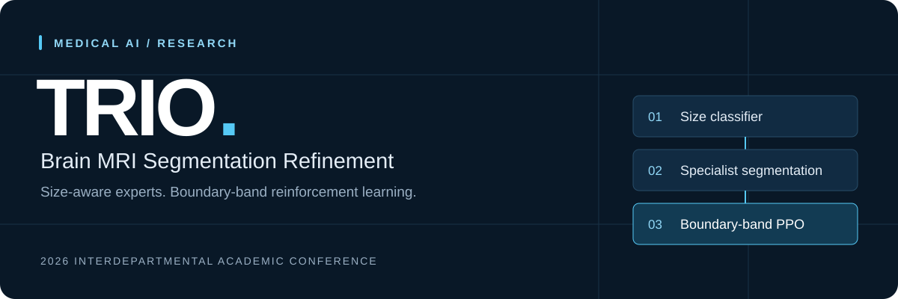
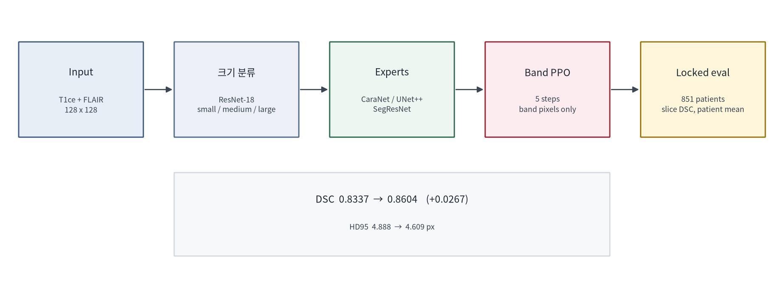
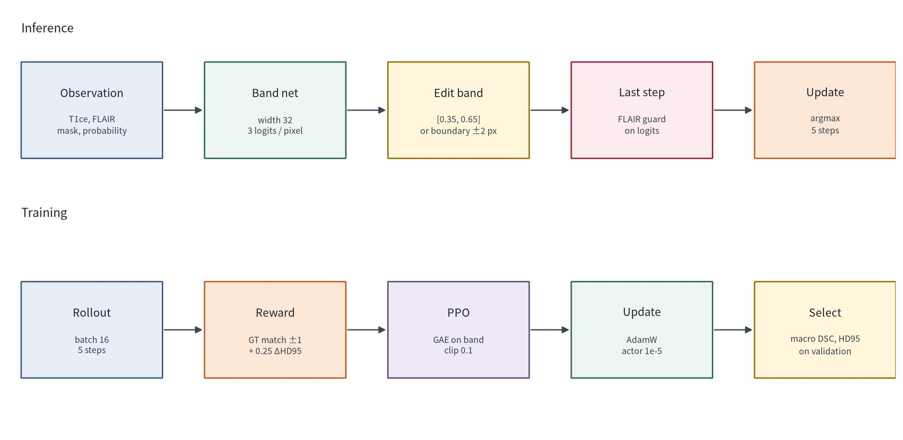
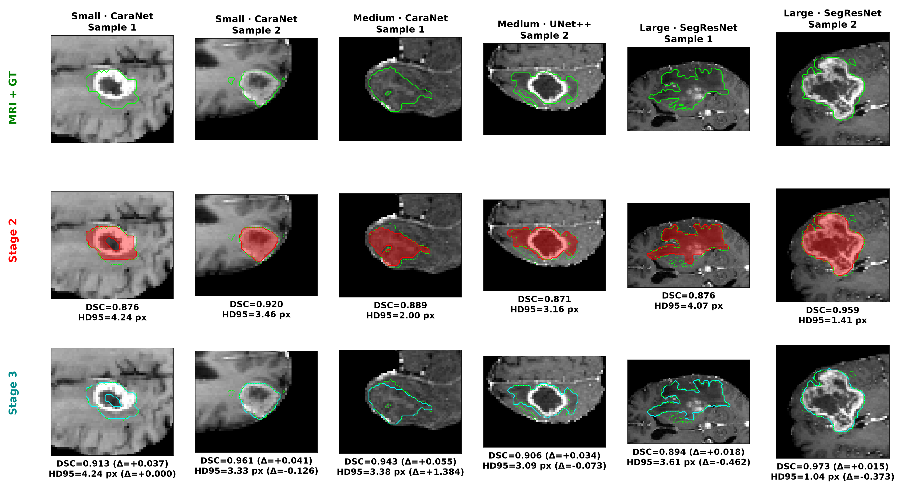
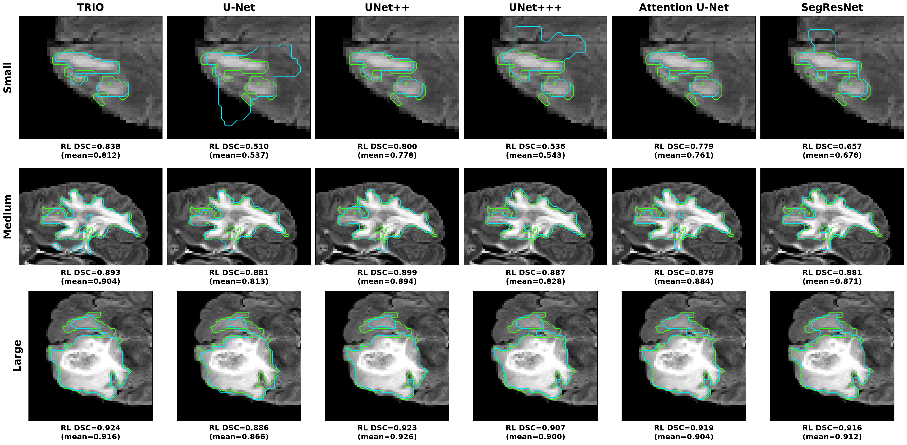

<p align="center">
  
</p>

<h1 align="center">뇌종양 MRI, 경계를 더 정밀하게.</h1>

<p align="center">
  크기에 맞는 전문가가 분할하고, 하나의 강화학습 정책이 애매한 경계 띠를 보정합니다.<br />
  <strong>2026 컴공 &amp; 인지 연합학술제 · 연구트랙</strong>
</p>

<p align="center">
  가천대학교 컴퓨터공학과 · 202135993 · <strong>안인성</strong><br />
  가천대학교 인공지능학과 · 202634031 · <strong>한수진</strong>
</p>

<p align="center">
  <a href="https://aninsung.github.io/2026-summer-Interdepartmental-Academic-Conference/"><strong>연구 페이지</strong></a> &nbsp; · &nbsp;
  <a href="연구_야호_PPT(09.30).pdf"><strong>ppt</strong></a> &nbsp; · &nbsp;
  <a href="docs/paper_miccai.pdf"><strong>논문</strong></a> &nbsp; · &nbsp;
  <a href="#02--pipeline">Pipeline</a> &nbsp; · &nbsp;
  <a href="#03--results">Results</a> &nbsp; · &nbsp;
  <a href="#04--reproduce">Reproduce</a> &nbsp; · &nbsp;
  <a href="#05--documents">Documents</a>
</p>

<p align="center">
  <code>BraTS 2021</code> &nbsp; <code>PyTorch</code> &nbsp; <code>MONAI</code> &nbsp; <code>PPO</code>
</p>

| 평가 환자 | 종양 슬라이스 | Stage 2 → 경계 띠 PPO | 환자 평균 DSC 향상 |
|:---:|:---:|:---:|:---:|
| **851명** | **50,010장** | **0.8337 → 0.8604** | **+0.0267** |

환자 짝 차이의 **95% CI는 0.0256–0.0278**입니다. 검증 60명으로 임계값을 다시 고른 Stage 2(0.8411)와 비교해도 **+0.0193** (95% CI 0.0184–0.0202)이 남습니다.

> **수치 읽기** — 128×128 2차원 슬라이스 DSC를 환자마다 평균한 결과이며, BraTS 3차원 대회 점수가 아닙니다. 851명은 가중치 학습에서 제외했지만, 이 중 148명은 과거 임계값·연결요소 기준을 정한 풀과 겹칩니다. 평가 조건과 비교의 한계는 아래에 함께 적었습니다.

---

## 01 · Research

Whole Tumor의 단면 크기는 슬라이스마다 다릅니다. 작은 단면과 큰 단면을 한 모델이 동시에 맞추면, 위치는 맞아도 경계에 과소분할이 남습니다. 그 경계를 사람이 슬라이스마다 고치는 일을, 크기별 전문가와 경계 띠 정책으로 나눴습니다.

지표는 겹침 **DSC**(높을수록 좋음)입니다. 평가는 128×128 슬라이스 DSC를 환자마다 평균한 값이며, BraTS 3차원 대회 점수가 아닙니다.

---

## 02 · Pipeline

<p align="center">
  
</p>

| 단계 | 하는 일 | 가중치 |
|:---:|---|---|
| 1 | T1ce·FLAIR로 종양 면적을 Small / Medium / Large로 분류 | `shape_classifier_best.pt` |
| 2 | 크기별 전문가가 확률 맵을 만들고 고정 임계값으로 이진화 | CaraNet · UNet++ · SegResNet |
| 3 | 확률 0.35–0.65 또는 경계 ±2px만 켜기·유지·끄기 | `band_ppo.pt` |
| 4 | 환자 평균 DSC로 채점 | `results/band_ppo_locked.json` |

Small은 인접 슬라이스 2.5D, Large는 부종과 종양핵을 Whole Tumor로 합칩니다. 정책은 크기마다 나누지 않습니다. 추론 관측에는 정답이 없고, 정답은 학습 보상에만 씁니다. 마지막 스텝의 행동만 그 슬라이스 FLAIR 밝기 제약을 받습니다.

<p align="center">
  
</p>

위는 네 채널 관측으로 띠를 정하고, FLAIR 제약을 마지막 스텝에만 건 뒤 argmax로 다섯 스텝 마스크를 갱신합니다. 아래는 정답을 보상에만 쓰고, 배치 16이 다섯 스텝을 돌아 GAE–PPO로 행동 머리와 가치 머리를 갱신합니다. 맨 아래 표는 분류기 라우팅 851명의 확정 평가이며, 숫자는 [크기별 표](#크기별-분할-성능)와 같습니다.

> **평가 범위**
>
> 환자 단위 분할입니다. BraTS 2021 1251명 중 seed 42로 고른 개발 400명(학습 280 / 검증 60 / 방법 선택 60)은 평가에서 뺍니다. 남은 **851명, 종양 슬라이스 50,010장**이 아래 표입니다. 고정 임계값 0.80/0.80/0.50과 연결요소 기준은 이전 210명 풀에서 정했고, 그중 148명이 이 851명에 들어 있습니다. 띠 설계는 이번 방법 선택 60명에서 정했고, 가중치는 이번 개발 400명으로 다시 학습했습니다.

---

## 03 · Results

### 크기별 분할 성능

분류기가 전문가를 고르고, 임계값은 0.80 / 0.80 / 0.50으로 고정했습니다. 크기 행은 서로 다른 환자군이 아닙니다. 그 면적의 슬라이스가 있는 환자 평균이라 같은 환자가 두 행 이상에 들어갑니다.

| 정답 면적 | 환자 | Stage 2 | 경계 띠 PPO | 짝 차이 (95% CI) |
|---|---:|---:|---:|---|
| 전체 | 851 | 0.8337 | **0.8604** | +0.0267 (0.0256–0.0278) |
| 300px 미만 | 851 | 0.7579 | **0.7933** | +0.0354 (0.0338–0.0370) |
| 300–700px | 757 | 0.8700 | **0.8952** | +0.0252 (0.0239–0.0265) |
| 700px 이상 | 408 | 0.8981 | **0.9169** | +0.0188 (0.0173–0.0205) |

### MRI · Before & After

<p align="center">
  <a href="results/band_ppo_delta_matched/delta_matched_comparison.png">
    
  </a>
</p>

**Ground truth → Initial mask → PPO refinement** · 이미지를 클릭하면 원본 크기로 볼 수 있습니다.

위는 정답, 가운데는 Stage 2, 아래는 경계 띠 PPO입니다. 열 제목의 앞은 정답 면적, 뒤는 분류기가 고른 전문가입니다. 중형 첫째는 정답 면적이 중형인데 CaraNet으로 갔습니다. 칸 숫자는 그 슬라이스 값이고 위 표의 환자 평균이 아닙니다. 중형 첫째의 HD95는 2.00에서 3.38 px로 늘었습니다.

### 임계값 재조정과 비교

임계값만 검증 60명으로 다시 고르면(0.45 / 0.80 / 0.20) Stage 2는 0.8411입니다. 이득의 약 28%는 임계값 조정으로 설명되고, 나머지 +0.0193은 PPO만의 몫입니다. 세 구간 모두 95% CI가 0을 포함하지 않습니다. 결과는 `results/stage2_retuned.json`이고, `python scripts/eval/evaluate_stage2_retuned.py`로 다시 만듭니다.

### 2026-10-07 재학습

위 표의 0.8337→0.8604는 9월 30일 잠금 가중치입니다. 같은 분할로 시드만 바꿔 다시 학습한 결과는 아래와 같습니다. 가중치는 `checkpoints/seeds/{42,7,123}/`입니다.

| 시드 | Stage 2 | 경계 띠 PPO | 대형 전 슬라이스 | PPO 빈 슬라이스 거짓 양성 | PPO 3D Dice | PPO 공통 HD95 |
|---|---:|---:|---:|---:|---:|---:|
| 42 | 0.8339 | 0.8597 | 0.8503 | 0.521 | 0.813 | 10.73 mm |
| 7 | 0.8370 | 0.8620 | 0.8540 | 0.497 | 0.811 | 10.35 mm |
| 123 | 0.8352 | 0.8609 | 0.8500 | 0.571 | 0.809 | 10.73 mm |

PPO DSC 평균은 0.8609, 범위는 0.0023입니다. 시드 42에서 Stage 2의 빈 슬라이스 거짓 양성은 0.567, 3D Dice는 0.779, 공통 HD95는 11.54 mm입니다. 대형 전문가를 전 슬라이스에 쓰면 거짓 양성 0.930, 3D Dice 0.799입니다. 시드 7의 Stage 2·PPO·대형은 거짓 양성 0.532, 0.497, 0.821이고 3D Dice는 0.786, 0.811, 0.796입니다. 시드 123은 거짓 양성 0.601, 0.571, 0.829이고 3D Dice는 0.771, 0.809, 0.759입니다. 대형 HD95는 세 방법이 모두 마스크를 가진 슬라이스만의 값입니다.

같은 시드 42 가중치의 추론 ablation에서 5스텝 PPO는 0.8597, 1스텝은 0.8460, 중형 지도학습 1스텝은 0.8383입니다. 대형 전문가에 경계 띠 PPO를 붙이면 0.8676, 정답 크기 라우팅은 0.8698입니다. 210명 풀과 겹치는 148명을 뺀 703명에서 5스텝 PPO는 0.8579입니다. 반경 0은 0.8427이고, 스텝 3·가드 해제·띠 폭 변경은 0.8575–0.8601입니다.

단일 U-Net은 DSC 0.8156(95% CI 0.8067–0.8243), HD95 6.939 px입니다. 전역 수축·유지·팽창 바닐라 PPO는 DSC 0.8133(0.8046–0.8220), HD95 6.955 px입니다. 환자 짝 차이는 −0.0023(95% CI −0.0029–−0.0017)입니다. 소형 0.7215→0.7197, 중형 0.8758→0.8736, 대형 0.8973→0.8939입니다. 파일은 `results/protocol_gaps/three_seeds.json`, `results/vanilla_unet_851.json`, `results/ablation_review/summary.json`입니다.

<details>
<summary><strong>추가 실험 보기 · 단일 백본 + PPO (48명, 슬라이스 평균)</strong></summary>

같은 분할의 학습 280명으로, 백본 하나와 섹터 PPO 하나를 다섯 세트 학습했습니다. 출력은 이진 Whole Tumor이고, 초기 임계값은 0.5, PPO는 15스텝·10만 스텝입니다. 아래 숫자는 851명 환자 평균이 아닙니다. 개발 400명을 뺀 환자 48명(seed 7), 종양 슬라이스 2,754장의 슬라이스 평균입니다. 그림의 TRIO 열만 현재 경계 띠 파이프라인입니다.

| 방법 | Small | Medium | Large |
|---|---:|---:|---:|
| TRIO | 0.812 | 0.904 | 0.916 |
| UNet++ + PPO | 0.778 | 0.894 | 0.926 |
| Attention U-Net + PPO | 0.761 | 0.884 | 0.904 |
| SegResNet + PPO | 0.676 | 0.871 | 0.912 |
| UNet+++ + PPO | 0.543 | 0.828 | 0.900 |
| U-Net + PPO | 0.537 | 0.813 | 0.866 |



가중치는 `checkpoints/single_backbone/`이고, 수치는 `results/single_backbone_ppo_grid_metrics.json`입니다. U-Net 검증 DSC는 0.8834입니다.

</details>

---

## 04 · Reproduce

**PyTorch · MONAI · PPO** &nbsp; / &nbsp; T1ce + FLAIR · 128×128 slices

### 환경 준비

```bash
git clone https://github.com/aninsung/2026-summer-Interdepartmental-Academic-Conference.git
cd 2026-summer-Interdepartmental-Academic-Conference
pip install -r requirements.txt
```

BraTS 2021은 `src/data/archive`에 둡니다. 논문 표는 아래 한 명령으로 다시 만듭니다.

```bash
python scripts/eval/evaluate_band_ppo_locked.py
```

```
run_pipeline.py          평가 진입점
scripts/train/           분류기, 전문가, 경계 띠 PPO
scripts/eval/            851명 평가와 비교 그림
src/                     데이터, 모델, 지표
baselines/               이전 실험 기록. 현재 비교에 쓰지 않는다
checkpoints/             가중치와 patient_split.json
```

---

## 05 · Documents

| 문서 | 내용 |
|:---|:---|
| [논문 · 영어](docs/paper_miccai.pdf) | 영문 원고 PDF. 연구 방법과 실험 결과 |
| [논문 · 한국어](docs/paper_miccai_ko.pdf) | 같은 내용의 한글 원고 PDF |
| [파이프라인 상세](docs/PIPELINE.md) | 단계별 입력·출력과 학습·평가 흐름 |
| [실험 결과](docs/EXPERIMENT_RESULTS.md) | 실험 수치와 기록 |
| [과거 실험 기록](docs/history_2026-08-20.md) | 2026-08-20 평가 · 210명 풀, val 42명, GT 기반 단조 DSC 게이트 |

<p align="center">
  <strong>TRIO · 2026 컴공 &amp; 인지 연합학술제</strong><br />
  Medical Image Segmentation · Deep Learning · Reinforcement Learning
</p>

