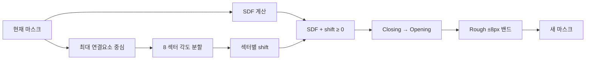
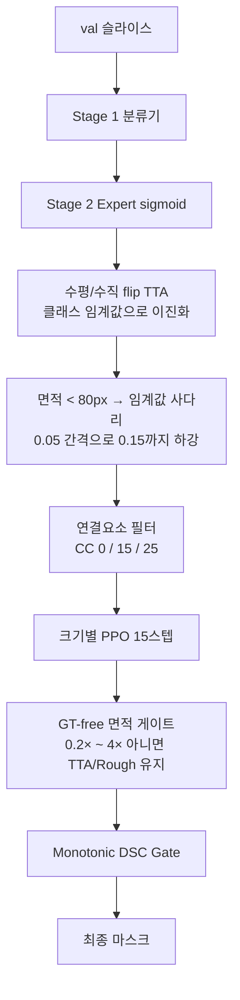
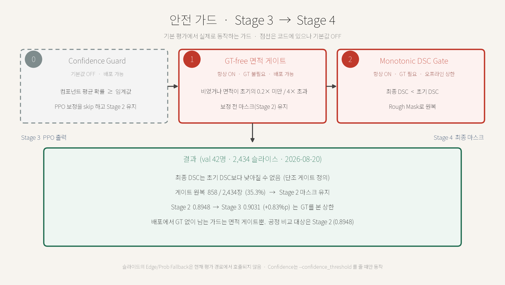

# RL-Refiner 파이프라인 상세

3단계 동적 라우팅(분류 → 크기별 Expert 분할 → 크기별 경계 보정)과 4번째 평가 단계를 **코드 기준**으로 정리한 문서입니다.

실험 수치와 이력은 [EXPERIMENT_RESULTS.md](EXPERIMENT_RESULTS.md), 대회 상위 입상 방법과의 비교는 [baselines/README.md](../baselines/README.md), 논문 초안은 [paper_draft_ko.md](paper_draft_ko.md)를 봅니다. 비교 그림·표에서 이 파이프라인 Stage 3(단조 DSC 게이트)는 **TRIO**로 표기합니다.

기준 실행: **2026-08-20 `python run_pipeline.py batch_size=64`** (seed 42, 결정적 모드 ON). Stage 2 임계값 0.80 / 0.80 / 0.50, CC 0 / 15 / 25.

---

## 1. 한눈에 보는 구조

입력은 BraTS 2021 환자의 **T1ce + FLAIR** 2채널 2D 슬라이스(128×128)입니다. Small Expert만 인접 슬라이스를 붙인 **2.5D**(6채널)를 씁니다. 출력은 Whole Tumor 이진 마스크입니다.

| 단계 | 이름 | 하는 일 | 학습 산출물 |
|:---:|---|---|---|
| 1 | Shape Classifier | 종양 면적으로 Small / Medium / Large 분류 | `checkpoints/shape_classifier_best.pt` |
| 2 | Size Expert | 클래스에 맞는 분할 모델이 확률 맵 생성 | `caranet_best.pt`, `unetplusplus_best.pt`, `segresnet_best.pt` |
| 3 | PPO Refiner | 8방위 SDF 이동으로 경계를 미세 조정 | `ppo_small.zip`, `ppo_medium.zip`, `ppo_large.zip` |
| 4 | Evaluation | DSC / HD95 / Precision / Recall 집계, Monotonic DSC Gate, 시각화 | `results/pipeline_sample_*.png`, `results/method_comparison_3x6.png` |

원스톱 진입점은 `run_pipeline.py`입니다. 기본 환자 풀은 Stage 1–4 공통 **210명**이고, 이 중 **train 168명 / val 42명**으로 나뉩니다.


구현 위치:

- 라우터: `src/models/dynamic_router.py`의 `AdaptivePipeline`
- RL 환경: `src/envs/mask_refinement_env.py`의 `MaskRefinementEnv`
- 지표: `src/utils/metrics.py` (`dice`, `hd95`, `precision`, `recall`, `apply_monotonic_dsc_gate`, `gt_size_class`)
- 평가: `scripts/eval/evaluate_pipeline.py`

---

## 2. 데이터

로더: `src/data/brats2020_dataset.py` (`BraTS2020Dataset`). BraTS 2020/2021 NIfTI를 모두 읽습니다.

| 항목 | 값 |
|---|---|
| 경로 | `src/data/archive` |
| 모달리티 | `t1ce+flair` (2채널). `t1ce`, `t1ce+t2` 등도 가능 |
| 해상도 | 128×128 |
| 레이블 | WT: seg의 0 이외. Large 학습용 영역 헤드: ED(label 2), TC(NCR 1 ∪ ET 4) |
| 정규화 | 뇌 마스크 안 z-score → 1–99 퍼센타일 클리핑 → 0–1 |
| 유효 슬라이스 | 종양 픽셀 비율 ≥ 0.002 |
| 기본 환자 풀 | 210명 → **12,241 슬라이스** |

### 2.1 환자 단위 분할

분할 파일은 `checkpoints/patient_split.json` (80/20, seed=42)이며 **Stage 1–4가 같은 파일을 공유**합니다. 슬라이스가 아니라 **환자**를 나누므로, 같은 환자의 인접 슬라이스가 train과 val에 동시에 들어가는 누출이 없습니다.

| 역할 | 환자 | 슬라이스 | Small `<300` | Medium `300–700` | Large `≥700` |
|---|---:|---:|---:|---:|---:|
| train (GT 구간) | 168 | 9,868 | 3,561 | 4,184 | 2,123 |
| val GT 구간 (이전 집계) | 42 | 2,373 | 942 | 847 | 584 |
| val 2026-08-20 평가 | 42 | **2,434** | 897* | 1,152* | 385* |

\* 2026-08-20 클래스 수는 **분류기 라우팅** 분포입니다.

`src/data/patient_split.py`의 `load_split_brats_datasets`가 **분할을 먼저 확정한 뒤 그 환자 ID만** 데이터셋에 넘깁니다. `max_patients`를 로더에 직접 넘기면 "정렬 순 앞 N명"이 실려 무작위 표본과 어긋나므로 그렇게 하지 않습니다.

기존 분할 파일이 현재 환자 풀과 호환되지 않으면 재생성하며, 호환되는 경우에는 절대 덮어쓰지 않습니다.

---

## 3. 크기 클래스

면적은 GT(또는 평가 시 예측 컴포넌트)의 픽셀 수입니다. 정의는 `src/utils/metrics.py`의 `gt_size_class`와 `src/data/shape_dataset.py`가 공유합니다.

| 클래스 | 면적 | Expert | PPO |
|---|---|---|---|
| 0 Small | `0 < area < 300` | CaraNet | `ppo_small.zip` |
| 1 Medium | `300 ≤ area < 700` | UNet++ | `ppo_medium.zip` |
| 2 Large | `area ≥ 700` | SegResNet | `ppo_large.zip` |

Stage 2 Expert와 Stage 3 PPO **모두 GT 면적**으로 클래스를 필터합니다. 분류기 예측을 쓰는 곳은 Stage 4 평가의 라우팅뿐입니다.

---

## 4. 학습 파이프라인 (`run_pipeline.py`)

```bash
python run_pipeline.py batch_size=64
```

`key=value` 형태를 `--key value`로 자동 변환하므로 `--batch_size 64`와 같습니다.

공통 인자: `--train_root src/data/archive`, `--max_train_patients 210`, `--patient_split checkpoints/patient_split.json`, `--modality t1ce+flair`, `--seed 42`, `--deterministic`.

건너뛰기 플래그: `--skip_classifier`, `--skip_experts`, `--skip_agents`, `--skip_eval`.


PPO는 Stage 2 체크포인트가 있어야 `AdaptivePipeline`이 Expert를 로드할 수 있으므로, Expert 학습이 먼저입니다.

### 4.1 재현성

| 항목 | 값 |
|---|---|
| 시드 | `--seed 42` (Stage 1–4 공통) |
| 결정적 모드 | **기본 활성화**. 해제는 `--no_deterministic` |
| 구현 | `src/utils/seed.py`의 `set_seed` |

`set_seed`는 `random` / `numpy` / `torch` / CUDA 시드를 고정하고, 결정적 모드에서 `cudnn.deterministic=True`, `cudnn.benchmark=False`, `CUBLAS_WORKSPACE_CONFIG=:4096:8`, `torch.use_deterministic_algorithms(True, warn_only=True)`를 설정합니다. `--deterministic` 플래그는 하위 호환용으로 남아 있으며 기본값과 동일합니다.

---

## 5. Stage 1 — Shape Classifier

| 항목 | 내용 |
|---|---|
| 스크립트 | `scripts/train/train_shape_classifier.py` |
| 모델 | ResNet18, `conv1`을 2채널, `fc`를 3클래스 (`src/models/shape_classifier.py`) |
| 초기화 | **ImageNet 사전학습 기본 사용**. `--no_pretrained`로 무작위 초기화 (ablation) |
| 레이블 | GT 면적 → 0/1/2 (`ShapeDataset`) |
| 손실 | CrossEntropy |
| 옵티마이저 | **AdamW**, `--lr 1e-3`, `--weight_decay 1e-4` |
| 스케줄러 | **CosineAnnealingLR** (`T_max=epochs`) |
| 에폭 / 배치 | 15 / 64 |
| 분할 | **환자 단위** (train 9,868 / val 2,373 슬라이스) |
| 저장 | 검증 정확도 최고 가중치 |
| 이번 실행 | Best Val Acc **0.8512** |

`conv1`을 2채널로 바꿀 때 ImageNet RGB 커널을 채널 축으로 합한 뒤 입력 채널 수로 나눠 균등 분배합니다. 입력 채널이 같은 값일 때 원래 응답 크기가 유지됩니다.

### 5.1 과적합에 대한 기록

이번 실행에서 Train Acc는 0.96–0.99까지 오르지만 Val Acc는 0.85 부근에서 멈춥니다. ImageNet 사전학습 없이 무작위 초기화한 ablation은 Best Val Acc **0.8424** (`checkpoints/shape_classifier_scratch_backup.pt`)로, 사전학습의 이득은 약 +0.9%p에 그쳤습니다.

원인은 특징 품질이 아니라 **레이블 자체의 모호성**입니다. 면적 300 / 700 경계 바로 옆 슬라이스는 몇 픽셀 차이로 클래스가 갈리므로, 분류 문제로 보면 줄일 수 없는 잡음이 남습니다. 라우팅 오류의 영향은 Stage 4 결과에서 확인할 수 있습니다(§8.5).

과거 문서에 있던 Val Acc 0.9383은 **슬라이스 단위 80/20 분할**로 측정한 값입니다. 같은 환자의 인접 슬라이스가 train과 val에 함께 들어가 누출이 있었으므로, 현재 환자 단위 분할 수치와 비교하면 안 됩니다.

---

## 6. Stage 2 — 크기별 Expert

Small·Medium은 `--refinement_mode`로 자기 크기(GT 면적)만 남깁니다. **Large SegResNet은 크기 필터 없이 전 구간**을 학습하고, 추론 때만 Large로 라우팅된 슬라이스에 쓰입니다.

| 항목 | 값 |
|---|---|
| 에폭 / 배치 | 20 / 64 |
| 옵티마이저 | Adam, `--lr 3e-4` |
| 스케줄러 | CosineAnnealingLR (`T_max=epochs`) |
| 정밀도 | AMP (FP16) |

| Expert | 파일 | 왜 이 모델인가 | 입력 / 출력 | 손실 | 학습 범위 |
|---|---|---|---|---|---|
| Small CaraNet | `src/models/caranet.py` | 작은 물체용 Context Axial Reverse Attention | 2.5D 6채널 (`z-1,z,z+1`) / WT 1채널 | **BCEDice** 0.5+0.5. GT `<50px` ×4 오버샘플, zoom-crop | Small만 |
| Medium UNet++ | `src/models/unetplusplus.py` | MONAI BasicUNetPlusPlus, features `(16,32,64,128,256,16)` | 중심 2채널 / WT 1채널 | BCEDice 0.5+0.5 | Medium만 |
| Large SegResNet | `src/models/segresnet.py` | 잔차 인코더, `init_filters=16` | 중심 2채널 / **ED+TC 2채널** → WT=`1-(1-p_ed)(1-p_tc)` | MultiChannelBCEDice | **전 구간** |

Small 학습 보조: `src/data/fragment_oversample.py`, `src/utils/zoom_crop.py`. 체크포인트 채널이 바뀌면 `src/utils/weight_adapt.py`가 첫  conv를 맞춰 이어서 학습합니다.

`AdaptivePipeline` 로드 순서:

1. Small: `caranet_best.pt` → 없으면 `attention_unet_best.pt` → 없으면 랜덤 CaraNet
2. Medium: `unetplusplus_best.pt` → 없으면 `unet3plus_best.pt` → 없으면 랜덤 UNet++
3. Large: `segresnet_best.pt` → 없으면 랜덤 SegResNet (ckpt의 in/out 채널을 읽어 구성)

순전파: 분류기는 **중심 2채널**, Small Expert는 2.5D, Medium/Large는 중심 2채널. 채널 수가 안 맞으면 `_match_in_channels`가 중심 슬라이스를 꺼내거나 복제합니다. 클래스별로 해당 Expert → sigmoid → WT 확률 `(B, 1, H, W)`. Large가 2채널이면 `region_logits_to_wt`로 합칩니다. Small은 1차 예측 뒤 zoom-crop 재추론을 한 번 더 합니다.

Expert 단독 성능은 이진화 임계값에 따라 달라지므로 §8에서 함께 다룹니다.

---

## 7. Stage 3 — 크기별 PPO

스크립트: `scripts/train/train_agent.py`
설정: `configs/ppo_brats.yaml`
라이브러리: Stable-Baselines3 PPO, Gymnasium

### 7.1 학습 데이터 구성

1. `patient_split.json`의 **train 환자** 슬라이스를 로드한다.
2. GT에 형태학 노이즈(`make_noisy_mask`, `max_morph_px=5`)를 넣어 **합성 Rough**를 만든다.
3. `AdaptivePipeline`으로 **실제 Expert 예측**과 확률 맵을 뽑은 뒤, **평가와 같은 클래스별 임계값(0.80 / 0.80 / 0.50)** 으로 이진화한다.
4. `gt_size_class`로 `refinement_mode`에 해당하는 클래스만 남긴다. (**GT 면적 기준**)
5. 실제 예측 50% + 합성 노이즈 50%를 이어 붙여 섞는다 (mixup).

평가 환경(`eval_env`)은 **val 환자 hold-out**을 쓰고 mixup 없이 실제 Expert 예측만 사용합니다. 즉 PPO의 조기 종료·best 모델 선택이 학습에 쓰이지 않은 환자로 이뤄집니다.

| 에이전트 | 클래스 필터 (train) | 믹스업 후 train | val hold-out |
|---|---:|---:|---:|
| Small | 3,561 | 7,122 | 942 |
| Medium | 4,184 | 8,368 | 847 |
| Large | 2,123 | 4,246 | 584 |

노이즈 생성기의 시드는 전역 `--seed`에 묶여 있어, 같은 시드면 같은 합성 Rough가 나옵니다.

### 7.2 PPO 하이퍼파라미터

| 항목 | 값 |
|---|---|
| total_timesteps | 300,000 (실제 303,104) |
| n_envs / n_steps | 8 / 1,024 |
| batch_size / n_epochs | 256 / 10 |
| lr / clip / ent_coef | 1e-4 / 0.2 / 0.01 |
| gamma / GAE λ | 0.99 / 0.95 |
| net_arch | `[512, 256, 128]` |
| max_steps / target_dsc | 30 / 1.0 (조기 종료 사실상 없음) |
| step_penalty | 0.001 |

조기 종료 장치는 셋 다 **끄거나 무해하게** 설정했습니다.

| 장치 | 설정 | 이유 |
|---|---|---|
| `stop_dsc_target` | **0 (비활성화)** | Medium/Large의 rough DSC가 이미 기본 임계값 0.92를 넘어 첫 평가(2,048 스텝)에서 즉시 중단됐다 |
| `stop_plateau` | **false (비활성화)** | 세 에이전트 모두 `total_timesteps`를 완주시킨다 |
| Milestone Snapshot | 25 / 50 / 75% | `checkpoints/snapshots/{small,medium,large}/`에 **클래스별 하위 폴더**로 저장해 서로 덮어쓰지 않는다 |

최종 모델은 eval 보상이 가장 좋았던 스냅샷(`checkpoints/best_{mode}/best_model.zip`)을 `ppo_{small,medium,large}.zip`으로 복사한 것입니다.

이번 실행의 Large 에이전트: 27m56s, eval 보상 120K 606.76 → 240K 639.43, 에피소드 길이 30.0 고정.

### 7.3 환경: 8방위 SDF 보정

공통 절차 (`MaskRefinementEnv.step`):

1. 현재 마스크에서 **가장 큰 연결 요소**의 중심을 잡는다.
2. 중심 기준 각도로 8개 섹터를 나눈다.
3. 마스크 SDF(내부 +, 외부 −)에 섹터별 shift를 더한다.
4. `SDF + shift ≥ 0`인 픽셀이 새 마스크가 된다.
5. 면적 > 20이면 Closing 후 Opening.
6. 초기 Rough의 **±8 px** 밖으로 나가지 못하게 클립한다.



관측(`_obs`)은 영상·현재 마스크·확률 맵·에지로만 구성되며 **GT를 포함하지 않습니다.** GT는 보상 계산에만 쓰입니다.

### 7.4 크기별 관측·행동·보상

| 항목 | Small | Medium | Large |
|---|---|---|---|
| 관측 | 4ch 64×64 crop (영상, 마스크, 확률, Sobel) | 3ch 128×128 (영상, 마스크, 확률) | Medium과 동일 |
| 행동 | 연속 `Box(-2, 2)` 8차원 | 이산 5단계×8 | Medium과 동일 |
| 이산 매핑 | — | 강수축 −1.0 / 약수축 −0.4 / Keep 0 / 약팽창 +0.4 / 강팽창 +1.0 px | 동일 |
| DSC 보너스 | ≥ 0.85 → +50 | ≥ 0.95 → +50 | ≥ 0.95 → +50 |
| HD95 가중치 | 0.2 | 0.1 | **0.5** |
| 보상 스케일 | ×30 × size_scale | ×30 × size_scale | × size_scale만 |

보상 공통:

- `size_scale = clip(300 / GT면적, 0.5, 3.0)` — 작은 종양일수록 보상 증폭
- DSC / 경계 DSC(GT ±3px 밴드) / HD95가 나빠지면 개선분의 **2배 감점**
- 에피소드 시작 DSC보다 떨어지면 **−5.0**
- Keep이면서 DSC ≥ 0.85이면 +0.05
- 행동 비용: Keep이 아닌 섹터 수 × `step_penalty / 8`
- DSC 목표 보너스는 조건을 만족하는 **매 스텝** 주어집니다 (1회 한정이 아님)

에피소드: 최대 30스텝, `DSC ≥ target_dsc(1.0)`이면 종료.

---

## 8. Stage 4 — 평가·추론

스크립트: `scripts/eval/evaluate_pipeline.py`

지표: **DSC**(↑), **HD95 px**(↓), **Precision**(↓이면 과분할), **Recall**(↓이면 과소분할). 구현은 모두 `src/utils/metrics.py`입니다.

기본 평가 경로:

- **val 환자 42명**만 사용 (`--split_role val`, 기본값)
- Stage 1 **분류기**로 Expert 선택. `--oracle_routing`을 주면 GT 면적으로 고정하는 상한 평가
- 클래스별 이진화 임계값 `--stage2_thresholds 0.80,0.80,0.50`
- 연결요소 최소 픽셀 `--cc_min_sizes 0,15,25` (Small은 끔)
- Small / Medium / Large **모두** PPO `predict()` 15스텝
- GT-free 면적 게이트 + Monotonic DSC Gate

주요 인자:

| 인자 | 기본값 | 설명 |
|---|---|---|
| `--max_patients` | 210 | 분할 생성 기준 환자 풀 |
| `--split_role` | `val` | `train` / `val` / `all` |
| `--stage2_thresholds` | `0.80,0.80,0.50` | Small / Medium / Large 이진화 임계값 |
| `--cc_min_sizes` | `0,15,25` | 클래스별 연결요소 최소 픽셀. 0이면 비활성 |
| `--micro_area_floor` | 80.0 | 이 면적 미만이면 임계값 사다리 발동 |
| `--micro_thr_floor` | 0.15 | 사다리 하한 |
| `--oracle_routing` | off | GT 면적 라우팅 (상한) |
| `--skip_ppo` | off | Stage 3 생략, Stage 2 단독 베이스라인 측정 |
| `--confidence_threshold` | None | 평균 확률이 이 값 이상이면 PPO 생략 |

### 8.1 슬라이스별 처리 순서



### 8.2 클래스별 이진화 임계값

기본값은 **0.80 / 0.80 / 0.50**입니다. Small·Medium은 과분할(Recall > Precision) 경향이 있어 임계값을 올렸고, Large는 ED/TC 학습 이후 **과소분할**(Precision > Recall)이라 0.70에서 **0.50**으로 내렸습니다.

TTA 재이진화는 **슬라이스 클래스 `c`** 의 임계값을 씁니다. 컴포넌트 크기 `ck`로 자르면 Large 슬라이스의 작은 덩어리가 Small 0.80으로 다시 잘립니다.

임계값 탐색은 `scripts/eval/sweep_threshold.py`로 합니다. 확률 맵을 한 번 캐시한 뒤 여러 임계값의 DSC / Precision / Recall을 재계산하므로 파이프라인을 다시 돌리지 않습니다.

```bash
python scripts/eval/sweep_threshold.py --split_role val --plot results/threshold_sweep.png
```

임계값 조정만으로 얻는 이득이 PPO 보정분에 필적하므로, 베이스라인과 비교할 때는 **양쪽 모두 임계값을 조정**해야 공정합니다. 자세한 논의는 [baselines/README.md](../baselines/README.md)를 봅니다.

### 8.3 미세 파편 임계값 사다리

TTA 확률을 클래스 임계값으로 이진화한 결과가 `--micro_area_floor`(80 px) 미만이면, 임계값을 **0.05씩 낮추며** 면적이 기준을 넘거나 `--micro_thr_floor`(0.15)에 닿을 때까지 반복합니다.

Small 클래스에 0.80 같은 높은 임계값을 쓰면 아주 작은 종양이 통째로 사라질 수 있는데, 사다리가 그 경우만 국소적으로 완화합니다. 고정된 후보 임계값 목록을 쓰지 않으므로 `--stage2_thresholds`를 바꿔도 사다리가 그 값에서 자연히 이어집니다.

### 8.4 라우팅과 PPO 재선택

Expert 선택은 분류기 예측 클래스로 하고, **보정기 선택은 예측 마스크의 연결요소 면적**으로 다시 합니다. 분류기가 틀려도 컴포넌트 크기에 맞는 PPO가 붙습니다.

Small은 마스크가 35 px 미만이면 수축(음수) 행동을 0으로 자릅니다.

### 8.5 안전 가드 (Stage 3 → 최종 마스크)

08-20 기본 평가에 **켜져 있는** 가드는 두 개입니다. 컴포넌트마다 한 번, 슬라이스 합친 뒤에 한 번 더 적용합니다.




| 순서 | 가드 | 판정 | GT | 08-20 기본 |
|---|---|---|:---:|:---:|
| ① | GT-free 면적 (`_gt_free_accept`) | 보정이 비었거나 면적이 초기의 0.2배 미만 / 4배 초과 | ✗ | **ON** |
| ② | Monotonic DSC (`apply_monotonic_dsc_gate`) | 보정 DSC &lt; 초기 DSC | **✓** | **ON** |
| — | Confidence skip (`--confidence_threshold`) | 컴포넌트 평균 확률 ≥ 임계값이면 PPO 자체를 생략 | ✗ | **OFF** (기본 `None`) |

학습 중 환경 안에도 하락을 막는 장치가 있습니다. 초기 Rough **±8 px** 밖으로 못 나가게 클립하고, 에피소드 시작 DSC보다 떨어지면 보상 **−5.0**입니다. 평가의 `_refine_with_ppo`는 15스텝 중 GT DSC가 가장 좋았던 스텝을 고른 뒤 다시 단조 게이트를 탑니다. 이 스텝 선택도 GT를 씁니다.

**현재 코드에 없는 것** (옛 발표 슬라이드와 다름):

- 확률–에지 정합이 안 좋아지면 되돌리는 **Edge / Prob Fallback**
- DSC 하락 **또는 HD95 증가** 시 원복하는 Dual Gate
- 기본 평가에서 Confidence 0.85로 PPO를 건너뛰는 설정
- “3개 클래스 점수 하락 0%” 같은 결과는 단조 게이트가 GT로 하락분을 잘라낸 뒤에만 성립합니다. 게이트 없이 PPO가 나빠진 슬라이스는 2,434장 중 **858장(35.3%)** 입니다.

Monotonic DSC Gate는 배포에 쓸 수 없습니다. 베이스라인과 공정 비교의 대상은 게이트를 타지 않은 **Stage 2 초기 DSC**입니다.

### 8.6 이번 실행 결과 (val 42명 · 2,434 슬라이스, 2026-08-20)

| 지표 | Stage 2 초기 | Stage 3 보정 후 | 변화 |
|---|---:|---:|---:|
| 평균 DSC | 0.8948 | **0.9031** | +0.0083 |
| 평균 HD95 | 1.7336 px | **1.6060 px** | −0.1276 px |

분류기 라우팅 결과 분포: Small 897 / Medium 1,152 / Large 385. 임계값 0.80 / 0.80 / 0.50, CC 0 / 15 / 25.

| 클래스 | Expert | n | 초기 → 최종 DSC | 초기 → 최종 HD95 | Precision | Recall |
|---|---|---:|---|---|---|---|
| Small | CaraNet 2.5D | 897 | 0.8286 → **0.8429** | 3.1618 → **2.9482** | 0.9005 → 0.9195 | 0.7958 → 0.8008 |
| Medium | UNet++ | 1,152 | 0.9264 → **0.9314** | 1.0790 → **1.0000** | 0.9529 → 0.9545 | 0.9089 → 0.9165 |
| Large | SegResNet ED/TC | 385 | 0.9546 → **0.9582** | 0.3650 → **0.2919** | 0.9596 → 0.9613 | 0.9515 → 0.9568 |

Small 층화:

| 구간 | n | 초기 → 최종 DSC | 초기 → 최종 HD95 |
|---|---:|---|---|
| Active tumor `≥50px` | 828 | 0.8427 → **0.8529** | 2.8934 → **2.7456** |
| Micro fragment `<50px` | 69 | 0.6595 → **0.7239** | 6.3828 → **5.3794** |

Small은 Precision > Recall(과소분할)입니다. Large는 임계값 0.50 이후 P≈0.96 / R≈0.95로 균형에 가깝습니다.

### 8.7 시각화

클래스별 **Final DSC가 클래스 평균에 가깝고 Final > Initial**인 원본 2장씩, 총 6장. 원본 MRI는 `*_original.png`.

| 파일 | Rough DSC | RL DSC | ΔDSC |
|---|---:|---:|---:|
| `pipeline_sample_small_1.png` | 0.8322 | 0.8429 | +0.0106 |
| `pipeline_sample_small_2.png` | 0.8127 | 0.8432 | +0.0305 |
| `pipeline_sample_medium_1.png` | 0.9003 | 0.9315 | +0.0313 |
| `pipeline_sample_medium_2.png` | 0.9209 | 0.9316 | +0.0107 |
| `pipeline_sample_large_1.png` | 0.9535 | 0.9582 | +0.0047 |
| `pipeline_sample_large_2.png` | 0.9520 | 0.9583 | +0.0063 |

통합 그림: `results/pipeline_sample_comparison.png`

TRIO / KAIST / NVAUTO를 **같은 슬라이스**에서 비교하는 그리드는 `results/method_comparison_3x6.png`입니다. 행이 방법(TRIO, KAIST, NVAUTO), 열이 Small 1–2 · Medium 1–2 · Large 1–2입니다. 제목은 영어(`Representative slices near class-mean DSC · dashed green = GT`)입니다. 고정 인덱스와 재현 명령은 [EXPERIMENT_RESULTS.md §2.6](EXPERIMENT_RESULTS.md)를 봅니다.

---

## 9. 베이스라인 비교

BraTS 2021 상위 입상 방법 두 개를 같은 42명 val 환자·같은 지표 구현으로 측정했습니다. 코드는 `baselines/`에 분리돼 있습니다.

| 방법 | DSC | HD95 | Precision | Recall |
|---|---:|---:|---:|---:|
| TRIO Stage 2 (게이트 없음) | 0.8948 | 1.7336 | — | — |
| **TRIO** Stage 3 (Monotonic DSC Gate, GT 사용) | **0.9031** | **1.6060** | — | — |
| Extending nnU-Net (KAIST, 1위) | 0.8923 | 1.9591 | 0.9215 | 0.8893 |
| SegResNet + 중복 감소 (NVAUTO, 2위) | 0.8971 | 1.9022 | 0.9077 | 0.9029 |

두 베이스라인은 3D·4모달리티·앙상블을 제외한 **2D 각색 구현**이므로 대회 리더보드 점수와 직접 비교할 수 없습니다. 베이스라인은 2,373장, 이번 파이프라인은 2,434장이라 슬라이스 수가 완전히 같지는 않습니다.

Stage 2 DSC 0.8948은 KAIST 0.8923을 넘고 NVAUTO 0.8971에 근접합니다. Stage 3는 더 높지만 GT 게이트 상한입니다.

| 클래스 | 파이프라인 초기 → 최종 | KAIST | NVAUTO |
|---|---|---:|---:|
| Small | 0.8286 → **0.8429** | 0.8278 | 0.8377 |
| Medium | 0.9264 → **0.9314** | 0.9165 | 0.9200 |
| Large | 0.9546 → **0.9582** | **0.9614** | 0.9594 |

Large 격차는 이전 −0.027에서 약 −0.003으로 줄었습니다.

---

## 10. 학습 vs 추론 차이

| 항목 | 학습 | Stage 4 평가 |
|---|---|---|
| 환자 집합 | `patient_split.json`의 **train 168명** | 같은 파일의 **val 42명** |
| 클래스 결정 | Expert·PPO 모두 **GT 면적** | **분류기 예측** (보정기는 컴포넌트 면적) |
| Rough 마스크 | 실제 Expert 예측 50% + 합성 노이즈 50% | 실제 Expert 출력만 |
| 이진화 임계값 | 평가와 동일: 라우팅 클래스별 0.80 / 0.80 / 0.50 | 클래스별 0.80 / 0.80 / 0.50 |
| PPO 스텝 | 최대 30 (롤아웃) | 15 |
| 성능 하락 방지 | 보상 −5.0 (에피소드 시작 DSC 대비) | Monotonic DSC Gate + 면적 비율 게이트 |
| TTA | 없음 | 수평/수직 flip |

---

## 11. 모듈 지도

```
run_pipeline.py                          Stage 1–4 순차 실행 (seed·결정적 모드 전파)
configs/ppo_brats.yaml                   PPO 하이퍼파라미터 (max_train_patients=210)

scripts/train/train_shape_classifier.py  Stage 1
scripts/train/train_caranet.py           Stage 2 Small
scripts/train/train_unetplusplus.py      Stage 2 Medium
scripts/train/train_segresnet.py         Stage 2 Large
scripts/train/train_agent.py             Stage 3 PPO 3종
scripts/eval/evaluate_pipeline.py        Stage 4 전체 파이프라인 평가
scripts/eval/evaluate.py                 단일 모델 평가
scripts/eval/sweep_threshold.py          이진화 임계값 스윕 (확률 맵 캐시)
scripts/eval/plot_three_method_grid.py   TRIO / KAIST / NVAUTO 같은 슬라이스 3×6 그리드

src/data/brats2020_dataset.py            NIfTI 로드, 2.5D 스택, ED/TC 영역 레이블
src/data/fragment_oversample.py          Small GT <50px 오버샘플
src/data/patient_split.py                환자 단위 train/val 분할
src/data/shape_dataset.py                면적 → 클래스 레이블
src/models/shape_classifier.py           ResNet18 분류기 (ImageNet 사전학습)
src/models/dynamic_router.py             AdaptivePipeline (분류 + Expert 라우팅, 2.5D/ED-TC)
src/models/caranet.py / unetplusplus.py / segresnet.py
src/envs/mask_refinement_env.py          8방위 SDF PPO 환경
src/utils/metrics.py                     dice / hd95 / precision / recall / 게이트 / 크기 클래스 / CC
src/utils/zoom_crop.py                   Small zoom-crop 학습·추론
src/utils/weight_adapt.py                채널 수가 다른 체크포인트 적응 로드
src/utils/seed.py                        전역 시드 및 결정적 모드

baselines/                               BraTS21 상위 입상 방법 2D 각색 비교 실험
```

---

## 12. 재현

```bash
pip install -r requirements.txt
# BraTS 2021를 src/data/archive 에 둔 뒤
python run_pipeline.py batch_size=64
```

이미 체크포인트가 있으면 평가만:

```bash
python run_pipeline.py --skip_classifier --skip_experts --skip_agents
```

또는 직접:

```bash
# 기본 (분류기 라우팅 + PPO + 게이트)
python scripts/eval/evaluate_pipeline.py --split_role val

# Stage 2 단독 (PPO·게이트 없음, 베이스라인과 비교용)
python scripts/eval/evaluate_pipeline.py --split_role val --skip_ppo

# 상한 (GT 면적 라우팅)
python scripts/eval/evaluate_pipeline.py --split_role val --oracle_routing
```

베이스라인:

```bash
python baselines/run_comparison.py --epochs 20 --batch_size 32 --sweep
```

같은 슬라이스 비교 그리드:

```bash
python scripts/eval/plot_three_method_grid.py --indices 113,2286,1121,2295,95,1480 --out results/method_comparison_3x6.png
```
