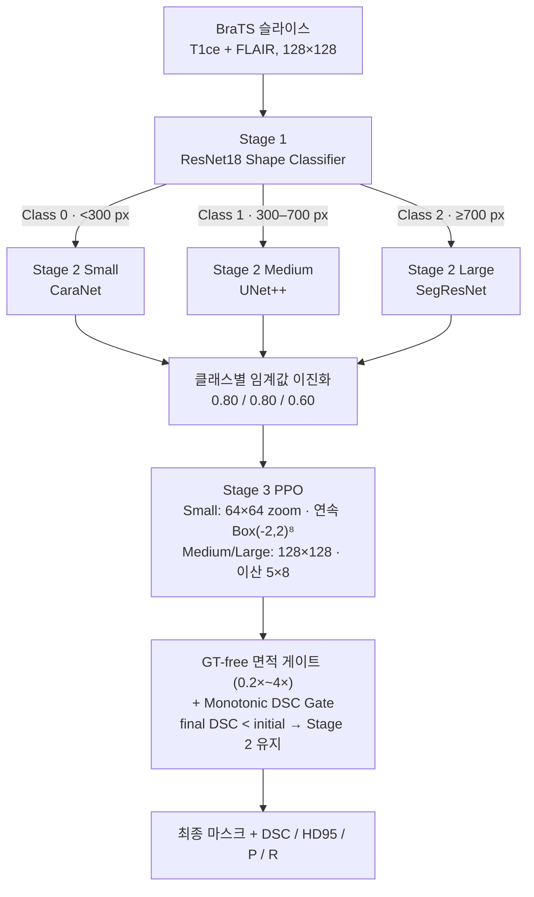
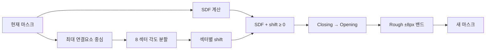
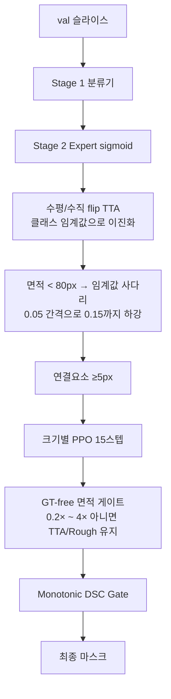

# RL-Refiner 파이프라인 상세

3단계 동적 라우팅(분류 → 크기별 Expert 분할 → 크기별 경계 보정)과 4번째 평가 단계를 **코드 기준**으로 정리한 문서입니다.

실험 수치와 이력은 [EXPERIMENT_RESULTS.md](EXPERIMENT_RESULTS.md), 대회 상위 입상 방법과의 비교는 [baselines/README.md](../baselines/README.md), 논문 초안은 [paper_draft_ko.md](paper_draft_ko.md)를 봅니다.

기준 실행: **2026-08-19 `python run_pipeline.py batch_size=64`** (seed 42, 결정적 모드 ON).

---

## 1. 한눈에 보는 구조

입력은 BraTS 2021 환자의 **T1ce + FLAIR** 2채널 2D 슬라이스(128×128)입니다. 출력은 Whole Tumor 이진 마스크입니다.

| 단계 | 이름 | 하는 일 | 학습 산출물 |
|:---:|---|---|---|
| 1 | Shape Classifier | 종양 면적으로 Small / Medium / Large 분류 | `checkpoints/shape_classifier_best.pt` |
| 2 | Size Expert | 클래스에 맞는 분할 모델이 확률 맵 생성 | `caranet_best.pt`, `unetplusplus_best.pt`, `segresnet_best.pt` |
| 3 | PPO Refiner | 8방위 SDF 이동으로 경계를 미세 조정 | `ppo_small.zip`, `ppo_medium.zip`, `ppo_large.zip` |
| 4 | Evaluation | DSC / HD95 / Precision / Recall 집계, Monotonic DSC Gate, 시각화 | `results/pipeline_sample_*.png` |

원스톱 진입점은 `run_pipeline.py`입니다. 기본 환자 풀은 Stage 1–4 공통 **210명**이고, 이 중 **train 168명 / val 42명**으로 나뉩니다.



구현 위치:

- 라우터: `src/models/dynamic_router.py`의 `AdaptivePipeline`
- RL 환경: `src/envs/mask_refinement_env.py`의 `MaskRefinementEnv`
- 지표: `src/utils/metrics.py` (`dice`, `hd95`, `precision`, `recall`, `apply_monotonic_dsc_gate`, `gt_size_class`)
- 평가: `scripts/eval/evaluate_pipeline.py`

---

## 2. 데이터

로더: `src/data/brats2020_dataset.py` (`BraTS2020Dataset`). BraTS 2020/2021 NIfTI를 모두 읽습니다.

| 항목 | 값 |
|---|---|
| 경로 | `src/data/archive` |
| 모달리티 | `t1ce+flair` (2채널). `t1ce`, `t1ce+t2` 등도 가능 |
| 해상도 | 128×128 |
| 레이블 | seg의 0 이외를 Whole Tumor로 이진화 (NCR/NET=1, ED=2, ET=4) |
| 정규화 | 뇌 마스크 안 z-score → 1–99 퍼센타일 클리핑 → 0–1 |
| 유효 슬라이스 | 종양 픽셀 비율 ≥ 0.002 |
| 기본 환자 풀 | 210명 → **12,241 슬라이스** |

### 2.1 환자 단위 분할

분할 파일은 `checkpoints/patient_split.json` (80/20, seed=42)이며 **Stage 1–4가 같은 파일을 공유**합니다. 슬라이스가 아니라 **환자**를 나누므로, 같은 환자의 인접 슬라이스가 train과 val에 동시에 들어가는 누출이 없습니다.

| 역할 | 환자 | 슬라이스 | Small `<300` | Medium `300–700` | Large `≥700` |
|---|---:|---:|---:|---:|---:|
| train | 168 | 9,868 | 3,561 | 4,184 | 2,123 |
| val | 42 | **2,373** | 942 | 847 | 584 |
| 합계 | 210 | 12,241 | 4,503 | 5,031 | 2,707 |

`src/data/patient_split.py`의 `load_split_brats_datasets`가 **분할을 먼저 확정한 뒤 그 환자 ID만** 데이터셋에 넘깁니다. `max_patients`를 로더에 직접 넘기면 "정렬 순 앞 N명"이 실려 무작위 표본과 어긋나므로 그렇게 하지 않습니다.

기존 분할 파일이 현재 환자 풀과 호환되지 않으면 재생성하며, 호환되는 경우에는 절대 덮어쓰지 않습니다.

---

## 3. 크기 클래스

면적은 GT(또는 평가 시 예측 컴포넌트)의 픽셀 수입니다. 정의는 `src/utils/metrics.py`의 `gt_size_class`와 `src/data/shape_dataset.py`가 공유합니다.

| 클래스 | 면적 | Expert | PPO |
|---|---|---|---|
| 0 Small | `0 < area < 300` | CaraNet | `ppo_small.zip` |
| 1 Medium | `300 ≤ area < 700` | UNet++ | `ppo_medium.zip` |
| 2 Large | `area ≥ 700` | SegResNet | `ppo_large.zip` |

Stage 2 Expert와 Stage 3 PPO **모두 GT 면적**으로 클래스를 필터합니다. 분류기 예측을 쓰는 곳은 Stage 4 평가의 라우팅뿐입니다.

---

## 4. 학습 파이프라인 (`run_pipeline.py`)

```bash
python run_pipeline.py batch_size=64
```

`key=value` 형태를 `--key value`로 자동 변환하므로 `--batch_size 64`와 같습니다.

공통 인자: `--train_root src/data/archive`, `--max_train_patients 210`, `--patient_split checkpoints/patient_split.json`, `--modality t1ce+flair`, `--seed 42`, `--deterministic`.

건너뛰기 플래그: `--skip_classifier`, `--skip_experts`, `--skip_agents`, `--skip_eval`.


PPO는 Stage 2 체크포인트가 있어야 `AdaptivePipeline`이 Expert를 로드할 수 있으므로, Expert 학습이 먼저입니다.

### 4.1 재현성

| 항목 | 값 |
|---|---|
| 시드 | `--seed 42` (Stage 1–4 공통) |
| 결정적 모드 | **기본 활성화**. 해제는 `--no_deterministic` |
| 구현 | `src/utils/seed.py`의 `set_seed` |

`set_seed`는 `random` / `numpy` / `torch` / CUDA 시드를 고정하고, 결정적 모드에서 `cudnn.deterministic=True`, `cudnn.benchmark=False`, `CUBLAS_WORKSPACE_CONFIG=:4096:8`, `torch.use_deterministic_algorithms(True, warn_only=True)`를 설정합니다. `--deterministic` 플래그는 하위 호환용으로 남아 있으며 기본값과 동일합니다.

---

## 5. Stage 1 — Shape Classifier

| 항목 | 내용 |
|---|---|
| 스크립트 | `scripts/train/train_shape_classifier.py` |
| 모델 | ResNet18, `conv1`을 2채널, `fc`를 3클래스 (`src/models/shape_classifier.py`) |
| 초기화 | **ImageNet 사전학습 기본 사용**. `--no_pretrained`로 무작위 초기화 (ablation) |
| 레이블 | GT 면적 → 0/1/2 (`ShapeDataset`) |
| 손실 | CrossEntropy |
| 옵티마이저 | **AdamW**, `--lr 1e-3`, `--weight_decay 1e-4` |
| 스케줄러 | **CosineAnnealingLR** (`T_max=epochs`) |
| 에폭 / 배치 | 15 / 64 |
| 분할 | **환자 단위** (train 9,868 / val 2,373 슬라이스) |
| 저장 | 검증 정확도 최고 가중치 |
| 이번 실행 | Best Val Acc **0.8512** |

`conv1`을 2채널로 바꿀 때 ImageNet RGB 커널을 채널 축으로 합한 뒤 입력 채널 수로 나눠 균등 분배합니다. 입력 채널이 같은 값일 때 원래 응답 크기가 유지됩니다.

### 5.1 과적합에 대한 기록

이번 실행에서 Train Acc는 0.96–0.99까지 오르지만 Val Acc는 0.85 부근에서 멈춥니다. ImageNet 사전학습 없이 무작위 초기화한 ablation은 Best Val Acc **0.8424** (`checkpoints/shape_classifier_scratch_backup.pt`)로, 사전학습의 이득은 약 +0.9%p에 그쳤습니다.

원인은 특징 품질이 아니라 **레이블 자체의 모호성**입니다. 면적 300 / 700 경계 바로 옆 슬라이스는 몇 픽셀 차이로 클래스가 갈리므로, 분류 문제로 보면 줄일 수 없는 잡음이 남습니다. 라우팅 오류의 영향은 Stage 4 결과에서 확인할 수 있습니다(§8.5).

과거 문서에 있던 Val Acc 0.9383은 **슬라이스 단위 80/20 분할**로 측정한 값입니다. 같은 환자의 인접 슬라이스가 train과 val에 함께 들어가 누출이 있었으므로, 현재 환자 단위 분할 수치와 비교하면 안 됩니다.

---

## 6. Stage 2 — 크기별 Expert

각 Expert는 `--refinement_mode`로 자기 크기(GT 면적 기준)만 남기고, 환자 단위 분할 위에서 학습합니다.

| 항목 | 값 |
|---|---|
| 에폭 / 배치 | 20 / 64 |
| 옵티마이저 | Adam, `--lr 3e-4` |
| 스케줄러 | CosineAnnealingLR (`T_max=epochs`) |
| 정밀도 | AMP (FP16) |

| Expert | 파일 | 왜 이 모델인가 | 손실 | train / val 슬라이스 |
|---|---|---|---|---:|
| Small CaraNet | `src/models/caranet.py` | 작은 물체용 Context Axial Reverse Attention | FocalTversky (α=0.3, β=0.7, γ=2.0) | 3,561 / 942 |
| Medium UNet++ | `src/models/unetplusplus.py` | MONAI BasicUNetPlusPlus, features `(16,32,64,128,256,16)` | BCEDice 0.5+0.5 | 4,184 / 847 |
| Large SegResNet | `src/models/segresnet.py` | 잔차 인코더, `init_filters=16` (~1.58M params) | BCEDice 0.5+0.5 (`--loss`로 `dice`/`boundary` 선택 가능) | 2,123 / 584 |

Small에 FocalTversky를 쓰는 이유는 `β > α`로 두어 미검출(FN)에 더 큰 벌점을 주기 위함입니다. 작은 종양은 놓치면 DSC가 급격히 떨어집니다.

`AdaptivePipeline` 로드 순서:

1. Small: `caranet_best.pt` → 없으면 `attention_unet_best.pt` → 없으면 랜덤 CaraNet
2. Medium: `unetplusplus_best.pt` → 없으면 `unet3plus_best.pt` → 없으면 랜덤 UNet++
3. Large: `segresnet_best.pt` → 없으면 랜덤 SegResNet

순전파: 클래스별로 해당 Expert → sigmoid → `(B, 1, H, W)` 확률 맵. 같은 클래스로 라우팅된 샘플을 모아 **배치 단위로 한 번에** 통과시킵니다. 입력 채널 수가 안 맞으면 반복/슬라이스로 맞춥니다.

Expert 단독 성능은 이진화 임계값에 따라 달라지므로 §8에서 함께 다룹니다.

---

## 7. Stage 3 — 크기별 PPO

스크립트: `scripts/train/train_agent.py`
설정: `configs/ppo_brats.yaml`
라이브러리: Stable-Baselines3 PPO, Gymnasium

### 7.1 학습 데이터 구성

1. `patient_split.json`의 **train 환자** 슬라이스를 로드한다.
2. GT에 형태학 노이즈(`make_noisy_mask`, `max_morph_px=5`)를 넣어 **합성 Rough**를 만든다.
3. `AdaptivePipeline`으로 **실제 Expert 예측**과 확률 맵을 뽑는다.
4. `gt_size_class`로 `refinement_mode`에 해당하는 클래스만 남긴다. (**GT 면적 기준**)
5. 실제 예측 50% + 합성 노이즈 50%를 이어 붙여 섞는다 (mixup).

평가 환경(`eval_env`)은 **val 환자 hold-out**을 쓰고 mixup 없이 실제 Expert 예측만 사용합니다. 즉 PPO의 조기 종료·best 모델 선택이 학습에 쓰이지 않은 환자로 이뤄집니다.

| 에이전트 | 클래스 필터 (train) | 믹스업 후 train | val hold-out |
|---|---:|---:|---:|
| Small | 3,561 | 7,122 | 942 |
| Medium | 4,184 | 8,368 | 847 |
| Large | 2,123 | 4,246 | 584 |

노이즈 생성기의 시드는 전역 `--seed`에 묶여 있어, 같은 시드면 같은 합성 Rough가 나옵니다.

### 7.2 PPO 하이퍼파라미터

| 항목 | 값 |
|---|---|
| total_timesteps | 300,000 (실제 303,104) |
| n_envs / n_steps | 8 / 1,024 |
| batch_size / n_epochs | 256 / 10 |
| lr / clip / ent_coef | 1e-4 / 0.2 / 0.01 |
| gamma / GAE λ | 0.99 / 0.95 |
| net_arch | `[512, 256, 128]` |
| max_steps / target_dsc | 30 / 1.0 (조기 종료 사실상 없음) |
| step_penalty | 0.001 |

조기 종료 장치는 셋 다 **끄거나 무해하게** 설정했습니다.

| 장치 | 설정 | 이유 |
|---|---|---|
| `stop_dsc_target` | **0 (비활성화)** | Medium/Large의 rough DSC가 이미 기본 임계값 0.92를 넘어 첫 평가(2,048 스텝)에서 즉시 중단됐다 |
| `stop_plateau` | **false (비활성화)** | 세 에이전트 모두 `total_timesteps`를 완주시킨다 |
| Milestone Snapshot | 25 / 50 / 75% | `checkpoints/snapshots/{small,medium,large}/`에 **클래스별 하위 폴더**로 저장해 서로 덮어쓰지 않는다 |

최종 모델은 eval 보상이 가장 좋았던 스냅샷(`checkpoints/best_{mode}/best_model.zip`)을 `ppo_{small,medium,large}.zip`으로 복사한 것입니다.

이번 실행의 Large 에이전트: 25m45s, eval 보상 120K 375.20 → 240K 387.60, 에피소드 길이 30.0 고정.

### 7.3 환경: 8방위 SDF 보정

공통 절차 (`MaskRefinementEnv.step`):

1. 현재 마스크에서 **가장 큰 연결 요소**의 중심을 잡는다.
2. 중심 기준 각도로 8개 섹터를 나눈다.
3. 마스크 SDF(내부 +, 외부 −)에 섹터별 shift를 더한다.
4. `SDF + shift ≥ 0`인 픽셀이 새 마스크가 된다.
5. 면적 > 20이면 Closing 후 Opening.
6. 초기 Rough의 **±8 px** 밖으로 나가지 못하게 클립한다.



관측(`_obs`)은 영상·현재 마스크·확률 맵·에지로만 구성되며 **GT를 포함하지 않습니다.** GT는 보상 계산에만 쓰입니다.

### 7.4 크기별 관측·행동·보상

| 항목 | Small | Medium | Large |
|---|---|---|---|
| 관측 | 4ch 64×64 crop (영상, 마스크, 확률, Sobel) | 3ch 128×128 (영상, 마스크, 확률) | Medium과 동일 |
| 행동 | 연속 `Box(-2, 2)` 8차원 | 이산 5단계×8 | Medium과 동일 |
| 이산 매핑 | — | 강수축 −1.0 / 약수축 −0.4 / Keep 0 / 약팽창 +0.4 / 강팽창 +1.0 px | 동일 |
| DSC 보너스 | ≥ 0.85 → +50 | ≥ 0.95 → +50 | ≥ 0.95 → +50 |
| HD95 가중치 | 0.2 | 0.1 | **0.5** |
| 보상 스케일 | ×30 × size_scale | ×30 × size_scale | × size_scale만 |

보상 공통:

- `size_scale = clip(300 / GT면적, 0.5, 3.0)` — 작은 종양일수록 보상 증폭
- DSC / 경계 DSC(GT ±3px 밴드) / HD95가 나빠지면 개선분의 **2배 감점**
- 에피소드 시작 DSC보다 떨어지면 **−5.0**
- Keep이면서 DSC ≥ 0.85이면 +0.05
- 행동 비용: Keep이 아닌 섹터 수 × `step_penalty / 8`
- DSC 목표 보너스는 조건을 만족하는 **매 스텝** 주어집니다 (1회 한정이 아님)

에피소드: 최대 30스텝, `DSC ≥ target_dsc(1.0)`이면 종료.

---

## 8. Stage 4 — 평가·추론

스크립트: `scripts/eval/evaluate_pipeline.py`

지표: **DSC**(↑), **HD95 px**(↓), **Precision**(↓이면 과분할), **Recall**(↓이면 과소분할). 구현은 모두 `src/utils/metrics.py`입니다.

기본 평가 경로:

- **val 환자 42명**만 사용 (`--split_role val`, 기본값)
- Stage 1 **분류기**로 Expert 선택. `--oracle_routing`을 주면 GT 면적으로 고정하는 상한 평가
- 클래스별 이진화 임계값 `--stage2_thresholds 0.80,0.80,0.60`
- Small / Medium / Large **모두** PPO `predict()` 15스텝
- GT-free 면적 게이트 + Monotonic DSC Gate

주요 인자:

| 인자 | 기본값 | 설명 |
|---|---|---|
| `--max_patients` | 210 | 분할 생성 기준 환자 풀 |
| `--split_role` | `val` | `train` / `val` / `all` |
| `--stage2_thresholds` | `0.80,0.80,0.60` | Small / Medium / Large 이진화 임계값 |
| `--micro_area_floor` | 80.0 | 이 면적 미만이면 임계값 사다리 발동 |
| `--micro_thr_floor` | 0.15 | 사다리 하한 |
| `--oracle_routing` | off | GT 면적 라우팅 (상한) |
| `--skip_ppo` | off | Stage 3 생략, Stage 2 단독 베이스라인 측정 |
| `--confidence_threshold` | None | 평균 확률이 이 값 이상이면 PPO 생략 |

### 8.1 슬라이스별 처리 순서



### 8.2 클래스별 이진화 임계값

기본값이 0.50이 아니라 **0.80 / 0.80 / 0.60**인 이유는 세 Expert 모두 확률을 과하게 크게 내보내 **Recall > Precision**(과분할) 경향을 보였기 때문입니다. 검증셋에서 임계값을 올리면 Precision이 오르고 DSC가 함께 개선됐습니다.

임계값 탐색은 `scripts/eval/sweep_threshold.py`로 합니다. 확률 맵을 한 번 캐시한 뒤 여러 임계값의 DSC / Precision / Recall을 재계산하므로 파이프라인을 다시 돌리지 않습니다.

```bash
python scripts/eval/sweep_threshold.py --split_role val --plot results/threshold_sweep.png
```

임계값 조정만으로 얻는 이득이 PPO 보정분에 필적하므로, 베이스라인과 비교할 때는 **양쪽 모두 임계값을 조정**해야 공정합니다. 자세한 논의는 [baselines/README.md](../baselines/README.md)를 봅니다.

### 8.3 미세 파편 임계값 사다리

TTA 확률을 클래스 임계값으로 이진화한 결과가 `--micro_area_floor`(80 px) 미만이면, 임계값을 **0.05씩 낮추며** 면적이 기준을 넘거나 `--micro_thr_floor`(0.15)에 닿을 때까지 반복합니다.

Small 클래스에 0.80 같은 높은 임계값을 쓰면 아주 작은 종양이 통째로 사라질 수 있는데, 사다리가 그 경우만 국소적으로 완화합니다. 고정된 후보 임계값 목록을 쓰지 않으므로 `--stage2_thresholds`를 바꿔도 사다리가 그 값에서 자연히 이어집니다.

### 8.4 라우팅과 PPO 재선택

Expert 선택은 분류기 예측 클래스로 하고, **보정기 선택은 예측 마스크의 연결요소 면적**으로 다시 합니다. 분류기가 틀려도 컴포넌트 크기에 맞는 PPO가 붙습니다.

Small은 마스크가 35 px 미만이면 수축(음수) 행동을 0으로 자릅니다.

### 8.5 게이트: Monotonic DSC + GT-free 면적

**원칙:** PPO 보정 후 DSC가 Stage 2 초기 DSC보다 낮아지면 Stage 2 마스크를 유지한다 (`apply_monotonic_dsc_gate`). 따라서 **최종 DSC는 초기 DSC보다 절대 낮을 수 없습니다.**

두 게이트는 성격이 다릅니다.

| 게이트 | 판정 기준 | GT 필요 | 배포 가능 |
|---|---|:---:|:---:|
| GT-free 면적 게이트 | 보정 마스크가 비었거나 면적이 초기의 0.2배 미만 / 4배 초과 | ✗ | ✓ |
| Monotonic DSC Gate | 보정 후 DSC < 초기 DSC | **✓** | ✗ |

Monotonic DSC Gate는 GT를 보므로 **오프라인 상한 측정 장치**입니다. 이번 실행에서 2,373장 중 **858장(36.2%)** 이 이 게이트로 Stage 2로 되돌아갔습니다. 즉 PPO는 슬라이스 3분의 1 이상에서 DSC를 떨어뜨렸고, 보고된 최종 점수는 그 손실을 GT로 걸러낸 값입니다.

베이스라인과 비교할 때 방법론적으로 공정한 대상은 게이트를 타지 않은 **초기 DSC(Stage 2)** 입니다.

### 8.6 이번 실행 결과 (val 42명 · 2,373 슬라이스)

| 지표 | Stage 2 초기 | Stage 3 보정 후 | 변화 |
|---|---:|---:|---:|
| 평균 DSC | 0.8672 | **0.8752** | +0.0080 |
| 평균 HD95 | 2.3365 px | **2.2897 px** | −0.0468 px |

분류기 라우팅 결과 분포: Small 922 / Medium 935 / Large 516 (GT 기준 942 / 847 / 584).

| 클래스 | Expert | n | 초기 → 최종 DSC | 초기 → 최종 HD95 | Precision | Recall |
|---|---|---:|---|---|---|---|
| Small | CaraNet | 922 | 0.7753 → **0.7892** | 4.4593 → **4.4459** | 0.7797 → 0.8044 | 0.8232 → 0.8199 |
| Medium | UNet++ | 935 | 0.9223 → **0.9270** | 1.0764 → **1.0170** | 0.9385 → 0.9394 | 0.9176 → 0.9249 |
| Large | SegResNet | 516 | 0.9316 → **0.9347** | 0.8271 → **0.7432** | 0.9017 → 0.9052 | 0.9730 → 0.9751 |

Small 층화:

| 구간 | n | 초기 → 최종 DSC | 초기 → 최종 HD95 |
|---|---:|---|---|
| Active tumor `≥50px` | 851 | 0.7928 → **0.8039** | 4.1623 → **4.1440** |
| Micro fragment `<50px` | 71 | 0.5644 → **0.6128** | 8.0184 → 8.0642 |

미세 파편은 DSC가 +4.8%p 올랐지만 HD95는 오히려 늘었습니다. 게이트가 DSC만 보기 때문에 DSC를 올리면서 경계 최악값을 악화시키는 보정이 통과할 수 있습니다.

Precision/Recall을 보면 임계값을 올린 뒤에도 Small(P 0.78 < R 0.82)과 Large(P 0.90 < R 0.97)는 여전히 과분할이고, Medium(P 0.94 > R 0.92)만 살짝 과소분할입니다. Large의 큰 격차는 임계값을 더 올릴 여지가 있음을 뜻합니다.

### 8.7 시각화

클래스별 ΔDSC 최대 2장씩, 총 6장을 저장합니다.

| 파일 | Rough DSC | RL DSC | ΔDSC |
|---|---:|---:|---:|
| `pipeline_sample_small_1.png` | 0.4941 | 0.7222 | **+0.2281** |
| `pipeline_sample_small_2.png` | 0.6825 | 0.8944 | +0.2118 |
| `pipeline_sample_medium_1.png` | 0.7792 | 0.8453 | +0.0661 |
| `pipeline_sample_medium_2.png` | 0.8675 | 0.9310 | +0.0635 |
| `pipeline_sample_large_1.png` | 0.7960 | 0.8578 | +0.0618 |
| `pipeline_sample_large_2.png` | 0.8152 | 0.8612 | +0.0460 |

통합 그림: `results/pipeline_sample_comparison.png`

이 표본은 **개선폭이 가장 큰** 슬라이스라서 평균을 대표하지 않습니다.

---

## 9. 베이스라인 비교

BraTS 2021 상위 입상 방법 두 개를 같은 42명 val 환자·같은 지표 구현으로 측정했습니다. 코드는 `baselines/`에 분리돼 있습니다.

| 방법 | DSC | HD95 | Precision | Recall |
|---|---:|---:|---:|---:|
| 파이프라인 Stage 2 (게이트 없음) | 0.8672 | 2.3365 | — | — |
| 파이프라인 Stage 3 (Monotonic DSC Gate, GT 사용) | 0.8752 | 2.2897 | — | — |
| Extending nnU-Net (KAIST, 1위) | 0.8923 | 1.9591 | 0.9215 | 0.8893 |
| SegResNet + 중복 감소 (NVAUTO, 2위) | **0.8971** | **1.9022** | 0.9077 | 0.9029 |

두 베이스라인은 3D·4모달리티·앙상블을 제외한 **2D 각색 구현**이므로 대회 리더보드 점수와 직접 비교할 수 없습니다. 각색 내역과 공정성 조건은 [baselines/README.md](../baselines/README.md)에 정리했습니다.

현재 상태에서 파이프라인은 GT 게이트를 켜고도 두 베이스라인보다 낮습니다. 크기별로 보면 Medium만 경쟁력이 있습니다.

| 클래스 | 파이프라인 초기 → 최종 | KAIST | NVAUTO |
|---|---|---:|---:|
| Small | 0.7753 → 0.7892 | 0.8278 | 0.8377 |
| Medium | 0.9223 → **0.9270** | 0.9165 | 0.9200 |
| Large | 0.9316 → 0.9347 | **0.9614** | 0.9594 |

Large 격차(약 −0.027)가 가장 큽니다. 단일 강한 백본이 큰 종양에서 유리하고, 라우팅 오류(분류기 Val Acc 0.85)가 그 위에 얹히기 때문입니다.

---

## 10. 학습 vs 추론 차이

| 항목 | 학습 | Stage 4 평가 |
|---|---|---|
| 환자 집합 | `patient_split.json`의 **train 168명** | 같은 파일의 **val 42명** |
| 클래스 결정 | Expert·PPO 모두 **GT 면적** | **분류기 예측** (보정기는 컴포넌트 면적) |
| Rough 마스크 | 실제 Expert 예측 50% + 합성 노이즈 50% | 실제 Expert 출력만 |
| 이진화 임계값 | 학습에서는 확률 맵을 직접 사용 | 클래스별 0.80 / 0.80 / 0.60 |
| PPO 스텝 | 최대 30 (롤아웃) | 15 |
| 성능 하락 방지 | 보상 −5.0 (에피소드 시작 DSC 대비) | Monotonic DSC Gate + 면적 비율 게이트 |
| TTA | 없음 | 수평/수직 flip |

---

## 11. 모듈 지도

```
run_pipeline.py                          Stage 1–4 순차 실행 (seed·결정적 모드 전파)
configs/ppo_brats.yaml                   PPO 하이퍼파라미터 (max_train_patients=210)

scripts/train/train_shape_classifier.py  Stage 1
scripts/train/train_caranet.py           Stage 2 Small
scripts/train/train_unetplusplus.py      Stage 2 Medium
scripts/train/train_segresnet.py         Stage 2 Large
scripts/train/train_agent.py             Stage 3 PPO 3종
scripts/eval/evaluate_pipeline.py        Stage 4 전체 파이프라인 평가
scripts/eval/evaluate.py                 단일 모델 평가
scripts/eval/sweep_threshold.py          이진화 임계값 스윕 (확률 맵 캐시)

src/data/brats2020_dataset.py            NIfTI 로드, 슬라이스, 노이즈 마스크
src/data/patient_split.py                환자 단위 train/val 분할
src/data/shape_dataset.py                면적 → 클래스 레이블
src/models/shape_classifier.py           ResNet18 분류기 (ImageNet 사전학습)
src/models/dynamic_router.py             AdaptivePipeline (분류 + Expert 라우팅)
src/models/caranet.py / unetplusplus.py / segresnet.py
src/envs/mask_refinement_env.py          8방위 SDF PPO 환경
src/utils/metrics.py                     dice / hd95 / precision / recall / 게이트 / 크기 클래스
src/utils/seed.py                        전역 시드 및 결정적 모드

baselines/                               BraTS21 상위 입상 방법 2D 각색 비교 실험
```

---

## 12. 재현

```bash
pip install -r requirements.txt
# BraTS 2021를 src/data/archive 에 둔 뒤
python run_pipeline.py batch_size=64
```

이미 체크포인트가 있으면 평가만:

```bash
python run_pipeline.py --skip_classifier --skip_experts --skip_agents
```

또는 직접:

```bash
# 기본 (분류기 라우팅 + PPO + 게이트)
python scripts/eval/evaluate_pipeline.py --split_role val

# Stage 2 단독 (PPO·게이트 없음, 베이스라인과 비교용)
python scripts/eval/evaluate_pipeline.py --split_role val --skip_ppo

# 상한 (GT 면적 라우팅)
python scripts/eval/evaluate_pipeline.py --split_role val --oracle_routing
```

베이스라인:

```bash
python baselines/run_comparison.py --epochs 20 --batch_size 32 --sweep
```
