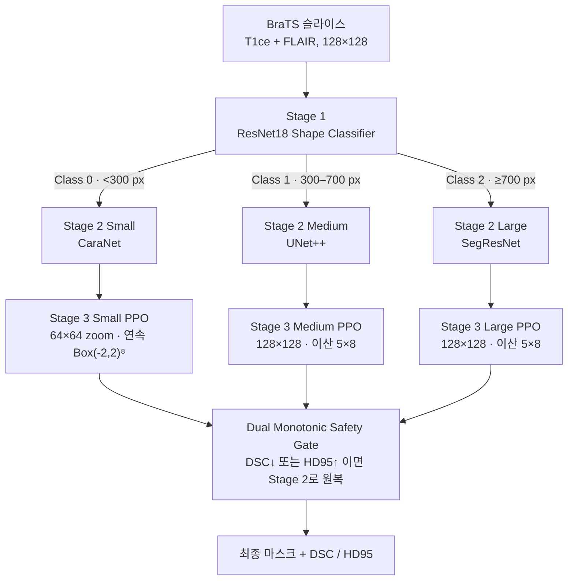
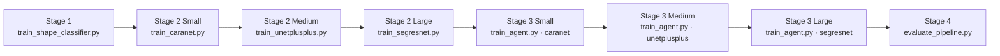
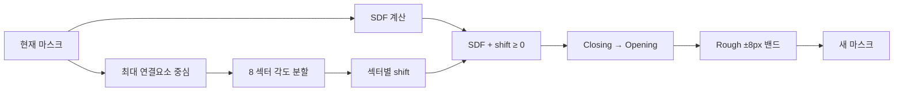
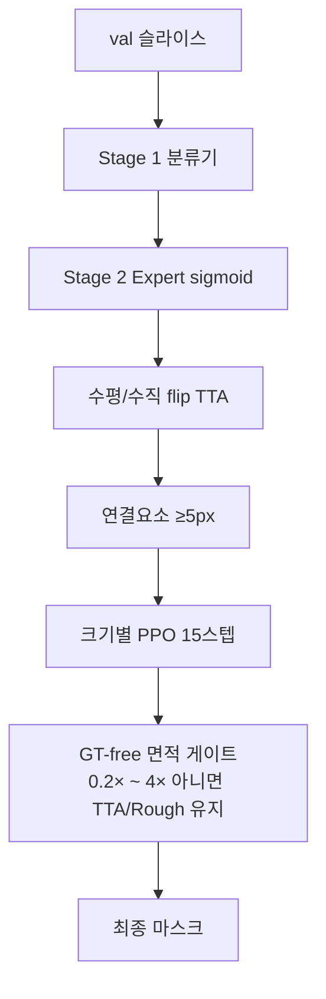

# RL-Refiner 파이프라인 상세

3단계 동적 라우팅(분류 → 크기별 Expert 분할 → 크기별 경계 보정)과 4번째 평가 단계를 코드 기준으로 정리한 문서입니다.

실험 수치와 이력은 [EXPERIMENT_RESULTS.md](EXPERIMENT_RESULTS.md), 논문 초안은 [paper_draft_ko.md](paper_draft_ko.md)를 봅니다.

---

## 1. 한눈에 보는 구조

입력은 BraTS 2021 환자의 **T1ce + FLAIR** 2채널 2D 슬라이스(128×128)입니다. 출력은 Whole Tumor 이진 마스크입니다.

| 단계 | 이름 | 하는 일 | 학습 산출물 |
|:---:|---|---|---|
| 1 | Shape Classifier | 종양 면적으로 Small / Medium / Large 분류 | `checkpoints/shape_classifier_best.pt` |
| 2 | Size Expert | 클래스에 맞는 분할 모델이 Rough Mask(확률 맵) 생성 | `caranet_best.pt`, `unetplusplus_best.pt`, `segresnet_best.pt` |
| 3 | PPO Refiner | 8방위 SDF 이동으로 경계를 미세 조정 | `ppo_small.zip`, `ppo_medium.zip`, `ppo_large.zip` |
| 4 | Evaluation | DSC / HD95 집계, Dual Safety Gate, 시각화 | `results/pipeline_sample_*.png` |

원스톱 진입점은 `run_pipeline.py`입니다. 기본 환자 수는 Stage 1–4 공통 **210명**입니다.



구현 위치:

- 라우터: `src/models/dynamic_router.py`의 `AdaptivePipeline`
- RL 환경: `src/envs/mask_refinement_env.py`의 `MaskRefinementEnv`
- 평가: `scripts/eval/evaluate_pipeline.py`

---

## 2. 데이터

로더: `src/data/brats2020_dataset.py` (`BraTS2020Dataset`). BraTS 2020/2021 NIfTI를 모두 읽습니다.

| 항목 | 값 |
|---|---|
| 경로 | `src/data/archive` |
| 모달리티 | `t1ce+flair` (2채널). `t1ce`, `t1ce+t2` 등도 가능 |
| 해상도 | 128×128 |
| 레이블 | seg의 0 이외를 Whole Tumor로 이진화 (NCR/NET=1, ED=2, ET=4) |
| 정규화 | 뇌 마스크 안 z-score → 1–99 퍼센타일 클리핑 → 0–1 |
| 유효 슬라이스 | 종양 픽셀 비율 ≥ 0.002 |
| 기본 환자 수 | 210명 → 이번 실행 기준 **12,241장** |

학습은 **train 환자**, 평가는 **val 환자**를 씁니다. 분할 파일은 `checkpoints/patient_split.json` (기본 80/20, seed=42)입니다.

---

## 3. 크기 클래스

면적은 GT(또는 평가 시 컴포넌트)의 픽셀 수입니다. 정의는 `src/data/shape_dataset.py`와 학습/평가 스크립트가 공유합니다.

| 클래스 | 면적 | Expert | PPO |
|---|---|---|---|
| 0 Small | `0 < area < 300` | CaraNet | `ppo_small.zip` |
| 1 Medium | `300 ≤ area < 700` | UNet++ | `ppo_medium.zip` |
| 2 Large | `area ≥ 700` | SegResNet | `ppo_large.zip` |

2026-08-19 전수 평가 분포: Small 4,503 / Medium 5,031 / Large 2,707.

학습 시 Expert는 **자기 클래스 슬라이스만** 남긴 뒤 80/20으로 나눕니다. PPO는 AdaptivePipeline이 예측한 클래스(또는 해당 `refinement_mode`)로 필터합니다.

---

## 4. 학습 파이프라인 (`run_pipeline.py`)

```bash
python run_pipeline.py --batch_size 64 --modality t1ce+flair
```

공통으로 `--max_train_patients 210`을 Stage 1–4에 넘깁니다.

건너뛰기 플래그: `--skip_classifier`, `--skip_experts`, `--skip_agents`, `--skip_eval`.



PPO는 Stage 2 체크포인트가 있어야 `AdaptivePipeline`이 Expert를 로드할 수 있으므로, Expert 학습이 먼저입니다.

---

## 5. Stage 1 — Shape Classifier

| 항목 | 내용 |
|---|---|
| 스크립트 | `scripts/train/train_shape_classifier.py` |
| 모델 | ResNet18, `conv1`을 2채널, `fc`를 3클래스 (`src/models/shape_classifier.py`) |
| 레이블 | GT 면적 → 0/1/2 (`ShapeDataset`) |
| 손실 | CrossEntropy |
| 옵티마이저 | Adam, lr `1e-3` |
| 에폭 / 분할 | 15 epoch, 슬라이스 80/20 |
| 저장 | 검증 정확도 최고 가중치 |
| 이번 실행 | Best Val Acc **0.9383** (Epoch 13) |

추론 시 `AdaptivePipeline.forward()`는 분류기 로짓을 argmax합니다. 평가 기본 경로도 이 분류기를 사용합니다. `--oracle_routing`을 주면 GT 면적으로 Expert를 고정하는 상한 평가가 됩니다.

---

## 6. Stage 2 — 크기별 Expert

각 Expert는 `--refinement_mode`로 자기 크기만 남기고, AMP(FP16), batch 64, 20 epoch로 학습합니다. 별도 val 폴더가 없어 Train 80% / Val 20%입니다.

| Expert | 파일 | 왜 이 모델인가 | 손실 | 필터 슬라이스 | Best Val DSC |
|---|---|---|---|---:|---:|
| Small CaraNet | `src/models/caranet.py` | 작은 물체용 Context Axial Reverse Attention | FocalTversky (α=0.3, β=0.7, γ=2.0) | 4,503 | **0.8262** |
| Medium UNet++ | `src/models/unetplusplus.py` | MONAI BasicUNetPlusPlus, features `(16,32,64,128,256,16)` | BCEDice 0.5+0.5 | 5,031 | **0.9197** |
| Large SegResNet | `src/models/segresnet.py` | 잔차 인코더, `init_filters=16` (~1.58M params) | BCEDice 0.5+0.5 | 2,707 | **0.9381** |

`AdaptivePipeline` 로드 순서:

1. Small: `caranet_best.pt` → 없으면 `attention_unet_best.pt` → 없으면 랜덤 CaraNet
2. Medium: `unetplusplus_best.pt` → 없으면 `unet3plus_best.pt` → 없으면 랜덤 UNet++
3. Large: `segresnet_best.pt` → 없으면 랜덤 SegResNet

순전파: 클래스별로 해당 Expert → sigmoid → `(B, 1, H, W)` 확률 맵. 채널 수가 안 맞으면 반복/슬라이스로 맞춥니다.

---

## 7. Stage 3 — 크기별 PPO

스크립트: `scripts/train/train_agent.py`  
설정: `configs/ppo_brats.yaml`  
라이브러리: Stable-Baselines3 PPO, Gymnasium

### 7.1 학습 데이터 구성

1. 210명 슬라이스를 로드한다.
2. GT에 형태학 노이즈(`make_noisy_mask`, `max_morph_px=5`)를 넣어 **합성 Rough**를 만든다.
3. `AdaptivePipeline`으로 **실제 Expert 예측**과 확률 맵을 뽑는다. 이때 분류기는 GT가 아니라 네트워크 예측을 쓴다.
4. `refinement_mode`에 해당하는 클래스만 남긴다.
5. 실제 예측 50% + 합성 노이즈 50%를 이어 붙여 섞는다.

이번 실행:

| 에이전트 | 클래스 필터 | 믹스업 후 | 시간 | Eval reward 120K → 240K |
|---|---:|---:|---:|---|
| Small | 4,505 | 9,010 | 12m 15s | 233.72 → 58.70 |
| Medium | 5,076 | 10,152 | 16m 33s | −108.40 → 255.36 |
| Large | 2,660 | 5,320 | 19m 11s | 194.74 → 540.01 |

필터 수가 Stage 2와 약간 다른 이유: Expert 학습은 **GT 면적**, PPO 필터는 **분류기 예측**입니다.

### 7.2 PPO 하이퍼파라미터

| 항목 | 값 |
|---|---|
| total_timesteps | 300,000 (실제 303,104) |
| n_envs / n_steps | 8 / 1,024 |
| batch_size / n_epochs | 256 / 10 |
| lr / clip / ent_coef | 1e-4 / 0.2 / 0.01 |
| gamma / GAE λ | 0.99 / 0.95 |
| net_arch | `[512, 256, 128]` |
| max_steps / target_dsc | 30 / 1.0 (조기 종료 사실상 없음) |
| stop_dsc_target | 0.92 (학습 중 평가 스톱, 이번 실행에서는 미발동) |

마일스톤 25/50/75% 스냅샷은 `checkpoints/snapshots/`에 저장됩니다. 클래스마다 같은 파일명을 쓰므로 **마지막(Large) 스냅샷이 앞선 Small/Medium을 덮어씁니다.** 최종 모델은 `ppo_{small,medium,large}.zip`입니다.

### 7.3 환경: 8방위 SDF 보정

공통 절차 (`MaskRefinementEnv.step`):

1. 현재 마스크에서 **가장 큰 연결 요소**의 중심을 잡는다.
2. 중심 기준 각도로 8개 섹터를 나눈다.
3. 마스크 SDF(내부 +, 외부 −)에 섹터별 shift를 더한다.
4. `SDF + shift ≥ 0`인 픽셀이 새 마스크가 된다.
5. 면적 > 20이면 Closing 후 Opening.
6. 초기 Rough의 **±8 px** 밖으로 나가지 못하게 클립한다.



### 7.4 크기별 관측·행동·보상

| 항목 | Small | Medium | Large |
|---|---|---|---|
| 관측 | 4ch 64×64 crop (영상, 마스크, 확률, Sobel) | 3ch 128×128 (영상, 마스크, 확률) | Medium과 동일 |
| 행동 | 연속 `Box(-2, 2)` 8차원 | 이산 5단계×8 | Medium과 동일 |
| 이산 매핑 | — | 강수축 −1.0 / 약수축 −0.4 / Keep 0 / 약팽창 +0.4 / 강팽창 +1.0 px | 동일 |
| DSC 보너스 | ≥ 0.85 → +50 | ≥ 0.95 → +50 | ≥ 0.95 → +50 |
| HD95 가중치 | 0.2 | 0.1 | **0.5** |
| 보상 스케일 | ×30 × size_scale | ×30 × size_scale | × size_scale만 |

보상 공통:

- `size_scale = clip(300 / GT면적, 0.5, 3.0)` — 작은 종양일수록 보상 증폭
- DSC / 경계 DSC(GT ±3px 밴드) / HD95가 나빠지면 개선분의 **2배 감점**
- 에피소드 시작 DSC보다 떨어지면 **−5.0**
- Keep이면서 DSC ≥ 0.85이면 +0.05
- 행동 비용: Keep이 아닌 섹터 수 × `step_penalty / 8`

에피소드: 최대 30스텝, `DSC ≥ target_dsc(1.0)`이면 종료.

---

## 8. Stage 4 — 평가·추론

스크립트: `scripts/eval/evaluate_pipeline.py`  
지표: DSC(높을수록 좋음), HD95 px(낮을수록 좋음)

기본 평가 경로 (코드 수정 후):

- **val 환자**만 사용 (`--split_role val`)
- Stage 1 **분류기**로 Expert 선택 (GT 면적 고정 없음)
- Small / Medium / Large 모두 PPO `predict()` 15스텝
- 게이트는 면적 비율만 본다 (GT DSC/HD95로 원복하지 않음)

이전 실험 12 (2026-08-19, 210명 전수) 숫자는 Oracle Routing + Medium/Large GT 형태학 + GT Safety Gate의 **상한**입니다 (DSC 0.8775 → 0.8880). 새 경로의 점수는 파이프라인을 다시 돌려야 나옵니다.

### 8.1 슬라이스별 처리 순서



### 8.2 라우팅

기본: 분류기 예측 클래스. `--oracle_routing`일 때만 GT 면적.

보정은 예측 마스크의 **연결요소 면적**으로 Small/Medium/Large PPO를 다시 고릅니다.

### 8.3 크기별 PPO 보정

세 클래스 공통: TTA 확률 → 임계값 0.50 (Small micro `<50px`만 0.30) → PPO 15스텝 → Closing.

Small만 마스크가 35px 미만이면 수축(음수) 행동을 0으로 자릅니다.

### 8.4 GT-free 게이트

GT DSC/HD95로 원복하지 않습니다. 보정 마스크가 비었거나 면적이 초기 대비 0.2배 미만·4배 초과이면 TTA(또는 Stage 2) 마스크를 유지합니다.

### 8.5 Small 층화 / 시각화

이전 실험 12 기준:

| 구간 | n | 초기 DSC → 최종 DSC |
|---|---:|---|
| Active tumor `≥50px` | 4,135 | 0.8135 → 0.8208 |
| Micro fragment `<50px` | 368 | 0.5944 → 0.6100 |

시각화 파일: `results/pipeline_sample_{small,medium,large}_{1,2}.png`

---

## 9. 학습 vs 추론 차이

| 항목 | 학습 | Stage 4 평가 (현재 코드) |
|---|---|---|
| 환자 집합 | `patient_split.json`의 train | 같은 파일의 **val** |
| Stage 1 클래스 | Expert: GT 면적 필터 / PPO: 분류기 예측 | **분류기 예측** |
| Stage 3 Small/Medium/Large | PPO 롤아웃 max 30스텝 | 세 클래스 모두 PPO 15스텝 |
| Safety Gate | 보상 −5.0 (에피소드 시작 DSC) | 면적 비율만 (GT 미사용) |
| 믹스업 | train만 Expert 50% + 합성 50% | 실제 Expert 출력만 |

---

## 10. 모듈 지도

```
run_pipeline.py                          Stage 1–4 순차 실행
configs/ppo_brats.yaml                   PPO 하이퍼파라미터 (max_train_patients=210)

scripts/train/train_shape_classifier.py  Stage 1
scripts/train/train_caranet.py           Stage 2 Small
scripts/train/train_unetplusplus.py      Stage 2 Medium
scripts/train/train_segresnet.py         Stage 2 Large
scripts/train/train_agent.py             Stage 3 PPO 3종
scripts/eval/evaluate_pipeline.py        Stage 4

src/data/brats2020_dataset.py            NIfTI 로드, 슬라이스, 노이즈 마스크
src/data/patient_split.py                환자 단위 train/val 분할
src/data/shape_dataset.py                면적 → 클래스 레이블
src/models/shape_classifier.py           ResNet18 분류기
src/models/dynamic_router.py             AdaptivePipeline (분류 + Expert 라우팅)
src/models/caranet.py / unetplusplus.py / segresnet.py
src/envs/mask_refinement_env.py          8방위 SDF PPO 환경
```

---

## 11. 재현

```bash
pip install -r requirements.txt
# BraTS 2021를 src/data/archive 에 둔 뒤
python run_pipeline.py --batch_size 64 --modality t1ce+flair
```

이미 체크포인트가 있으면 평가만:

```bash
python run_pipeline.py --skip_classifier --skip_experts --skip_agents --modality t1ce+flair
```

또는

```bash
python scripts/eval/evaluate_pipeline.py --max_patients 210 --modality t1ce+flair --split_role val
```
