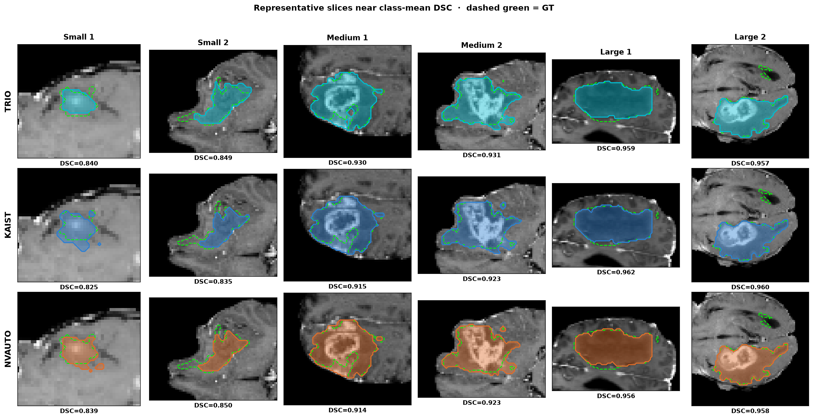
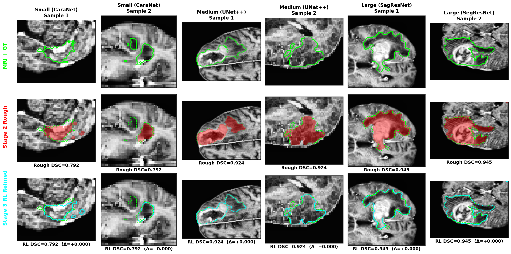
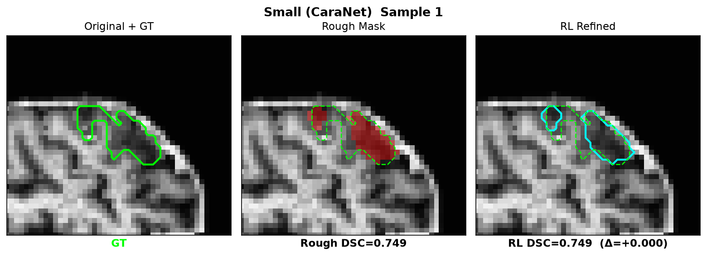
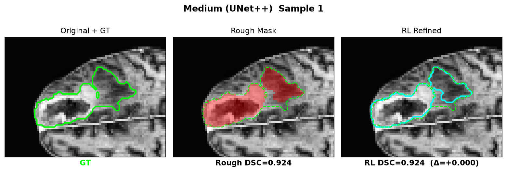
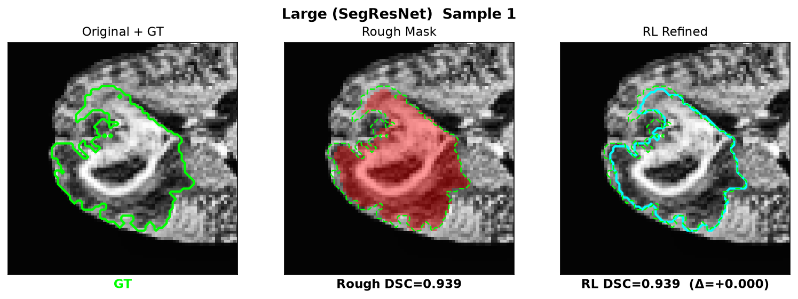
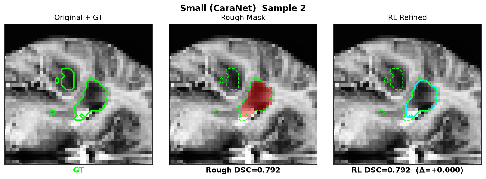
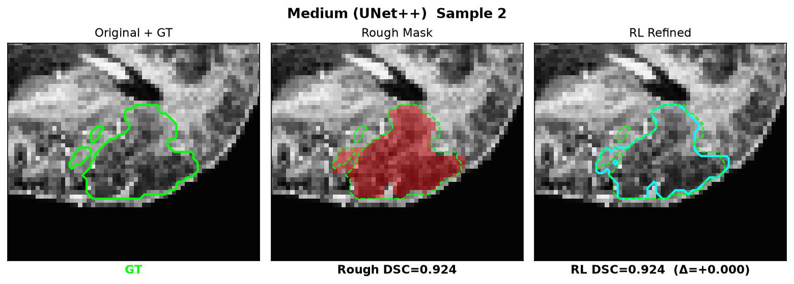
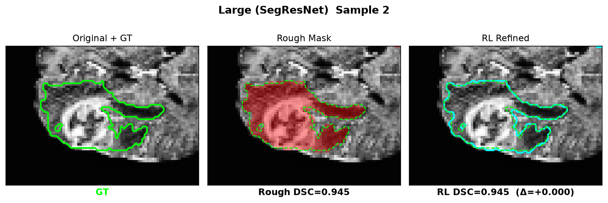
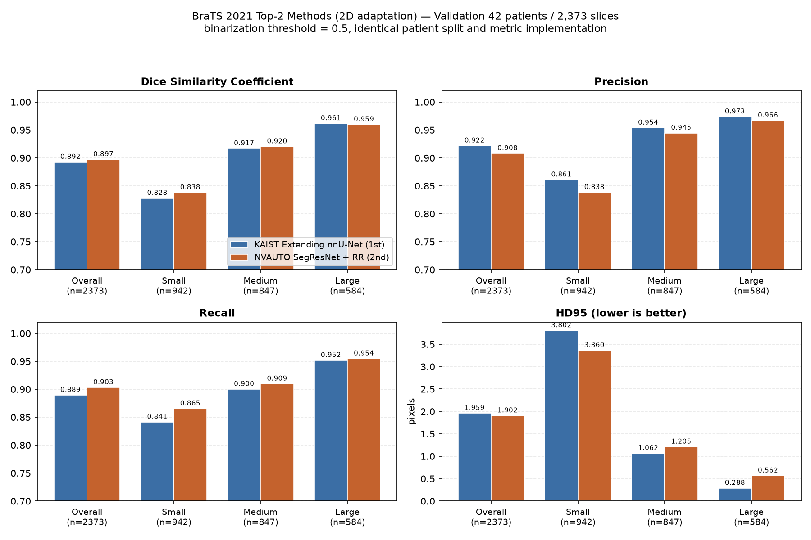
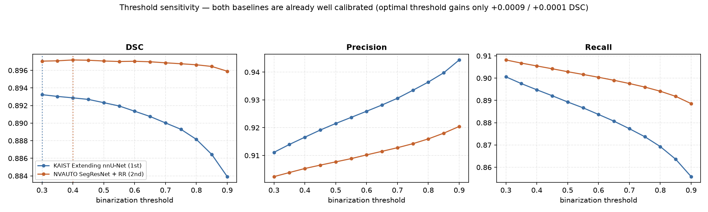

# 과거 기록 (2026-08-20)

이 문서는 README에서 뺀 210명 풀·val 42명 기록이다. 논문 본문은 [paper_draft_ko.md](paper_draft_ko.md)다. 그 수치는 개발 400명을 뺀 851명 환자 평균이다. 고정 임계값 Stage 2 대비 DSC 0.8337→0.8604이고, 검증에서 다시 고른 임계값 Stage 2(0.8411) 대비 짝 차이는 +0.0193이다. 로그는 [EXPERIMENT_RESULTS.md §0.11–0.13](EXPERIMENT_RESULTS.md)에 있다. 2026-09-30 단일 백본+섹터 PPO 다섯 세트(48명 표본 슬라이스 평균)는 [§0.14](EXPERIMENT_RESULTS.md)다. 이 문서의 08-20 표와 다른 실험이다. 이 210명 풀 가운데 148명은 그 851명 평가에 들어 있다(같은 함수·seed 42로 풀을 재현한 수). 당시 이 풀에서 정한 고정 임계값 0.80/0.80/0.50이 그 환자들에게도 적용되었다. 경계 띠 설계는 이후 개발 400명에서 정했다.

아래 표는 단조 DSC 게이트가 있는 예전 Stage 3다. `run_pipeline.py`로 1251명 전체를 잰 슬라이스 평균(DSC 0.8503→0.8758)은 개발 400명이 포함되므로 논문 본문 성능이 아니다.

품질 gate 절차: [QUALITY_GATE.md](QUALITY_GATE.md).

## 평가 설정 (val 42명)

`t1ce+flair` 2채널, BraTS 2021 환자 210명 중 **val 42명(2,434 슬라이스) hold-out** 평가입니다. 라우팅은 Stage 1 분류기 예측을 쓰고(Oracle 아님), Stage 2 임계값은 **0.80 / 0.80 / 0.50**, CC는 **0 / 15 / 25**, GT-free 면적 게이트와 Monotonic DSC 게이트를 적용했습니다. Confidence skip은 기본으로 꺼져 있습니다.

| 단계 | 산출 | 수치 |
|---|---|---|
| Stage 1 Shape Classifier | Best Val Acc | **0.8512** (ImageNet 사전학습) |
| Stage 2 Expert 3종 | val 초기 DSC (Small/Medium/Large) | **0.8286** / **0.9264** / **0.9546** |
| Stage 3 PPO 3종 | 학습 스텝 | 303,104 each |

| 지표 | Stage 2 (배포 가능 초기 분할) | Stage 3 (PPO + 단조 게이트 이론적 상한) | 변화 |
|---|---:|---:|---:|
| **평균 DSC** | **0.8948** | **0.9031** | **+0.83%p** |
| **평균 HD95** | **1.7336 px** | **1.6060 px** | **−0.128 px** |

| 크기 클래스 | Expert | n | Stage 2 초기 DSC → Stage 3 최종 DSC | 초기 HD95 → 최종 HD95 |
|---|---|---:|---:|---:|
| Small (`<300px`) | CaraNet 2.5D | 897 | 0.8286 → **0.8429** | 3.1618 → **2.9482 px** |
| Medium (`300–700px`) | UNet++ | 1152 | 0.9264 → **0.9314** | 1.0790 → **1.0000 px** |
| Large (`≥700px`) | SegResNet ED/TC | 385 | 0.9546 → **0.9582** | 0.3650 → **0.2919 px** |

### 대회 상위 입상 방법과의 비교

베이스라인은 같은 42명 val 환자에서 이전에 측정한 값입니다(당시 2,373 슬라이스). 이번 파이프라인 평가는 2,434장이라 슬라이스 수가 완전히 같지는 않습니다.

| 방법 | DSC (배포 기준) | DSC (단조 게이트 상한) | HD95 (px) | Precision | Recall |
|---|---:|---:|---:|---:|---:|
| **TRIO (제안 파이프라인)** | **0.8948** | **0.9031** | **1.7336** | 0.9348 | 0.8741 |
| Extending nnU-Net 각색 (KAIST, BraTS21 1위) | 0.8923 | — | 1.9591 | 0.9215 | 0.8893 |
| SegResNet + 중복 감소 각색 (NVAUTO, BraTS21 2위) | 0.8971 | — | 1.9022 | 0.9077 | 0.9029 |

배포 가능한 순수 Stage 2(0.8948)는 KAIST 각색 베이스라인(0.8923)보다 높고 NVAUTO 각색 베이스라인(0.8971)에 가깝습니다. Stage 3(0.9031)은 단조 DSC 게이트가 적용되었을 때의 이론적 상한입니다. 크기별로는 Medium이 계속 앞서고, Large 최종 DSC 0.9582는 NVAUTO 0.9594·KAIST 0.9614에 가깝습니다. 두 베이스라인은 3D·4모달리티·앙상블을 제외한 2D 각색 구현이므로 대회 리더보드 점수와 직접 비교할 수 없습니다. 상세는 [베이스라인](../baselines/README.md).

과거 08-20 평가의 안전 가드는 두 개였습니다. 면적 게이트(0.2×–4×, GT 불필요) 다음에 Monotonic DSC 게이트(GT 필요)가 있습니다. 후자는 보정 DSC가 초기보다 낮으면 Stage 2로 되돌리므로 최종 DSC는 상한입니다. 2,434장 중 858장(35.3%)이 되돌려졌습니다. GT 없이 측정되는 실제 배포 성능은 Stage 2 초기 DSC입니다.

## 당시 데이터 분할

환자 단위로 나눕니다. 같은 환자의 인접 슬라이스가 train과 val에 동시에 들어가지 않습니다.

| 역할 | 환자 | 슬라이스 | Small | Medium | Large |
|---|---:|---:|---:|---:|---:|
| train | 168 | 9,868 | 3,561 | 4,184 | 2,123 |
| val (GT 구간, 이전 집계) | 42 | 2,373 | 942 | 847 | 584 |
| val (2026-08-20 평가) | 42 | **2,434** | 897* | 1152* | 385* |

\* 2026-08-20 숫자는 분류기 라우팅 분포입니다. GT 면적 기준 구간과 다릅니다.

이후 개발 분할은 `checkpoints/patient_split.json`(seed 42, 400명 = train 280 / val 60 / test 60)입니다.

## 당시 시각화

세 방법을 같은 val 슬라이스 6장에서 비교합니다. 이 그림의 TRIO는 단조 DSC 게이트가 있는 예전 Stage 3입니다. 행은 TRIO / KAIST / NVAUTO, 열은 Small 1–2 · Medium 1–2 · Large 1–2입니다. 초록 점선은 GT입니다. 인덱스는 `113, 2286, 1121, 2295, 95, 1480`으로 고정합니다.



```bash
python scripts/eval/plot_three_method_grid.py --indices 113,2286,1121,2295,95,1480 --out results/method_comparison_3x6.png
```

그림에 쓰인 베이스라인 가중치는 원본이 없어서 2026-08-20에 같은 분할로 다시 학습한 것입니다(학습 중 val DSC KAIST 0.9021 / NVAUTO 0.8999). 위 정량 표의 0.8923 / 0.8971은 2026-08-19 `baselines/results/{kaist,nvauto}_metrics.json` 값입니다.

### 파이프라인 표본

클래스마다 Final DSC가 그 클래스 평균에 가깝고, Final DSC > Initial DSC인 원본 2장씩(총 6장)입니다. 초록=GT, 빨강=Stage 2, 하늘색=당시 Stage 3입니다.



| Small | Medium | Large |
|---|---|---|
|  |  |  |
|  |  |  |

| 크기별 성능 | 임계값 스윕 |
|---|---|
|  |  |

## 당시 재현 명령

```bash
python scripts/eval/evaluate_pipeline.py --split_role val
python scripts/eval/evaluate_pipeline.py --split_role val --skip_ppo
python scripts/eval/sweep_threshold.py --split_role val --plot results/threshold_sweep.png
python baselines/run_comparison.py --epochs 20 --batch_size 32 --sweep
python scripts/eval/plot_three_method_grid.py --indices 113,2286,1121,2295,95,1480 --out results/method_comparison_3x6.png

python run_pipeline.py --refinement_profile band_ppo --max_train_patients 1251 \
  --split_role all --slice_selection tumor --no_deterministic \
  --output_dir results/band_ppo_pipeline_1251 --no_plots
```

마지막 명령은 개발 400명이 포함된 1251명 슬라이스 평균입니다.
