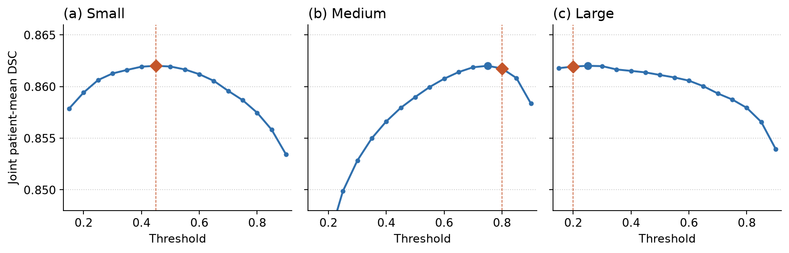
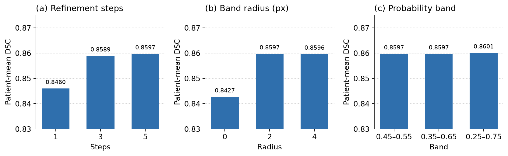

# 크기별 전문가 분할과 경계 띠 정책 보정을 이용한 뇌종양 MRI 분할

안인성 (컴퓨터공학과, a3426751@gachon.ac.kr), 한수진 (인공지능학과, hansj@gachon.ac.kr)
교신저자: 최아영, aychoi@gachon.ac.kr
가천대학교

2026 컴공&인지 연합학술제 연구트랙

## 초록

뇌종양 MRI의 Whole Tumor는 단면 크기와 경계 양상이 달라, 하나의 분할 모델로 전 구간을 맞추기 어렵다. 본 연구는 T1ce와 FLAIR를 128×128로 줄인 2차원 슬라이스에서 종양 크기를 분류하고, 크기별 전문가로 초기 마스크를 만든 뒤, 클래스 공통 PPO가 정해진 띠 안의 픽셀을 켜거나 끄는 파이프라인을 제안한다. 소형은 2.5D CaraNet, 중형은 UNet++, 대형은 부종과 종양핵을 나눠 예측한 SegResNet이다. 보정 정책은 하나이며, 전문가 확률 0.35–0.65인 픽셀 또는 마스크 경계 ±2픽셀을 수정한다. 학습 보상에는 정답을 쓰고, 추론 관측에는 정답이 없다. FLAIR 상대 밝기 제약은 마지막 스텝의 행동에만 둔다.

BraTS 2021 1251명 중 개발 400명(학습 280, 검증 60, 방법 선택 60)을 뺀 851명, 종양 슬라이스 50,010장에서 평가했다. 지표는 2차원 슬라이스 DSC의 환자 평균이다. 분류기가 전문가를 고르고 임계값 0.45/0.80/0.20을 쓴 Stage 2 대비 DSC는 0.8419에서 0.8595로 올랐다(환자 짝 차이 +0.0176, 95% CI 0.0166–0.0185). 이 값은 그 임계값으로 Stage 2 마스크를 만들고 경계 띠 PPO를 학습한 2026-10-08 실행이다. 2026-10-07에 같은 분할로 다시 학습한 시드 42·7·123의 경계 띠 PPO 환자 평균 DSC는 0.8597, 0.8620, 0.8609이고 범위는 0.0023이다. 시드 42에서 빈 슬라이스 거짓 양성은 0.521, 슬라이스를 쌓은 3D Dice는 0.813, 양쪽 마스크가 있는 공통 슬라이스의 HD95 환자 평균은 10.73 mm이다. 단일 U-Net은 0.8156이고, 전역 수축·유지·팽창 바닐라 PPO를 붙이면 0.8133이다. 코드와 실험 기록은 https://github.com/aninsung/2026-summer-Interdepartmental-Academic-Conference 에 있다.

**주요어:** 뇌종양 분할, 자기공명영상, 강화학습, PPO, 동적 라우팅, 경계 보정

---

## 1. 서론

뇌종양 영역의 분할은 종양 부담을 정량화하고 치료 범위를 정하는 데 쓰인다. MRI에서 종양의 크기, 조영 양상, 부종 경계는 환자마다, 그리고 같은 환자 안에서도 슬라이스마다 달라 단일 백본이 극소 단면과 큰 단면을 동시에 맞추기 어렵다. U-Net 계열은 의료영상 분할의 기본 구조로 자리 잡았으나[1], 크기별로 오차 형태가 다르면 초기 마스크의 경계에 체계적인 과소분할이 남을 수 있다. 정밀 방사선 치료에서는 그 경계의 작은 오차도 치료 범위에 영향을 주고, 모든 단면을 사람이 고치는 일은 시간이 많이 든다.

본 연구는 초기 분할과 경계 보정을 나눈다. 분류기가 슬라이스 크기를 고르면 해당 전문가가 확률 맵을 만들고, 하나의 PPO가 애매한 확률 구간과 마스크 경계 주변만 수정한다. 마스크 전체를 다시 그리지 않으므로 전문가가 맞춘 내부는 유지되고, 정책이 손댈 수 있는 곳은 띠 안으로 제한된다. 관측에는 정답이 없고, 정답은 학습 보상에만 쓴다.

이하 이 세 단계 파이프라인을 TRIO라 부른다. TRIO는 크기 분류, 크기별 전문가 분할, 경계 띠 PPO를 가리킨다. 기여는 다음 두 가지다.

1. 소형·중형·대형 전문가로 초기 Whole Tumor 마스크를 만드는 라우팅 분할을 구성하였다.
2. 크기마다 정책을 나누지 않고, 경계 띠 픽셀의 켜기·유지·끄기만 학습하는 PPO 하나를 두었다.

중형 슬라이스만으로 학습한 띠 보정 네트워크는 이 PPO의 초기 가중치다. 그 지도학습 보정, 그리고 같은 네트워크를 나중에 지도학습으로 다시 맞추는 절차는 기여가 아니다. 지표의 정의와 평가 집합을 미리 고정한 것도 실험 절차이며 기여가 아니다.

---

## 2. 관련 연구

U-Net은 skip connection으로 인코더의 위치 정보와 디코더의 의미 정보를 함께 쓰는 의료영상 분할의 기본 구조다[1]. 본 연구는 그 계열의 세 모델을 크기 구간에 나눠 배치한다.

### 2.1 CaraNet

CaraNet은 크기가 매우 작은 객체를 정확히 찾도록 설계된 의료영상 분할 모델이다[4]. 인코더 특징에 문맥 모듈을 두고, Axial Attention과 Reverse Attention을 결합한 모듈로 이미 찾은 영역의 바깥, 곧 놓치기 쉬운 경계 쪽에 주의를 돌린다. 여러 단계의 출력에 감독을 건다. 본 연구에서는 소형 전문가로 쓴다.

### 2.2 SegResNet

SegResNet은 Encoder–Decoder 구조에 ResNet의 Residual Learning 블록을 결합한 모델이다[3]. 각 블록은 정규화, ReLU, 합성곱을 두 번 거친 뒤 입력을 더한다. 원 논문은 3차원 뇌종양 MRI 분할에 쓰였고, 인코더 출력에서 입력을 복원하는 가지를 정규화로 붙였다. 본 연구에서는 대형 전문가로 쓰며, 부종과 종양핵을 따로 예측한 뒤 Whole Tumor로 합친다.

### 2.3 UNet++

UNet++는 인코더와 디코더 사이를 중첩된 조밀한 Skip connection으로 잇는 U-Net의 고도화 모델이다[2]. 같은 해상도의 특징을 여러 단계의 중간 노드로 이어, 인코더와 디코더 특징의 의미 차이를 줄이고 객체 경계선의 분할 정확도를 높인다. 여러 깊이의 출력에 감독을 걸 수 있다. 본 연구에서는 중형 전문가로 쓴다.

### 2.4 PPO

PPO(Proximal Policy Optimization)는 정책 경사 계열의 강화학습 알고리즘이다[5]. 에이전트가 환경에서 상태를 보고 행동을 고르며 보상을 받는 표본 수집과, 모은 궤적으로 손실을 계산해 정책 신경망을 갱신하는 학습을 번갈아 한다. 새 정책과 이전 정책의 확률 비를 일정 구간으로 자르는(Clipping) 목적 함수로 한 번의 갱신 폭을 제한해 학습을 안정시킨다. 같은 궤적을 여러 에폭에 나눠 다시 쓰므로 단순 정책 경사보다 표본을 효율적으로 쓴다. 본 연구에서는 슬라이스 하나를 환경으로, 띠 안 픽셀의 끄기·유지·켜기를 행동으로 둔다.

의료영상에서는 다중 에이전트로 3차원 경계를 반복 수정하는 방법[7]과 픽셀 단위 강화학습[8]이 보고되었다. nnU-Net은 전처리와 모델 선택을 데이터에 맞춰 고르는 자기구성 분할이다[9]. BraTS의 다중 기관 MRI와 전문가 라벨은 Menze 등[10]과 Bakas 등[11]이 정리했고, 본 연구의 영상은 그 계열의 2021년 과제다[6]. 거친 분할을 단계적으로 좁힌 뒤 경계를 다시 그리는 cascade 계열[12,13]과 달리, 본 연구는 크기별 전문가의 초기 마스크에서 정해진 띠만 수정한다. 본 연구의 정책은 크기별로 분리하지 않는다. 행동도 외곽선을 한 값만큼 평행 이동하는 방식이 아니라, 정해진 띠 안의 픽셀 레이블을 바꾸는 방식이다. 개발 과정에서는 방위별 거리 이동과 닫힌 윤곽 회귀도 검토했으나, 채택한 구현은 경계 띠 보정이다. 그 검토 수치는 4.2절의 방법 선택과 구분하며, 확정 성능은 4.3절이다.

---

## 3. 방법

그림 1은 전체 파이프라인이다. 분류기가 슬라이스 크기를 고르고, 크기별 전문가가 초기 마스크를 만들며, 경계 띠 PPO가 띠 안의 픽셀만 고친다.

**그림 1.** 파이프라인. Stage 1 크기 분류, Stage 2 크기별 전문가, Stage 3 경계 띠 PPO, Stage 4 평가.

### 3.1 데이터와 분할

입력은 BraTS 2021[6]의 T1ce와 FLAIR이다. 슬라이스는 128×128로 맞추고, 뇌 영역 안에서 z-score 정규화한 뒤 1–99 퍼센타일로 잘라 0–1로 맞춘다. 종양 픽셀 비율이 0.2% 이상인 단면만 학습과 평가에 넣는다. Whole Tumor는 분할 라벨이 0이 아닌 픽셀이다. 크기 기준은 정답 면적이다. 300픽셀 미만은 소형, 300 이상 700 미만은 중형, 700 이상은 대형이다.

환자 단위로 나눈다. 같은 환자의 인접 슬라이스가 학습과 검증에 동시에 들어가지 않는다. 전체 1251명 중 seed 42로 고른 개발 400명은 학습 280, 검증 60, 방법 선택 60이다. 나머지 851명, 종양 슬라이스 50,010장은 가중치 학습과 이번 방법 선택에 쓰지 않았다. 이진화 임계값 0.45/0.80/0.20은 이 분할의 검증 60명에서 골랐다. 연결요소 최소 크기는 이전 프로토콜의 0, 15, 25픽셀이다. 띠 설계는 이번 방법 선택 60명에서 정했다. 표 1이 이 역할을 정리한다.

**표 1.** 환자 분할.

| 역할 | 환자 수 | 용도 |
|---|---:|---|
| 학습 | 280 | 분류기, 전문가, 경계 띠 PPO |
| 검증 | 60 | 학습 중 가중치 선택, 베이스라인 임계값 |
| 방법 선택 | 60 | 정책 채택. 본문 성능이 아님 |
| 확정 평가 | 851 | 한 번 적용한 환자 평균 |

### 3.2 라우팅과 전문가

분류기는 ImageNet으로 초기화한 ResNet18이다. 입력은 인접 슬라이스를 붙인 2.5D이고, 첫 합성곱은 RGB 커널을 채널 축으로 합쳐 맞춘다. 면적 경계 ±80픽셀은 학습에서 빼 경계 사례의 라벨 흔들림을 줄인다. 손실은 label smoothing 0.05를 둔 교차엔트로피다. 이번 학습의 검증 정확도는 0.8216이다. 851명 슬라이스에서 분류기 예측이 정답 크기와 맞는 비율은 0.8353이다.

추론에서 분류기가 전문가를 고른다. 소형은 2.5D CaraNet이다. 입력이 여섯 채널이고, 아주 작은 정답은 학습에서 더 자주 뽑으며, 1차 예측 뒤 64×64로 확대해 한 번 더 추론한다. 중형은 중심 슬라이스 두 채널의 UNet++이다. 대형은 SegResNet이 부종과 종양핵을 따로 예측한 뒤 Whole Tumor 확률로 합친다. 합치는 식은 \(1-(1-p_{\mathrm{ED}})(1-p_{\mathrm{TC}})\)이다. 대형 전문가는 전 구간으로 학습하고, 추론에서는 대형으로 분류된 슬라이스에만 쓴다.

확률은 원본과 좌우·상하 반전의 평균이다. 이진화 임계값은 소형·중형·대형이 각각 0.45, 0.80, 0.20이고, 연결요소 최소 크기는 0, 15, 25픽셀이다. 검증 60명에서 분류기 라우팅의 환자 평균 DSC가 가장 높은 조합으로 골랐고, Stage 2 마스크와 851명 평가가 이 값을 쓴다. 전문가 학습은 20에폭, 배치 64, Adam(학습률 \(3\times10^{-4}\)), 코사인 스케줄, 혼합정밀도다. 손실은 이진 교차엔트로피와 Dice의 합이다. 이번 분할에서 소형 CaraNet의 검증 DSC는 0.8177이다.

학습 때의 전문가 선택은 추론과 다르다. 정책 학습과 저장 에폭 선택은 정답 면적으로 전문가를 골랐다. 851명 평가 슬라이스의 16.5%는, 그 정답 크기의 학습에 쓰이던 전문가가 아닌 모델의 마스크를 보정한다.

### 3.3 경계 띠 PPO

정책은 하나다. 시작 가중치는 중형 슬라이스만으로 지도학습한 띠 보정 네트워크이다. 이 지도학습 보정은 초기화이며 기여가 아니다. 기여는 크기별 라우팅과, 그 마스크의 띠를 고치는 PPO이다. 같은 네트워크를 전 크기로 지도학습해 다시 맞추는 절차도 기여에 넣지 않는다. 네트워크는 폭 32의 소형 U-Net이다. 입력 네 채널은 T1ce, FLAIR, 현재 마스크, 전문가 확률이다. 정답은 관측에 들어가지 않는다. 디코더 끝에서 행동 머리와 가치 머리가 갈라진다. 행동 머리는 픽셀마다 끄기, 유지, 켜기 세 로짓을 내고, 추론은 그 argmax를 쓴다. 가치 머리는 학습에만 쓴다. 띠 밖 로짓은 끄기와 켜기를 막아 유지가 된다.

수정할 수 있는 픽셀은 전문가 확률이 0.35–0.65인 곳, 또는 현재 마스크 경계에서 2픽셀 안팎이다. 띠 밖은 Stage 2 레이블을 유지한다. 확률이 그 구간에 들어가면 경계에서 멀리 있어도 바뀔 수 있으므로, 수정 범위는 경계 ±2픽셀만이 아니다. 다섯 스텝 동안 확률 맵은 고정하고 마스크만 다음 관측으로 넘긴다.

FLAIR 제약은 마지막 스텝의 행동에만 건다. 그 슬라이스 띠의 평균과 표준편차로 상대 밝기를 내어, 평균보다 어두운 픽셀은 마지막에 켜지 못하고 밝은 픽셀은 마지막에 끄지 못한다. 띠 픽셀이 8개 미만이거나 분산이 없으면 그 슬라이스는 Stage 2를 유지한다. 1–4스텝에는 이 제약이 없으므로, 앞에서 켠 픽셀을 마지막 스텝이 항상 되돌리지는 못한다. 최종 마스크가 FLAIR 규칙을 만족한다고 보지 않는다. DSC가 내려도 초기 마스크로 되돌리지 않는다.

보상은 학습에만 정답을 쓴다. 뒤집은 픽셀이 정답과 같으면 +1, 다르면 −1이다. 그 스텝에서 양쪽 마스크가 비어 있지 않아 HD95를 계산할 수 있으면, HD95 감소량에 0.25를 곱한 값을 뒤집은 픽셀마다 더한다. HD95 항의 합은 뒤집힌 픽셀 수에 비례한다. 띠 픽셀만으로 GAE를 계산한다. PPO 클립은 0.1, 할인 0.9, GAE λ 0.95, 엔트로피 계수 0.001, 가치 계수 0.5이다. 옵티마이저는 AdamW이고 행동 학습률은 \(1\times10^{-5}\), 가치 학습률은 \(1\times10^{-4}\)이다. 에폭은 6, PPO 내부 에폭은 2, 배치는 16이다. 세 크기 클래스를 한 배치에 섞는다.

저장 에폭은 정답 면적 라우팅의 검증에서 macro DSC가 Stage 2 이상이고 macro HD95가 가장 낮은 에폭이다. 저장된 체크포인트의 검증 macro DSC는 0.8936, HD95는 3.608이다. 같은 검증의 Stage 2는 DSC 0.8789, HD95 3.768이다.

그림 2는 이 절의 추론과 학습 경로이다. 위는 네 채널 관측으로 띠를 정하고, FLAIR 제약을 마지막 스텝에만 건 뒤 argmax로 다섯 스텝 마스크를 갱신한다. 아래는 정답을 보상에만 쓰고, 배치 16의 다섯 스텝으로 GAE–PPO 손실을 만들어 행동 머리와 가치 머리를 갱신한다. 확정 평가 숫자는 그림에 넣지 않고 표 4에 둔다.

**그림 2.** 경계 띠 PPO의 내부 경로. 위는 다섯 스텝 argmax 추론이고, 아래는 보상과 GAE–PPO 학습이다.

### 3.4 지표

주 지표는 슬라이스 DSC의 환자 평균이다. 환자 안에서는 종양 슬라이스를 같은 가중으로 평균하고, 환자 사이도 같은 가중이다. 종양 픽셀 비율 0.2% 미만인 단면은 평가에 넣지 않는다. 이 값은 BraTS의 3차원 볼륨 Dice가 아니다. Stage 2와의 비교는 환자 짝 차이의 구간으로 한다. 구간은 환자 단위 bootstrap 2000회의 2.5–97.5 백분위이다.

HD95는 같은 128×128 격자에서 두 윤곽의 95% 표면 거리이고 단위는 픽셀이다. 밀리미터가 아니다. 예측과 정답 중 한쪽이 비면 그 슬라이스를 HD95 평균에서 빼는데, 방법이 서로 다른 슬라이스를 뺄 수 있다. 환자 수가 같더라도 같은 슬라이스 집합의 짝비교가 아니므로 본문 주장으로 쓰지 않는다. 표에 적힌 HD95는 그 정의로 계산된 기술 평균이다.

크기 행은 환자군이 아니다. 정답 면적이 그 구간에 들어오는 슬라이스만 모아, 그런 슬라이스가 있는 환자의 평균을 낸다. 851명 모두가 소형 슬라이스를 가지므로 그 행의 환자 수는 851이다. 이것은 소형 종양만 있는 환자군이 아니다. 중형 행은 757명, 대형 행은 408명이고 같은 환자가 두 행 이상에 들어간다. 행의 환자 수를 더하면 안 된다. 구간별 슬라이스 수는 소형 19,077, 중형 19,907, 대형 11,026이다.

---

## 4. 실험

### 4.1 설정

확정 평가는 개발 400명을 뺀 851명이다. 라우팅은 분류기이고, 전문가는 테스트 시점 증강 뒤 임계값 0.45/0.80/0.20과 연결요소 제거를 거친다. 그 마스크에 경계 띠 PPO를 다섯 스텝 적용한다. 학습과 이 평가는 결정적 연산 모드를 끄고 시드 42로 돌렸다. 수치는 이 학습 실행 한 번이다.

방법 선택에 쓴 60명은 확정 평가에 넣지 않았다. 그 집합의 라우팅은 정답 면적이다. 따라서 4.2절의 DSC를 4.3절과 나란히 읽어 성능이 올랐거나 내렸다고 해석하지 않는다. 집합, 라우팅, 집계가 다르다.

내부 비교는 같은 분류기, 같은 전문가, 같은 임계값의 Stage 2이다. 경계 띠 PPO만 빠져 있다. 단일 백본 섹터 PPO는 4.4절이고, 단일 U-Net과 전역 바닐라 PPO를 포함한 Ablation Study는 4.5절이다.

### 4.2 방법 선택

개발 집합의 방법 선택 60명, 종양 슬라이스 3,495장에서 정답 면적으로 전문가를 골랐다. 세 크기 모두 Stage 2보다 DSC가 높고 기록된 HD95 평균이 낮아 이 정책을 채택했다. 표 2는 그 채택 기록이다. 논문의 성능 주장은 표 4이다.

**표 2.** 방법 선택 60명. 정답 면적 라우팅. 확정 성능이 아니다.

| 구간 | Stage 2 DSC | PPO DSC | Stage 2 HD95 | PPO HD95 |
|---|---:|---:|---:|---:|
| 소형 | 0.7500 | 0.7846 | 6.640 | 6.393 |
| 중형 | 0.9035 | 0.9215 | 3.592 | 2.885 |
| 대형 | 0.9223 | 0.9330 | 4.312 | 4.073 |
| 전체 | 0.8494 | 0.8721 | 4.905 | 4.474 |

같은 개발 프로토콜에서 닫힌 윤곽을 반복 이동하는 회귀는 중형·대형 DSC를 Stage 2보다 올렸으나 HD95 평균은 Stage 2보다 낮아지지 않았다. 방위별 거리 이동은 게이트를 풀면 마스크가 무너졌고, 게이트를 두면 Stage 2와 거의 같은 DSC에 머물렀다. 그 실험은 환자 분할이 표 1과 다른 기록도 있어 본문 표로 옮기지 않는다. 채택 이유는 표 2에서 세 구간 모두 DSC와 기록된 HD95가 Stage 2보다 나았기 때문이다.

### 4.3 확정 평가

임계값은 이번 실행의 전문가로, 검증 60명·종양 슬라이스 3,542장에서 골랐다. 라우팅은 분류기이고 확률은 테스트 시점 증강이다. 탐색은 0.10–0.90을 0.05 간격으로 두고, 세 값을 환자 평균 DSC로 함께 찾았다. 공동 최고점은 소형 0.45, 중형 0.75, 대형 0.25이고 DSC는 0.8620이다. 바로 아래 조합과의 차이는 0.00003이다. 이전 프로토콜의 0.80/0.80/0.50은 0.8563으로, 최고점보다 0.0057 낮다.

그림 3은 공동 최고점에 나머지 둘을 고정하고 한 축만 바꾼 곡선이다. 주황 마름모는 채택값이다. 소형 0.45는 그 곡선의 최고점이다. 중형 0.80은 0.8617, 대형 0.20은 0.8619로, 최고점 0.8620과의 차이는 0.0003과 0.0001이다. 임계값 0.10은 중형 환자 평균 DSC를 0.097로, 공동 DSC를 0.558로 떨어뜨려 그림에서 뺐다. 채택한 0.45/0.80/0.20은 이 평탄한 꼭대기 위에 있다. 이 값으로 Stage 2 마스크를 만들어 경계 띠 PPO를 학습했고, 851명 평가도 같은 임계값이다.

**표 3.** 검증 60명. 클래스별 환자 평균 DSC. 채택 행은 그 클래스 임계값만 바꾼 값이다.

| | 소형 | 중형 | 대형 |
|---|---:|---:|---:|
| 클래스별 최고 임계값 | 0.50 | 0.75 | 0.25 |
| 최고 DSC | 0.7858 | 0.8963 | 0.9308 |
| 채택 임계값 | 0.45 | 0.80 | 0.20 |
| 채택 DSC | 0.7858 | 0.8954 | 0.9304 |
| 슬라이스 / 환자 | 1,258 / 60 | 1,420 / 54 | 864 / 36 |

소형에서 0.45와 0.50의 DSC 차이는 0.0001이다. 중형은 0.0009, 대형은 0.0004이다. 클래스별 최고점을 그대로 이어 붙인 조합은 공동 최고점과 다르다. 공동 탐색의 최고점이 채택 근거이고, 채택값은 그 최고점에서 중형·대형을 한 칸씩 옮긴 평탄 구간의 점이다.

**그림 3.** 검증 60명의 공동 환자 평균 DSC. 각 패널은 나머지 둘을 0.45/0.75/0.25에 고정한다. 주황 마름모와 점선은 채택값 0.45, 0.80, 0.20이다.

분류기 라우팅으로 851명에 한 번 적용한 결과가 표 4이다. 표 4의 Stage 2가 채택 임계값의 초기 마스크다. 주 결과는 전체 행이다. 환자 짝 차이 +0.0176의 95% CI는 0을 포함하지 않는다. 아래 세 행은 소형·중형·대형 환자군이 아니다. 추론은 DSC가 내려간 슬라이스를 되돌리지 않는다.

**표 4.** 미사용 851명. 분류기 라우팅, 임계값 0.45/0.80/0.20. 슬라이스 DSC의 환자 평균.

| 정답 면적 구간 | 환자 | 슬라이스 | Stage 2 DSC | PPO DSC | 환자 짝 차이 (95% CI) |
|---|---:|---:|---:|---:|---|
| 전체 | 851 | 50,010 | 0.8419 | **0.8595** | +0.0176 (0.0166–0.0185) |
| Small | 851 | 19,077 | 0.7693 | **0.7922** | +0.0229 (0.0215–0.0243) |
| Medium | 757 | 19,907 | 0.8780 | **0.8932** | +0.0152 (0.0144–0.0160) |
| Large | 408 | 11,026 | 0.9030 | **0.9156** | +0.0125 (0.0112–0.0138) |

환자 열은 짝 차이의 95% 구간을 잡은 표본 수이다. 슬라이스 열은 그 정답 면적에 들어오는 종양 슬라이스 수이다. Small, Medium, Large는 19,077장, 19,907장, 11,026장이고 세 수의 합이 50,010이다. 같은 환자가 여러 행에 들어가므로 환자 수를 더하면 851을 넘는다. Small 행의 851명은 소형 단면이 한 장이라도 있는 환자 전부다. 차이는 소형 구간에서 +0.0229로 가장 크고, 대형 구간에서 +0.0125로 가장 작다. 대형 구간의 초기 DSC가 이미 0.9030이라 띠 안에서 겹침을 더 올릴 여지가 작다.

같은 평가의 HD95 평균은 전체 4.747에서 4.547 px이다. 구간별로는 5.591에서 5.577, 4.231에서 3.897, 4.408에서 3.950 px이다. 빈 마스크를 빼는 슬라이스가 Stage 2와 PPO에서 달라 이 차이를 짝비교 개선으로 보고하지 않는다. 제안 방법의 전체 HD95는 4.547 px이다.

그림 4는 이전 잠금 가중치로 그린, 개발 400명에 없는 여섯 슬라이스이다. 열 제목의 앞은 정답 면적이고, 뒤는 분류기가 고른 전문가이다. 칸 아래 숫자는 그 슬라이스의 DSC와 HD95이며 표 4의 환자 평균이 아니다. 정량 주장은 표 4이다.

**그림 4.** 미사용 환자의 같은 슬라이스. 위는 정답(초록), 가운데는 Stage 2(빨강), 아래는 경계 띠 PPO(하늘색). 칸의 DSC와 HD95는 그 장만의 값이다.

### 4.4 단일 백본 섹터 PPO

표 5는 백본마다 PPO를 하나씩 둔 단일 백본 섹터 PPO이다. 행동은 마스크를 5×8 섹터로 나누어 15스텝 움직이는 것이고, 초기 마스크 임계값은 0.5이다. 평가는 같은 분할에서 시드 7로 뽑은 48명, 종양 슬라이스 2,754장의 슬라이스 평균이다. HD95는 양쪽 마스크가 비어 있지 않은 슬라이스만의 평균이고 단위는 px이다. TRIO 행은 같은 48명에 경계 띠 PPO를 적용한 값이다. 집계는 표 4의 851명 환자 평균과 다르다.

**표 5.** 단일 백본 섹터 PPO. 48명, 슬라이스 평균.

| 방법 | 소형 DSC | 중형 DSC | 대형 DSC | 소형 HD95 | 중형 HD95 | 대형 HD95 |
|---|---:|---:|---:|---:|---:|---:|
| TRIO | **0.812** | **0.904** | 0.916 | **4.877** | **3.432** | **3.761** |
| U-Net + 섹터 PPO | 0.537 | 0.813 | 0.866 | 12.126 | 6.518 | 6.527 |
| UNet++ + 섹터 PPO | 0.778 | 0.894 | **0.926** | 5.786 | 3.617 | 3.773 |
| UNet+++ + 섹터 PPO | 0.543 | 0.828 | 0.900 | 10.308 | 5.087 | 4.345 |
| Attention U-Net + 섹터 PPO | 0.761 | 0.884 | 0.904 | 6.660 | 3.821 | 4.606 |
| SegResNet + 섹터 PPO | 0.676 | 0.871 | 0.912 | 8.821 | 4.240 | 4.319 |

이 48명 표본의 소형 DSC는 TRIO가 0.812로 가장 높다. 중형·대형 DSC는 UNet++ + 섹터 PPO가 0.894, 0.926이다.

### 4.5 Ablation Study

이 절은 표 4와 다른 학습이다. 환자 분할은 그대로 두고 시드만 바꾸거나, 시드 42 가중치에서 추론 조건만 바꾼다. 기준은 크기별 전문가의 Stage 2이다. 여기에 중형 지도학습 초기화, PPO, 다섯 스텝을 차례로 더했다. 표 6의 체크는 그 행에서 켠 구성이다. 숫자는 851명 환자 평균 DSC이다.

**표 6.** 구성 추가. 시드 42, 851명. 환자 평균 DSC.

| 크기별 전문가 | 띠 지도학습 | PPO | 5스텝 | DSC |
|:---:|:---:|:---:|:---:|---:|
| ✓ | | | | 0.8339 |
| ✓ | ✓ | | | 0.8383 |
| ✓ | ✓ | ✓ | | 0.8460 |
| ✓ | ✓ | ✓ | ✓ | **0.8597** |

기준 Stage 2는 0.8339이다. 띠 지도학습을 한 스텝만 적용하면 0.8383, 그 초기화 위의 PPO를 한 스텝 적용하면 0.8460, 다섯 스텝으로 늘리면 0.8597이다. 구성을 더할 때마다 DSC가 올랐다. 같은 분할의 시드 42·7·123에서 Stage 2는 0.8354±0.0016, 경계 띠 PPO는 0.8609±0.0012, 대형 전문가를 전 슬라이스에 쓰면 0.8514±0.0022이다. 표준편차는 세 시드의 표본 표준편차이고, PPO의 범위는 0.0023이다.

**그림 5.** 시드 42 추론 초매개변수. (a) 보정 스텝. (b) 띠 반경. (c) 확률 띠. 점선은 채택 설정인 5스텝, 반경 2, 확률 띠 0.35–0.65의 DSC 0.8597이다.

그림 5의 세 축은 표 6의 마지막 행에서 하나씩만 바꾼 값이다. 스텝은 1에서 3으로 올릴 때 0.8460에서 0.8589로 오르고, 5스텝은 0.8597이다. 반경 0은 0.8427로 떨어지고, 반경 2와 4는 0.8597과 0.8596으로 같다. 확률 띠 0.45–0.55, 0.35–0.65, 0.25–0.75는 0.8597, 0.8597, 0.8601이다. 반경이 0이 아니면 스텝 3 이상과 띠 폭 변경에 DSC가 거의 움직이지 않는다. FLAIR 가드를 끄면 0.8575이다.

크기별 전문가 대신 대형 전문가만 쓰면 0.8503이고, 그 마스크에 경계 띠 PPO를 얹으면 0.8676이다. 분류기 대신 정답 크기로 라우팅하면 0.8698이다. 이전 210명 풀과 겹치는 148명을 뺀 703명에서는 5스텝 PPO가 0.8579이다.

**표 7.** 세 시드의 추가 지표. 빈 슬라이스 131,905장. 평균±표준편차는 시드 세 개의 표본 표준편차.

| 지표 | Stage 2 | 경계 띠 PPO | 대형 전문가, 전 슬라이스 |
|---|---:|---:|---:|
| DSC | 0.8354±0.0016 | **0.8609±0.0012** | 0.8514±0.0022 |
| 거짓 양성 | 0.5667±0.0345 | **0.5297±0.0378** | 0.8600±0.0608 |
| HD95 (mm) | 11.344±0.316 | **10.605±0.220** | — |
| 3D Dice | 0.7787±0.0075 | **0.8110±0.0020** | 0.7847±0.0223 |

거짓 양성은 종양 픽셀 비율 0.2% 미만인 단면에서 마스크가 나온 비율이다. HD95는 Stage 2와 PPO가 함께 마스크를 가진 슬라이스의 환자 평균이고, mm는 픽셀×1.9이다. 3D Dice는 슬라이스를 z로 쌓은 환자 평균이다. 시드별 원값은 Stage 2 DSC 0.8339, 0.8370, 0.8352, PPO DSC 0.8597, 0.8620, 0.8609, 대형 전 슬라이스 DSC 0.8503, 0.8540, 0.8500이다. 거짓 양성은 Stage 2가 0.567, 0.532, 0.601, PPO가 0.521, 0.497, 0.571, 대형이 0.930, 0.821, 0.829이다. HD95는 Stage 2가 11.536, 10.979, 11.516 mm, PPO가 10.734, 10.351, 10.731 mm이다. 3D Dice는 Stage 2가 0.779, 0.786, 0.771, PPO가 0.813, 0.811, 0.809, 대형이 0.799, 0.796, 0.759이다.

같은 280명을 20에폭 학습한 단일 U-Net이다. 임계값은 0.5이고, 평가는 851명, 종양 슬라이스 50,010장이다. 바닐라 PPO는 그 마스크를 전역 1픽셀 수축·유지·팽창으로 15스텝 수정한다. 환자 짝 차이는 −0.0023(95% CI −0.0029–−0.0017)이다. 크기 행의 환자 수는 소형 851, 중형 757, 대형 408이다.

**표 8.** 단일 U-Net과 전역 바닐라 PPO. 851명 환자 평균.

| 방법 | DSC (95% CI) | HD95 (px) | 소형 | 중형 | 대형 |
|---|---:|---:|---:|---:|---:|
| U-Net | 0.8156 (0.8067–0.8243) | 6.939 | 0.7215 | 0.8758 | 0.8973 |
| 바닐라 PPO | 0.8133 (0.8046–0.8220) | 6.955 | 0.7197 | 0.8736 | 0.8939 |

전역 수축·유지·팽창은 세 크기 모두 DSC를 올리지 못했다.

## 5. 결론

TRIO는 크기 분류, 크기별 전문가, 경계 띠 PPO이다. 미사용 851명에서 임계값 0.45/0.80/0.20의 Stage 2 환자 평균 DSC는 0.8419이고, 경계 띠 PPO를 다섯 스텝 적용한 뒤는 0.8595이다. 환자 짝 차이 +0.0176의 95% CI는 0.0166–0.0185이다. 차이는 small에서 +0.0229로 가장 크고, large에서 +0.0125로 가장 작다.

이외 실험은 재학습, 스텝 수, 단일 대형 전문가, 전역 바닐라 PPO, 섹터 PPO를 따로 측정한다. 같은 분할을 2026-10-07에 시드 42·7·123으로 다시 학습하면 경계 띠 PPO DSC는 0.8597–0.8620이다. 시드 42에서 5스텝 PPO는 0.8597, 1스텝은 0.8460, 중형 지도학습 초기화 한 스텝은 0.8383, 대형 전문가를 전 슬라이스에 적용한 값은 0.8503이다. 같은 851명에서 단일 U-Net은 0.8156이고, 전역 1픽셀 수축·유지·팽창 바닐라 PPO는 0.8133이다. 시드 42의 빈 슬라이스 거짓 양성은 0.567에서 0.521로 줄고, 슬라이스를 쌓은 3D Dice는 0.779에서 0.813으로 오른다.

---

## 참고문헌

[1] O. Ronneberger, P. Fischer, and T. Brox, “U-Net: Convolutional Networks for Biomedical Image Segmentation,” in *MICCAI*, 2015, pp. 234–241.

[2] Z. Zhou, M. M. R. Siddiquee, N. Tajbakhsh, and J. Liang, “UNet++: Redesigning Skip Connections to Exploit Multiscale Features in Image Segmentation,” *IEEE Transactions on Medical Imaging*, vol. 39, no. 6, pp. 1856–1867, 2020.

[3] A. Myronenko, “3D MRI Brain Tumor Segmentation Using Autoencoder Regularization,” in *Brainlesion: Glioma, Multiple Sclerosis, Stroke and Traumatic Brain Injuries (MICCAI BraTS)*, 2018, pp. 311–320.

[4] A. Lou, S. Guan, and M. Loew, “CaraNet: Context Axial Reverse Attention Network for Segmentation of Small Medical Objects,” *Journal of Medical Imaging*, vol. 10, no. 1, p. 014005, 2023.

[5] J. Schulman, F. Wolski, P. Dhariwal, A. Radford, and O. Klimov, “Proximal Policy Optimization Algorithms,” arXiv:1707.06347, 2017.

[6] U. Baid et al., “The RSNA-ASNR-MICCAI BraTS 2021 Benchmark on Brain Tumor Segmentation and Radiogenomic Classification,” arXiv:2107.02314, 2021.

[7] X. Liao, W. Li, Q. Xu, X. Wang, B. Jin, X. Zhang, and Y. Zheng, “Iteratively-Refined Interactive 3D Medical Image Segmentation with Multi-Agent Reinforcement Learning,” in *IEEE/CVF Conference on Computer Vision and Pattern Recognition (CVPR)*, 2020, pp. 9394–9402.

[8] R. Furuta, N. Inoue, and T. Yamasaki, “PixelRL: Fully Convolutional Reinforcement Learning with Action-Successor Representation for Image Processing,” *IEEE Transactions on Multimedia*, 2020.

[9] F. Isensee, P. F. Jaeger, S. A. A. Kohl, J. Petersen, and K. H. Maier-Hein, “nnU-Net: a self-configuring method for deep learning-based biomedical image segmentation,” *Nature Methods*, vol. 18, no. 2, pp. 203–211, 2021.

[10] B. H. Menze et al., “The Multimodal Brain Tumor Image Segmentation Benchmark (BRATS),” *IEEE Transactions on Medical Imaging*, vol. 34, no. 10, pp. 1993–2024, 2015.

[11] S. Bakas et al., “Advancing The Cancer Genome Atlas glioma MRI collections with expert segmentation labels and radiomic features,” *Scientific Data*, vol. 4, 170117, 2017.

[12] G. Wang, W. Li, S. Ourselin, and T. Vercauteren, “Automatic Brain Tumor Segmentation Using Cascaded Anisotropic Convolutional Neural Networks,” in *BrainLes (MICCAI)*, 2018, pp. 178–190.

[13] H. Chen, X. Qi, L. Yu, and P.-A. Heng, “DCAN: Deep Contour-Aware Networks for Accurate Gland Segmentation,” in *CVPR*, 2016, pp. 2487–2496.
