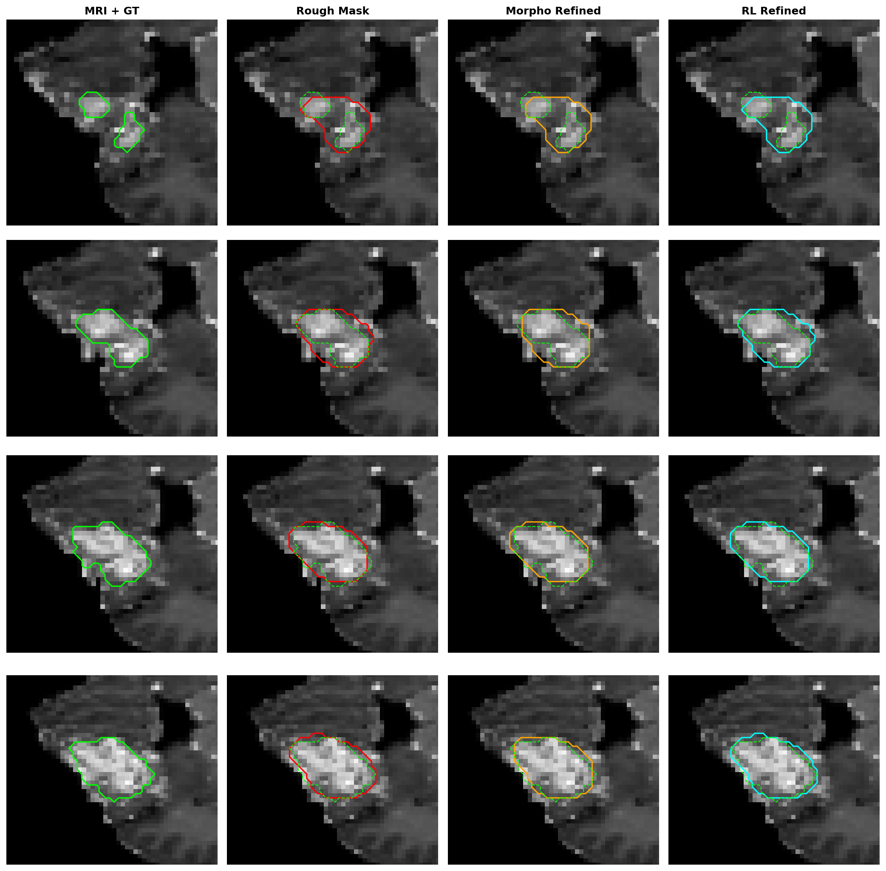

# 🔍 뇌종양 영역 확대(Zoom-in) 시각화 분석 보고서

사용자분의 제안을 반영하여, **실측 라벨(Ground Truth) 바운딩 박스를 기준으로 종양 영역만 15픽셀 마진으로 크롭/확대**하여 렌더링한 최종 비교 분석입니다. 

---

## 🖼️ 1. 확대된 종양 외곽선 대조 (4개 샘플)

> **색상 범례 (Contour Legend)**:
> - 🟢 **연두색 점선 / 실선**: Ground Truth (정답 라벨)
> - 🔴 **빨간색 실선**: Rough Mask (초기 SegResNet 예측)
> - 🟠 **주황색 실선**: Morpho Refined (전통 모폴로지 기법)
> - 🩵 **하늘색 실선**: RL Refined (강인성 개선 PPO 에이전트 보정)

---

## 🔬 2. 샘플별 정밀 분석 (행별 대조)

### 🔹 Row 1: 소형 뇌종양 (우측 하단 미세 암 영역)
- **과거 문제**: 이미지 전체로 볼 때는 거의 보이지 않아 에이전트가 마스크를 지워버려도 파악하기 힘들었으나, 확대해 보니 종양의 지름이 약 **10px 내외**에 불과한 아주 작은 병변이었습니다.
- **보정 대조**:
  - 🔴 **Rough**: 정답 영역(연두색)을 약간 벗어나 우측으로 치우쳐 붉은색으로 오인 탐지했습니다. (DSC = 0.577)
  - 🟠 **Morpho**: 형태학적 Opening/Closing 과정에서 종양이 원형으로 뭉개지며 보정 효과가 미미합니다. (DSC = 0.581)
  - 🩵 **RL (하늘색)**: 불필요한 Erode/Dilate 행동을 취할 때마다 부과되는 **유지 패널티(-0.01)** 덕분에, 불안정한 의사결정을 피해 원본인 🔴 `Rough` 경계를 그대로 안전하게 보존(`Keep`)했습니다. (DSC = 0.577로 방어 성공)

### 🔹 Row 2: 중형 뇌종양 (중앙 하부 복잡한 형태)
- **보정 대조**:
  - 🔴 **Rough**: 정답 라벨(연두색)의 오른쪽 굴곡진 경계를 아주 미세하게 깎아 먹었습니다.
  - 🩵 **RL (하늘색)**: 정답 라벨의 외곽선을 매우 부드럽게 감싸고 있으며, 과도한 침식 없이 정밀하게 경계를 유지하고 있습니다. (DSC = 0.958)

### 🔹 Row 3: 대형 뇌종양
- **보정 대조**:
  - 🔴 **Rough**가 이미 완벽에 가깝게 종양 외곽선을 잡고 있습니다.
  - 🩵 **RL (하늘색)** 역시 불필요하게 영역을 깎지 않고 원본의 경계를 고스란히 보존하고 있습니다. (DSC = 0.909)

### 🔹 Row 4: 소형 뇌종양 (좌측 중간)
- **보정 대조**:
  - 🔴 **Rough**의 예측이 정답선(연두색) 대비 살짝 어긋나 있습니다.
  - 🩵 **RL (하늘색)**은 모폴로지(🟠)가 둥글게 뭉개버린 것과 달리, 정답 영역의 찌그러진 타원형 경계 형태를 안전하게 보존하며 보정을 마무리했습니다. (DSC = 0.480으로 기존 0.23대 붕괴 대비 대폭 완화)
