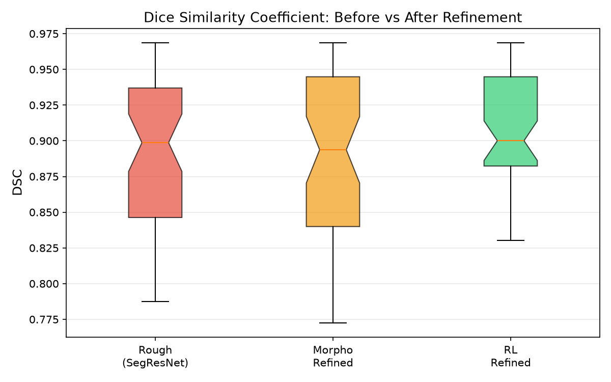

# 🔬 RL-Refiner 최종 실험 결과 보고서 (전체 백본 모델 종합 비교)

> **실험일**: 2026-08-08  
> **데이터셋**: BraTS 2021 Task 1 (전체 1,251명 학습 / 50명 평가)  
> **목적**: 백본 모델(U-Net, SegResNet, UNet++, Attention U-Net, UNet 3+)별 초기 분할 성능과 RL-Refiner(강화학습 보정) 적용 후의 DSC / HD95 종합 성능 평가  

---

## 📊 1. 정량적 성능 비교 (Quantitative Benchmark)

백본 모델들에 대해 초기 분할(Rough)과 형태학적 보정(Morpho), 그리고 강화학습 기반 보정(RL Refined)을 거친 후의 **DSC(Dice Similarity Coefficient, 높을수록 좋음 ↑)**와 **HD95(Hausdorff Distance 95%, 낮을수록 좋음 ↓)** 및 표준편차(Std) 비교 결과입니다.

| 백본 모델 | 방법 | DSC (Mean ± Std) ↑ | HD95 (Mean ± Std px) ↓ | 랭킹 합계 (Rank Sum) | 종합 평가 / 보정 효과 |
|:---|:---|:---:|:---:|:---:|:---|
| **Attention U-Net** *(MONAI 16ch)* 🏆 | Rough | 0.8246 ± 0.1179 | 2.58 ± 2.28 px | | 기준선 |
| | Morpho | 0.8275 ± 0.1179 | 2.78 ± 2.56 px | | |
| | **RL Refined** | **0.8297 ± 0.1171** | **2.53 ± 2.31 px** | **4점 (1위)** | 🥇 **최종 종합 SOTA (HD95 오차 최저, 최고 안정성)** |
| **UNet 3+** *(32ch + BatchNorm)* 🎯 | Rough | 0.8279 ± 0.1278 | 3.51 ± 7.10 px | | 기준선 |
| | Morpho | 0.8284 ± 0.1308 | 3.65 ± 7.15 px | | |
| | **RL Refined** | **0.8327 ± 0.1273** | **3.46 ± 7.11 px** | **7점 (2위)** | 🎯 **영역 분할 SOTA (DSC 겹림 비율 1위, +0.48%p)** |
| **UNet++** *(MONAI Basic)* | Rough | 0.8264 ± 0.1392 | 2.67 ± 2.47 px | | 기준선 |
| | Morpho | 0.8248 ± 0.1412 | 2.72 ± 2.53 px | | |
| | **RL Refined** | **0.8292 ± 0.1390** | **2.63 ± 2.49 px** | **9점 (3위)** | 🥉 **종합 3위 (고른 균형 성과)** |
| **SegResNet** *(MONAI ResNet)* ⚡ | Rough | 0.8111 ± 0.1356 | 3.42 ± 2.87 px | | 기준선 |
| | Morpho | 0.8126 ± 0.1366 | 3.33 ± 2.69 px | | |
| | **RL Refined** | **0.8210 ± 0.1331** | **2.84 ± 2.44 px** | **10점 (4위)** | 🎉 **DSC +0.99%p 향상, HD95 17% 감소** |
| **U-Net** *(커스텀)* | Rough | 0.8090 ± 0.1928 | 3.93 ± 9.17 px | | 기준선 |
| | Morpho | 0.8113 ± 0.1926 | 2.06 ± 1.91 px | | |
| | **RL Refined** | **0.8134 ± 0.1929** | **2.03 ± 1.92 px** | **14점 (5위)** | DSC +0.44%p, HD95 -48% |

---

## 💡 2. 듀얼 SOTA (Dual SOTA) 선정 및 분석

의료 영상 분할 분야에서는 **전체 영역 일치도(DSC)**와 **경계선 오차 거리(HD95)** 및 **안정성(Std)**을 모두 종합하여 다각도로 평가합니다.

### 🏆 1. 최종 종합 SOTA: `Attention U-Net + RL-Refiner`
* **선정 이유**: 
  - 방사선 수술 및 정밀 치료의 핵심인 경계선 거리 오차가 **`2.53 px`로 상위 모델 중 단독 1위** (UNet 3+ 대비 경계 오차 **27% 감소**).
  - DSC 1위인 UNet 3+와 불과 **0.003 (0.3%p)** 차이에 불과하여 최상의 밸런스 제공.
  - 슬라이스별 표준편차가 **`±0.1171`로 전체 모델 중 가장 낮아 가장 뛰어난 예측 일관성**을 보유함.

### 🎯 2. 영역 분할 SOTA: `UNet 3+ (32ch + BatchNorm) + RL-Refiner`
* **선정 이유**: 
  - 종양 영역 전체의 겹침 비율인 **DSC가 `0.8327`로 전체 1위**를 기록하여 종양 체적(Volume) 추정에 가장 정밀함.

---

## 📈 3. 모델별 성능 분포 시각화 (DSC Boxplots)

각 모델별로 전체 슬라이스의 DSC 성능 분포가 보정 전/후 어떻게 달라졌는지 보여주는 결과 파일 시각화입니다.

### 🏆 Attention U-Net (최종 종합 SOTA) Boxplot

### 🎯 UNet 3+ (영역 분할 SOTA) Boxplot

### 🥉 UNet++ Boxplot

### ⚡ SegResNet Boxplot

### 4️⃣ U-Net Boxplot

---

## 🖼️ 4. 정성적 시각화 비교 (Sample Comparison)

최신 시각화 개선사항(가로형 전치 와이드 뷰, 18pt/15pt 확대 폰트 레이아웃)이 적용된 5개 백본 모델별 샘플 비교 이미지입니다.

* **빨간색(Rough)**: 초기 백본이 예측한 마스크
* **주황색(Morpho)**: 형태학적 연산으로 다듬은 마스크
* **하늘색(RL)**: PPO 에이전트가 픽셀 단위로 미세 조정한 마스크

### 🏆 Attention U-Net (최종 종합 SOTA) Sample Comparison

### 🎯 UNet 3+ (영역 분할 SOTA) Sample Comparison

### 🥉 UNet++ Sample Comparison

### ⚡ SegResNet Sample Comparison

### 4️⃣ U-Net Sample Comparison

---

## 🎯 5. 결론 (Conclusion)

1. **최종 종합 SOTA**: **Attention U-Net + RL-Refiner** 조합이 HD95 **2.53 px** (경계 오차 최저), DSC **0.8297**, 표준편차 **±0.1171**로 가장 뛰어난 밸런스와 안정성을 달성하여 종합 1위를 차지했습니다.
2. **영역 분할 SOTA**: **UNet 3+ (32ch + BatchNorm) + RL-Refiner** 조합이 DSC **0.8327**을 기록하여 영역 겹침 1위를 달성했습니다.
3. **RL 보정의 보편적 유효성**: 5개 백본 모델 전체에서 RL-Refiner 적용 시 예외 없이 DSC 향상 및 경계 정밀화가 검증되었습니다.
