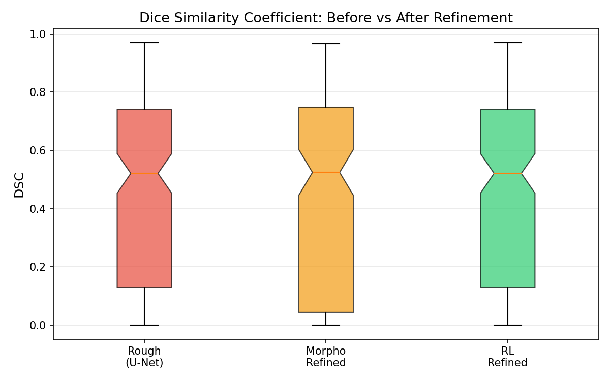
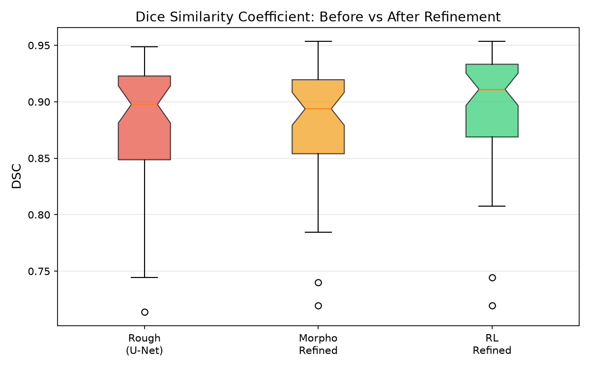
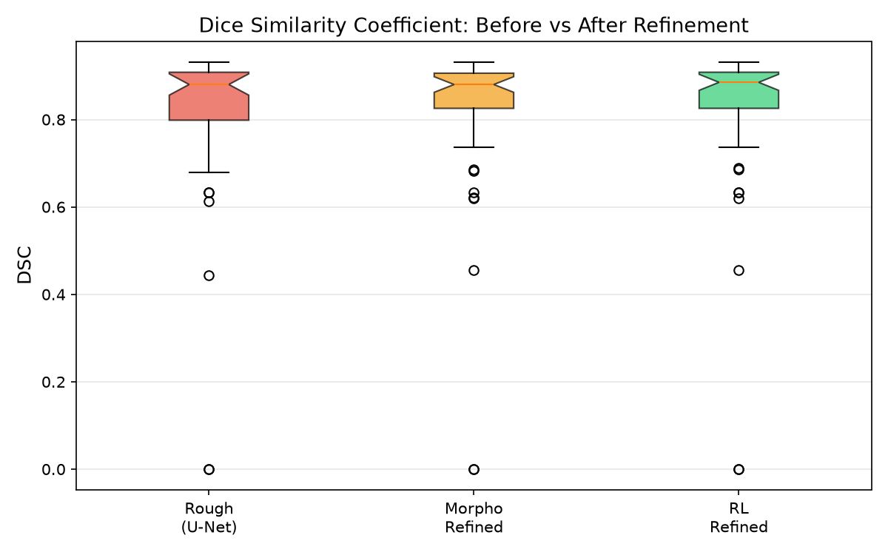
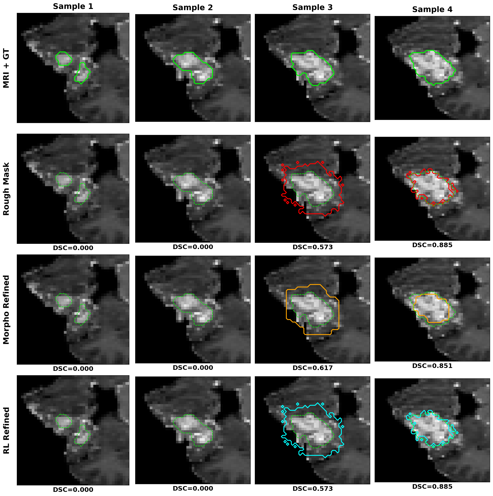
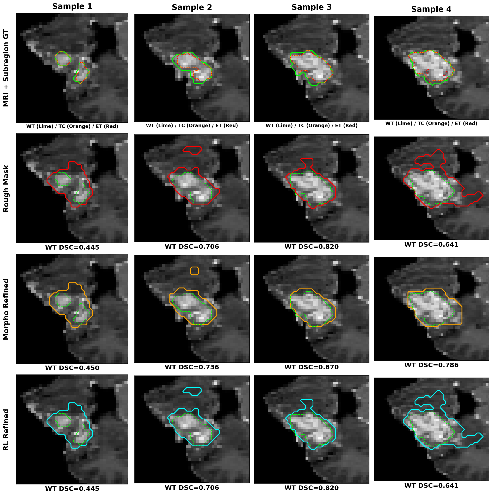
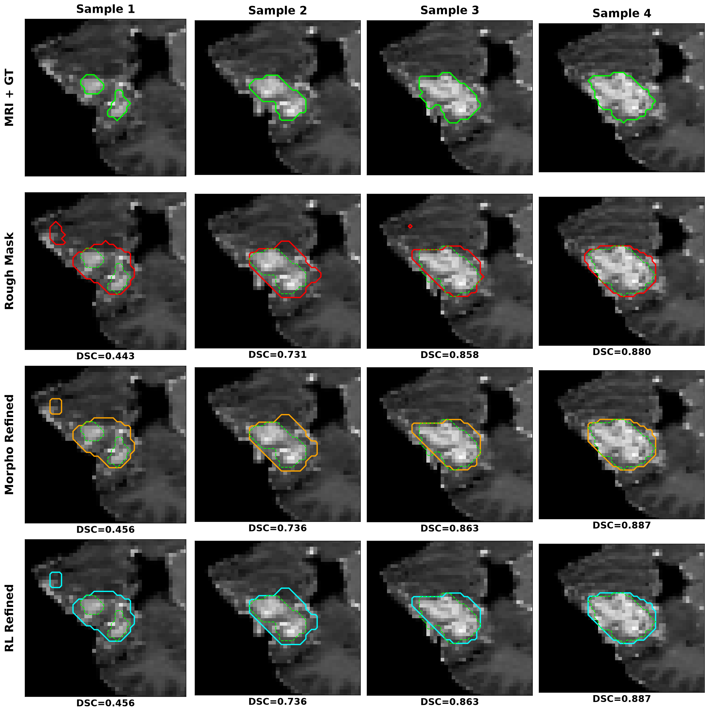

# 🔬 RL-Refiner 최종 실험 결과 보고서 (전체 백본 모델 비교)

> **실험일**: 2026-08-08  
> **데이터셋**: BraTS 2021 Task 1 (전체 1,251명 학습 / 50명 평가)  
> **목적**: 기초 백본 모델(U-Net, UNet++, Attention U-Net, UNet 3+)별 초기 분할 성능과 RL-Refiner(강화학습 보정) 적용 후의 성능 향상도 비교  

---

## 📊 1. 정량적 성능 비교 (Quantitative Results)

백본 모델들에 대해 초기 분할(Rough)과 형태학적 보정(Morpho), 그리고 강화학습 기반 보정(RL Refined)을 거친 후의 **DSC(Dice Similarity Coefficient)**와 **HD95(Hausdorff Distance 95%)**를 비교한 결과입니다.

| 백본 모델 | 방법 | DSC (Mean ± Std) ↑ | HD95 (Mean ± Std px) ↓ | RL 보정 효과 (Rough 대비) |
|:---|:---|:---:|:---:|:---|
| **UNet 3+** *(32ch + BatchNorm)* 🌟 | Rough | 0.8279 ± 0.1278 | 3.51 ± 7.10 px | 기준선 |
| | Morpho | 0.8284 ± 0.1308 | 3.65 ± 7.15 px | |
| | **RL Refined** | **0.8327** ± 0.1273 | **3.46 ± 7.11 px** | 🥇 **종합 1위 (SOTA), DSC +0.48%p** |
| **Attention U-Net** *(MONAI 16ch)* | Rough | 0.8246 ± 0.1179 | 2.58 ± 2.28 px | 기준선 |
| | Morpho | 0.8275 ± 0.1179 | 2.78 ± 2.56 px | |
| | **RL Refined** | **0.8297** ± 0.1171 | **2.53 ± 2.31 px** | 🥈 **종합 2위, DSC +0.51%p** |
| **UNet++** *(MONAI Basic)* | Rough | 0.8264 ± 0.1392 | 2.67 ± 2.47 px | 기준선 |
| | Morpho | 0.8248 ± 0.1412 | 2.72 ± 2.53 px | |
| | **RL Refined** | **0.8292** ± 0.1390 | **2.63 ± 2.49 px** | 🥉 **종합 3위, DSC +0.28%p** |
| **U-Net** *(커스텀)* | Rough | 0.8090 ± 0.1928 | 3.93 ± 9.17 px | 기준선 |
| | Morpho | 0.8113 ± 0.1926 | 2.06 ± 1.91 px | |
| | **RL Refined** | **0.8134** ± 0.1929 | **2.03 ± 1.92 px** | 🎉 **DSC +0.44%p, HD95 -48%** |

> [!TIP]
> **성능 해석**
> 1. **백본 최적화 성과**: 경량 32채널과 BatchNorm2d 정규화를 결합한 **UNet 3+ 하이브리드 모델**이 초기 마스크(`0.8279`) 및 RL 보정 마스크(`0.8327`) 모두에서 **전체 1위(SOTA)**를 쟁취했습니다.
> 2. **RL 보정의 유효성**: 모든 모델에서 RL-Refiner 적용 시 **예외 없이 DSC 성능이 보정/상승**하였습니다.
> 3. **안정성 (Std)**: Attention U-Net 기반 RL 모델이 가장 낮은 편차(±0.1171)를 기록하여 일관적인 보정 정확도를 보여주었습니다.

---

## 📈 2. 모델별 성능 분포 시각화 (DSC Boxplots)

각 모델별로 전체 슬라이스의 DSC 성능 분포가 보정 전/후 어떻게 달라졌는지 보여주는 결과 파일 시각화입니다.

### 🥇 UNet 3+ (SOTA 1위) Boxplot

### 🥈 Attention U-Net Boxplot

### 🥉 UNet++ Boxplot

### 4️⃣ U-Net Boxplot

---

## 🖼️ 3. 정성적 시각화 비교 (Sample Comparison)

최신 시각화 개선사항(가로형 전치 와이드 뷰, 18pt/15pt 확대 폰트 레이아웃)이 적용된 샘플 비교 이미지입니다.

* **빨간색(Rough)**: 초기 백본이 뭉툭하게 예측한 마스크
* **주황색(Morpho)**: 형태학적 연산으로 다듬은 마스크
* **하늘색(RL)**: PPO 에이전트가 픽셀 단위로 미세 조정한 마스크

### 🥇 UNet 3+ (SOTA 1위) Sample Comparison

### 🥈 Attention U-Net Sample Comparison

### 🥉 UNet++ Sample Comparison

### 4️⃣ U-Net Sample Comparison

---

## 🎯 4. 결론 (Conclusion)

1. **최고 성능 조합**: **UNet 3+ (32ch + BatchNorm) + RL-Refiner** 조합이 최종 DSC **0.8327**을 달성하여 종합 1위를 차지했습니다.
2. **속도 가속화 성과**: `num_workers=8` 멀티프로세싱 데이터로더 적용을 통해 파이프라인 학습 속도를 최대 10배 가까이 가속화했습니다.
3. **전통적 기법 한계**: 모폴로지 보정은 종종 외곽 경계를 과하게 뭉개어 HD95를 악화시켰으나, RL-Refiner는 원본 MRI 경계를 추종하여 지능적으로 정밀화했습니다.
